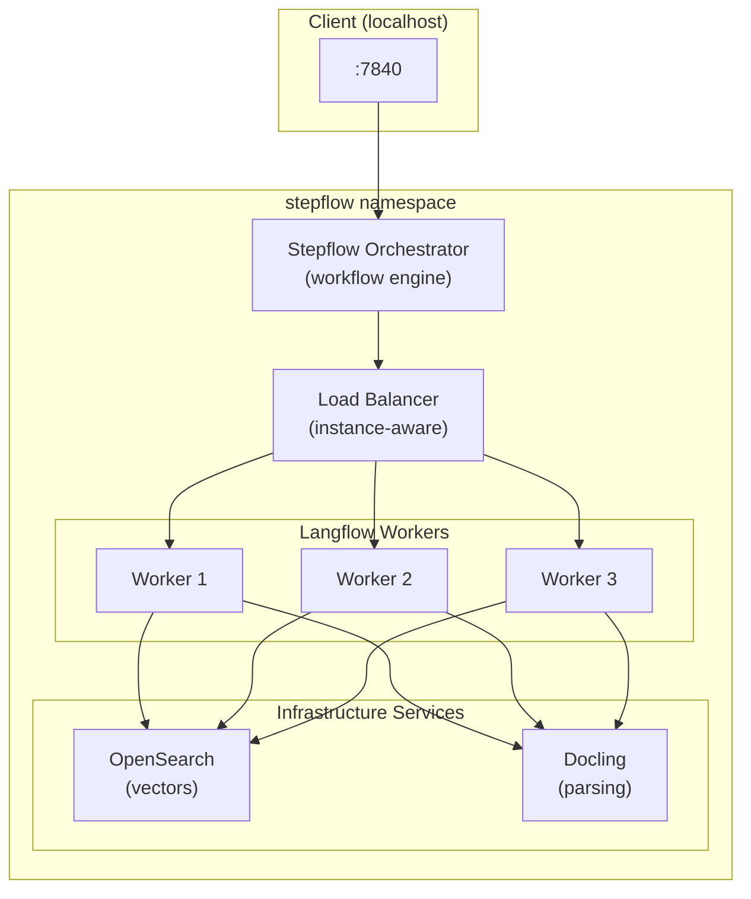
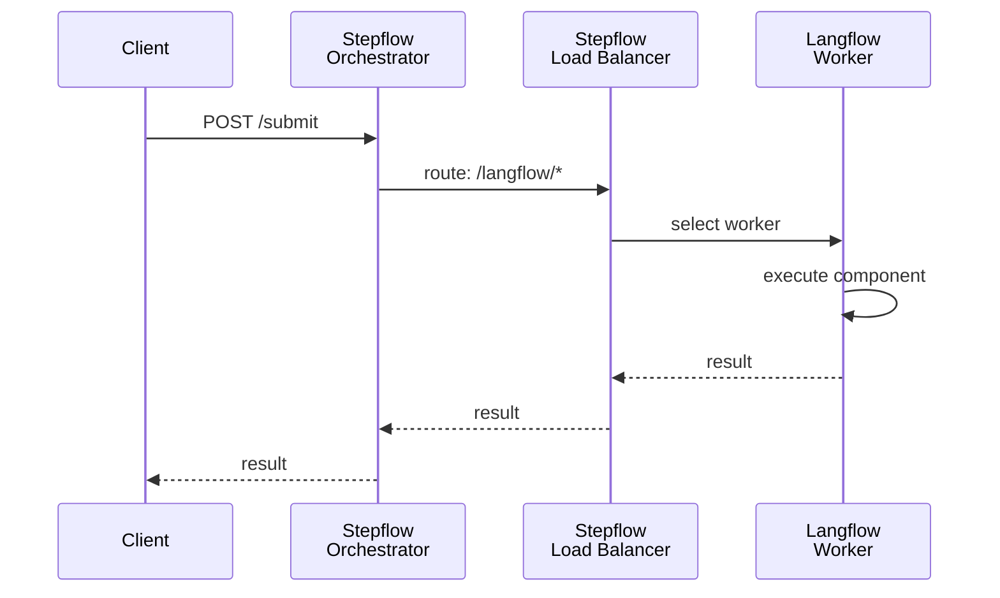
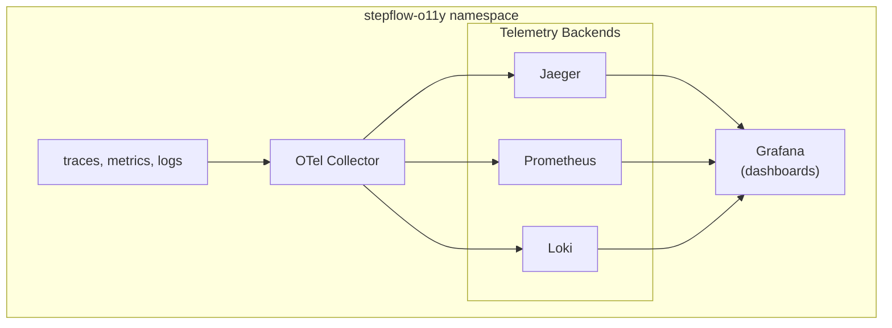

# Running AI Workflows at Scale: Distributed Langflow using Stepflow and Kubernetes

If you havent already worked with [Langflow](https://langflow.org), stop right now, download it immediately, and marvel at your newfound AI workflow productivity! Building a Langflow workflow is intuitive. Drag components, connect edges, test in the UI. Langflow even has tools that help you get to production. These tools allow you to run the flow without the Langflow UI, monitoring the execution, etc. But, when you look to scale that flow for production use, your only choice is distributing entire flows across Langflow replicas. This is where Stepflow, a general purpose workflow orchestration and distributino platform steps in. With Stepflow deployed to Kubernetes, we can run any Langflow workflow with full observability and distribution of steps within a flow across workers.

To showcase this, we've created a real-world example using an off the shelf Langflow flow. This post walks through running the Langflow workflow on Kubernetes using Stepflow's example production architecture. To do this, we'll convert a sample [document ingestion pipeline](https://github.com/langflow-ai/openrag/blob/main/flows/ingestion_flow.json) workflow currently in use in the [OpenRAG project](https://www.openr.ag/). With Stepflow deployed to a local Kind cluster, we'll run this workflow and trace the execution through the system using Stepflow's built in telemetry stack. 

<!-- truncate -->

## The Architecture at a Glance

To get an idea of how Stepflow was designed, let's take a quick look at the Stepflow Kubernetes example production deployment. This not only serves as a reference architecture, but provides a complete execution environment for Langflow workflows. This example uses the built-in load balancer to distribute our example Langflow workflow across multiple worker instances. Docling and OpenSearch are included as two top-level infrastructure services, providing real world ingestion and search capabilities. The stack, as deployed, looks like this: 



**Key components:**
From the diagram, we have the following key components:

- **Stepflow Orchestrator**: The workflow orchestration engine. Parses flows, schedules steps, manages state.
- **Pingora Load Balancer**: Routes `/langflow/*` requests to healthy worker pods with instance affinity.
- **Langflow Workers**: Python processes running the actual Langflow component code.
- **Infrastructure Services**: OpenSearch for vector storage, Docling for document processing.

This example architecture deployed into the `stepflow` namespace is designed around increasing the throughput and performance of Langflow workflow. We do this by distributing the workload across multiple worker pods. The Stepflow Orchestrator marshals the workflow execution, while the Stepflow Load Balancer ensures that requests are routed to the workers whenever `/langflow/*` is encountered in the workflow's YAML execution. Stepflow's Langflow Worker pods are responsible for executing the actual Langflow component code, and the Infrastructure Services provide additional functionality such as vector storage and document processing. We'll walk through the routing mechanics a bit further down, but the takeaway here is that we can scale our workers and right size machine instances to specific workloads to facilitate resource efficiency and high througput. 

A separate `stepflow-o11y` namespace houses a full observability stack based on familiar open source tooling: OpenTelemetry Collector, Jaeger, Prometheus, Loki, and Grafana.

## Converting a Langflow Flow to Stepflow YAML

Every Langflow workflow starts as a JSON export. The Stepflow Langflow integration provides CLI tools to convert and execute these JSON files into Stepflow's native YAML. We'll walk through an example conversion below to give you an idea of how this all plugs together. 

### Analyze First

Because we are dealing with fast moving projects, the first thing we want to do is validate the exported workflow. To do that, we'll run the `analyze` command found in `stepflow-langflow` package. 

```bash
cd integrations/langflow
uv run stepflow-langflow analyze path/to/flow.json
```

This shows node count, component types, dependencies, and potential issues—useful for understanding complex workflows before conversion. 

### Convert to Stepflow YAML

Once we know we have a valid workflow, we can then convert the flow into the Stepflow YAML format. This is done using the `convert` command:

```bash
# Output to stdout
uv run stepflow-langflow convert flow.json

# Save to file
uv run stepflow-langflow convert flow.json workflow.yaml
```

### The Blob + Executor Pattern
 There is a fair amount happening in the conversion process above. If you would like to know more, we covered the Langflow to Stepflow conversion in detail in a [previous post](/blog/langflow-poc), but here's a quick summary. During execution, each Langflow component becomes **two** Stepflow steps:

1. **Blob step**: Stores the component's Python code and configuration
2. **Executor step**: Loads the blob and runs the component

Here's a simplified example:

```yaml
# Step 1: Store component code and config as a blob
- id: langflow_TextInput-abc123_blob
  component: /builtin/put_blob
  input:
    data:
      code: |
        class TextInputComponent(TextComponent):
          # ... Langflow component code
      template:
        input_value:
          value: "Hello world"
      component_type: TextInput

# Step 2: Execute the component
- id: langflow_TextInput-abc123
  component: /langflow/udf_executor
  input:
    blob_id:
      $step: langflow_TextInput-abc123_blob
      path: blob_id
```

This pattern preserves the original Langflow component implementations while adapting them to Stepflow's execution model. In addition to the blog post, we have some detailed documentation on Langflow integration in Stepflow [available here](/docs/integrations/langflow). 

### Secrets vs. Tweaks

A common question: how do API keys flow through the system? The answer depends on whether you're running locally or in a resource managed environment such as Kubernetes. Since the scope of this blog post is productionising Langflow flows, we'll focus on the Kubernetes case.

**Secrets in Kubernetes (no tweaks needed)**

Langflow's `SecretInput` components have a `load_from_db: true` flag. In the converted YAML, the `value` field contains the *environment variable name*, not the actual secret:

```yaml
# In the converted workflow - note this is the ENV VAR NAME, not the secret
template:
  api_key:
    value: "OPENAI_API_KEY"    # Name of env var to look up
    load_from_db: true          # Tells executor to check environment
```

At runtime, the UDF executor checks: "Is this field empty and marked `load_from_db`?" If so, it reads the value from the worker's environment. Kubernetes injects the actual secret:

```yaml
# k8s langflow-worker deployment.yaml
env:
  - name: OPENAI_API_KEY
    valueFrom:
      secretKeyRef:
        name: stepflow-secrets
        key: openai-api-key
```

This means secrets never appear in your workflow YAML. They flow from k8s Secret → Pod Environment → Executor lookup.

**Tweaks for Local Development**

When running locally (not on K8s), you can inject values directly via [tweaks](https://docs.langflow.org/concepts-publish#input-schema) using the `--tweaks` flag via the `stepflow-langflow` CLI command:

```bash
uv run stepflow-langflow execute flow.json '{"message": "Hello"}' \
  --tweaks '{"LanguageModelComponent-xyz": {"api_key": "sk-..."}}'
```

**Tweaks for Configuration Overrides**

Tweaks are also useful for non-secret configuration changes. For example, this workflow allows for swapping out the LLM models and parameters for such at runtime:

```bash
# Change model, temperature, or other settings
uv run stepflow-langflow execute flow.json '{}' \
  --tweaks '{"LanguageModelComponent-xyz": {"model_name": "gpt-4-turbo", "temperature": 0.9}}'
```

### Setting Up Secrets for Kubernetes

The OpenRAG ingestion workflow requires several environment variables. Here's what the workflow expects:

| Variable | Type | Description |
|----------|------|-------------|
| `OPENAI_API_KEY` | Secret | OpenAI API key for embeddings |
| `WATSONX_API_KEY` | Secret | IBM watsonx.ai API key (if using Watson) |
| `WATSONX_PROJECT_ID` | Config | IBM watsonx.ai project ID |
| `OLLAMA_BASE_URL` | Config | Ollama API endpoint (if using local models) |
| `OPENSEARCH_URL` | Config | OpenSearch cluster URL |
| `OPENSEARCH_USERNAME` | Secret | OpenSearch username |
| `OPENSEARCH_PASSWORD` | Secret | OpenSearch password |
| `CONNECTOR_TYPE` | Config | Document connector type |
| `SELECTED_EMBEDDING_MODEL` | Config | Which embedding model to use |
| `OWNER`, `OWNER_EMAIL`, `OWNER_NAME` | Metadata | Document ownership info |
| `FILENAME`, `FILESIZE`, `MIMETYPE` | Metadata | Document metadata |

For secrets marked with `load_from_db: true` in the Langflow export (like `OPENAI_API_KEY`), the UDF executor automatically looks them up from the worker's environment. Create a Kubernetes secret with all the credentials your workflow needs:

```bash
kubectl create secret generic stepflow-secrets \
  --namespace=stepflow \
  --from-literal=openai-api-key="$OPENAI_API_KEY" \
  --from-literal=opensearch-username="admin" \
  --from-literal=opensearch-password="$OPENSEARCH_PASSWORD"
```

The [langflow-worker deployment](https://github.com/stepflow-ai/stepflow/blob/main/examples/production/k8s/stepflow/langflow-worker/deployment.yaml) maps these to environment variables:

```yaml
env:
  - name: OPENAI_API_KEY
    valueFrom:
      secretKeyRef:
        name: stepflow-secrets
        key: openai-api-key
        optional: true
```

### Handling Hardcoded Credentials

Some Langflow exports contain hardcoded credentials in the workflow itself. The OpenRAG flow, for example, has OpenSearch credentials baked into the component configuration:

```yaml
# Found in the exported workflow - not ideal for production!
username:
  value: admin
password:
  value: MyStrongOpenSearchPassword123!
```

Rather than modifying the exported workflow, the cleanest approach is to use **tweaks at submission time**. This keeps the original export unchanged and injects secrets from your K8s environment.

The production example includes a [submission wrapper script](https://github.com/stepflow-ai/stepflow/blob/main/examples/production/k8s/submit-workflow.sh) that reads secrets and constructs tweaks:

```bash
#!/bin/bash
# submit-workflow.sh - Submit workflow with secrets injected via tweaks

set -e

# Build tweaks JSON from environment variables
# These are injected into the pod by K8s secrets
TWEAKS=$(cat <<EOF
{
  "OpenSearchVectorStoreComponentMultimodalMultiEmbedding-By9U4": {
    "opensearch_url": "${OPENSEARCH_URL:-http://opensearch.stepflow.svc.cluster.local:9200}",
    "username": "${OPENSEARCH_USERNAME:-admin}",
    "password": "${OPENSEARCH_PASSWORD}"
  }
}
EOF
)

# Submit with tweaks
stepflow submit \
  --url http://stepflow-server:7840/api/v1 \
  --flow /workflows/openrag_ingestion_flow.yaml \
  --tweaks "$TWEAKS" \
  --input-json "$1"
```

This pattern has several advantages:

- **Original export stays clean** - no manual edits to maintain when re-exporting from Langflow
- **Secrets injected at runtime** - never stored in the workflow YAML
- **Flexible per-environment** - dev/staging/prod can have different values
- **Familiar K8s pattern** - secrets flow from K8s Secret → Pod environment → tweaks

To use this in K8s, we mount the script as a ConfigMap and ensure the pod has access to the secrets:

```yaml
env:
  - name: OPENSEARCH_URL
    value: "http://opensearch.stepflow.svc.cluster.local:9200"
  - name: OPENSEARCH_USERNAME
    valueFrom:
      secretKeyRef:
        name: stepflow-secrets
        key: opensearch-username
  - name: OPENSEARCH_PASSWORD
    valueFrom:
      secretKeyRef:
        name: stepflow-secrets
        key: opensearch-password
```

Then submit workflows using the wrapper:

```bash
./submit-workflow.sh '{"document_url": "https://example.com/doc.pdf"}'
```

## Understanding the Execution Path

So we now have an understanding of how this plugs together architecturally, let's look at the runtime and what specifically happens when you submit a workflow. The following diagram illustrates the execution path which we'll call out in detail below:



### 1. Job Submission

To kick things off, the client submits a workflow to the Stepflow server using the [stepflow CLI](/docs/cli):

```bash
stepflow submit \
  --url http://localhost:7840/api/v1 \
  --flow workflow.yaml \
  --input-json '{"document_url": "https://example.com/doc.pdf"}'
```

This invocation packages the workflow definition with the arguments to the workflow - a single document in this example. The server then parses the workflow and begins executing steps.

### 2. Component Routing

Routing individual steps to optimised components and infrastructure is one of the most powerful features of Stepflow. Take the small example from our `stepflow-config.yml` file below. When the server parses the workflow and begins executing steps, it encounters a `/langflow/*` component, the routing configuration kicks in:

```yaml
# stepflow-config.yml
routes:
  "/langflow/{*component}":
    - plugin: langflow_k8s
```

This routes the request to the `langflow_k8s` load balancer configured in the same file:

```yaml
# also stepflow-config.yml
  langflow_k8s:
    type: stepflow
    transport: http
    url: "http://stepflow-load-balancer.stepflow.svc.cluster.local:8080"
```

As the load balancer is a k8s primitive, the number and type of workers is not our concern. It can be one, 100, or 10,000. The orchestrator just forwards the requests and the Stepflow Load Balander will maintain affinity. For reference, you can see the full [stepflow configuration](https://github.com/stepflow-ai/stepflow/blob/main/examples/production/k8s/stepflow-config.yml) for this production architecture in the repository.

### 3. Worker Selection

The Stepflow Load Balancer (more details below) selects a healthy langflow-worker pod and routes the step to the worker. For stateful operations, it maintains instance affinity—subsequent requests for the same workflow execution go to the same worker. 

### 4. Component Execution

The worker's UDF executor:
1. Fetches the blob containing the component code
2. Instantiates the Langflow component
3. Executes it with the provided inputs
4. Returns the result

### 5. Data Flow

Stepflow wires step outputs to inputs using `$step` references:

```yaml
- id: embed_document
  component: /langflow/udf_executor
  input:
    text:
      $step: parse_document    # Output from previous step
      path: result.content
```

Like many modern workflow systems, the Stepflow orchestrator handles this automatically as a [directed acyclic graph](https://en.wikipedia.org/wiki/Directed_acyclic_graph) or DAG. Independent steps run in parallel, dependent steps wait for their inputs, facilitating work distribution and parelization.

## The Load Balancer: Instance-Aware Routing

The Stepflow load balancer was built using the [Pingora](https://github.com/cloudflare/pingora) crates from Cloudflare. We chose this route instead of a standard Kubernetes service for several reasons:

1. **Instance Affinity**: Some Langflow components maintain state (memory, caches). Pingora routes related requests to the same worker.

2. **Health-Aware Routing**: Active health checks ensure requests only go to healthy workers.

3. **Performance**: Written in Rust, Pingora adds minimal latency and supports native SSE streaming. 

4. **Observability**: Full OpenTelemetry integration for tracing requests through the proxy.

The load balancer configuration lives in `stepflow/loadbalancer/configmap.yaml` and defines upstream workers, health check intervals, and routing policies.

## Infrastructure Services

Like most architectures, you probably need some infrastructure like databases, caches, etc. to support your business cases. As our example workflow uses Docling and OpenSearch, we include them in the reference architecture to provide real functionality. They're accessed directly by workers via Kubernetes DNS:

| Service | DNS | Port | Purpose |
|---------|-----|------|---------|
| OpenSearch | `opensearch.stepflow.svc.cluster.local` | 9200 | Vector storage for RAG |
| Docling | `docling-serve.stepflow.svc.cluster.local` | 5001 | Document processing |

As with most resource-managed envrionments, workers discover these via environment variables:

```yaml
env:
  - name: OPENSEARCH_HOST
    value: "opensearch.stepflow.svc.cluster.local"
  - name: DOCLING_SERVE_URL
    value: "http://docling-serve.stepflow.svc.cluster.local:5001"
```

This separation keeps the routing configuration simple while allowing workers to access backend services directly.

## Observability: Traces, Metrics, and Logs

Given we were building a distributed workflow system from the ground up, observability (commonly abbreviated as o11y) was baked in from the start via the [Open Telemetry](https://opentelemetry.io/docs/specs/otlp/) standard. Along those lines, we've created the `stepflow-o11y` namespace with common open source telemetry servcies to provide full observability for the Stepflow runtime. The `stepflow-o11y` namespace contains the following services which are detailed below:



### Trace Correlation

Stepflow uses the workflow `run_id` as the OpenTelemetry `trace_id`. This means you can:

1. Find a workflow execution by run ID
2. See the complete trace in Jaeger
3. Correlate logs in Loki using the same trace ID

### Following a Request

In Jaeger (http://localhost:16686):

1. Search for service `stepflow-server`
2. Find your trace by run ID or time range
3. Expand to see: server → load balancer → worker → component execution

Each span shows timing, status, and any errors—invaluable for debugging production issues.

For detailed observability documentation, see [OBSERVABILITY.md](https://github.com/stepflow-ai/stepflow/blob/main/examples/production/k8s/OBSERVABILITY.md).

## Running the Example

Now that we now how all this plugs together, it's time to run the example. 

### Prerequisites

Since our focus here is productionising Langflow via Stepflow, we assume some knowledge of common production tooling, specifically kubectl, Kind, and Podman (though Docker should work as well). Getting any further into any of this architecture is unfortunately outside the scope of this post. That said, we've made every attempt to assure that we adhere to best practices and standards, so most modern LLM agents should be able to spin this up for you if this tooling is not your day to day toolbox.

### Quick Start

The following commands will get you going, but the "quick" part of this is relative. The AI and ML python communities are fast moving enough that the SBOMs for the images are rather large. This is a good thing as they ecapsulate what is otherwise a frustrating cermony in chasing circular dependencies, but it means that the images will take a while to build. With that said, let's get started.

```bash
# 1. Build images (from repo root)
podman build -t stepflow-server:latest -f docker/Dockerfile.server .
podman build -t stepflow-load-balancer:latest -f docker/Dockerfile.loadbalancer .
podman build -t langflow-worker:latest -f docker/langflow-worker/Dockerfile .
# Maybe go get a coffee while this last one builds...

# 2. Create cluster
cd examples/production/k8s
kind create cluster --config kind-config.yaml

# 3. Load images
kind load docker-image stepflow-server:latest --name stepflow
kind load docker-image stepflow-load-balancer:latest --name stepflow
kind load docker-image langflow-worker:latest --name stepflow

# 4. Create secrets
kubectl create namespace stepflow
kubectl create secret generic stepflow-secrets \
  --namespace=stepflow \
  --from-literal=openai-api-key="$OPENAI_API_KEY"

# 5. Deploy
./apply.sh

# 6. Verify
kubectl get pods -n stepflow
kubectl get pods -n stepflow-o11y
```

### Submit a Workflow

With Stepflow deployed and the observability stack ready and waiting, it's time to run a flow. We'll use the `stepflow` CLI to submit a workflow to the cluster.

If you have your own flow, you can convert it to a Stepflow workflow using the `stepflow-langflow` CLI:

```bash
# Convert a Langflow flow
cd integrations/langflow
uv run stepflow-langflow convert path/to/flow.json ../examples/production/k8s/workflow.yaml
```

Once the flow is ready, we can submit it to the cluster:

```bash
# Submit to the cluster
stepflow submit \
  --url http://localhost:7840/api/v1 \
  --flow ../examples/production/k8s/workflow.yaml \
  --input-json '{"message": "Hello from K8s!"}'
```

### Access the Observability Stack and Stepflow Infrastructure

| Service | URL |
|---------|-----|
| Stepflow API | http://localhost:7840 |
| Swagger UI | http://localhost:7840/swagger-ui/ |
| Grafana | http://localhost:3000 (admin/admin) |
| Jaeger | http://localhost:16686 |
| Prometheus | http://localhost:9090 |

## What's Next

We're actively working on deeper integrations:

- **[Docling Integration](https://github.com/stepflow-ai/stepflow/blob/main/docs/proposals/docling-integration.md)**: First-class document processing with dedicated workers and GPU routing support.

- **GPU Worker Tiers**: Route compute-intensive components (embeddings, OCR) to GPU-enabled nodes.

- **Horizontal Pod Autoscaling**: Scale workers based on queue depth and CPU utilization.

## Conclusion

Taking a Langflow workflow from prototype to production doesn't have to be painful. With Stepflow's Kubernetes architecture:

1. **Convert** your Langflow JSON to Stepflow YAML with the CLI
2. **Deploy** to Kubernetes with the provided manifests
3. **Scale** with multiple worker replicas behind a load balancer
4. **Observe** with integrated tracing, metrics, and logging

The same workflow that runs locally runs in production—with the observability and scalability you need.

---

**Resources:**

- [Stepflow Repository](https://github.com/stepflow-ai/stepflow)
- [K8s Deployment README](https://github.com/stepflow-ai/stepflow/blob/main/examples/production/k8s/README.md)
- [Langflow Integration README](https://github.com/stepflow-ai/stepflow/blob/main/integrations/langflow/README.md)
- [Observability Documentation](https://github.com/stepflow-ai/stepflow/blob/main/examples/production/k8s/OBSERVABILITY.md)

*Questions or feedback? Open an issue on [GitHub](https://github.com/stepflow-ai/stepflow/issues) or join the discussion!*
