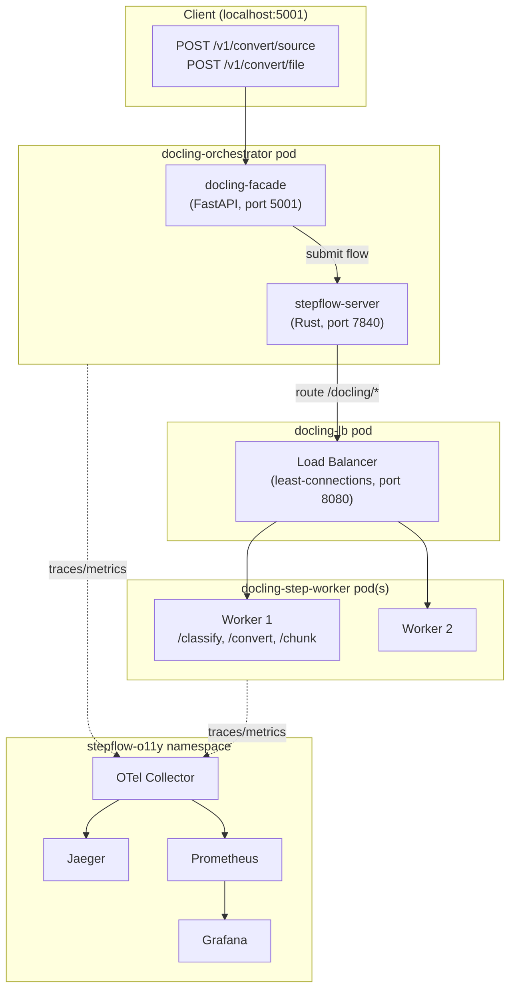
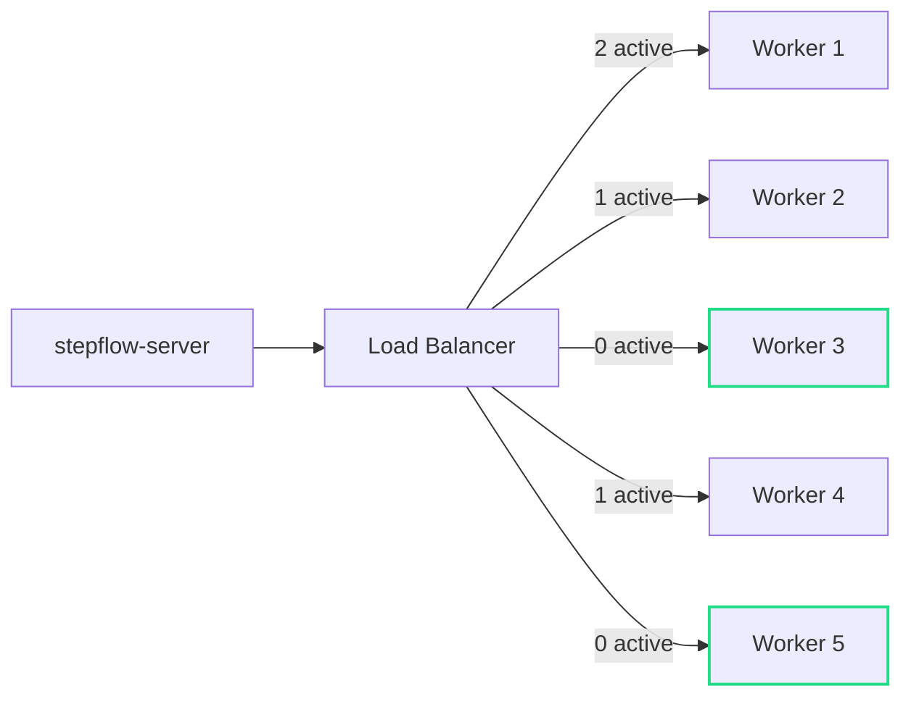
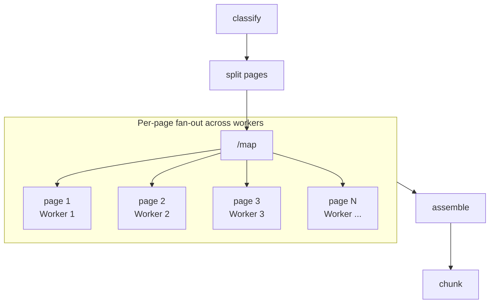

# How Stepflow Transforms Docling into a Scalable Document Processing Pipeline

[Docling](https://github.com/docling-project/docling) is a powerful document processing library. It handles PDF parsing, layout analysis, table extraction, OCR, and multi-format export. It's the kind of specialized AI pipeline that does one set of tasks very well. But scaling it in production means running [docling-serve](https://github.com/docling-project/docling-serve), which brings its own set of architectural constraints: async task state pinned to a single process and a resource intensive scaling path.

Stepflow is a general purpose AI workflow system designed to solve exactly this class of problem. Its orchestration architecture provides resilient distributed execution state, HTTP SSE-aware load-balanced routing to worker pools, persistent result storage, and full observability out of the box. 

After initial success with scaling Langflow throughput, we started looking for other high-value integration projects. After looking through docling throughput as part of some day-job work with [OpenRAG](https://www.openr.ag/), we started to wonder: *how hard would it be to take a sophisticated AI pipeline like docling and run it entirely on Stepflow?*

The answer was a lot simpler than we though: some quick dev work shaping requests and responses for API parity via a simple proxy and setting up a basic Stepflow flow to define the workflow. This post walks through how Stepflow's architecture made that speed possible and what it means for scaling AI related pipeline tasks like document processing in production. We also introduced some enhanced, docling-specific observability facilitated by this architecture for which any administrator who has had to wrestle with AI workflow issues like token burn will find immediate value.

<!-- truncate -->

## What Stepflow Brings to the Table

Before diving into the Docling integration, it's worth understanding what Stepflow provides as an execution platform. These are the properties that make porting an AI pipeline straightforward rather than a months-long rewrite:

**Declarative flow definitions.** Workflows are YAML files with typed inputs, outputs, and step dependencies. A new pipeline is a new YAML file, not new application code.

**Load-balanced worker pools.** Stepflow's load balancer uses the [routes primitive](https://github.com/stepflow-ai/stepflow/blob/main/examples/production/k8s/stepflow-docling/orchestrator/configmap.yaml#L32-L38) to send executions to component-specific workers using least-connections balancing. Adding capacity means scaling a deployment, not re-architecting. Unit economics become a lot more manageable as we can right size instances to specifc types of tasks, like model execution or calculating embedding vs document parsing.

**Distributed execution state.** All run state lives in the orchestrator's [storage backend](/docs/deployment/persistence-recovery), not in worker memory. Any pod can serve status queries. Runs survive pod restarts, picking up where they left off. 

**Persistent result storage.** Flow outputs are stored in Stepflow's content-addressed blob store. Results are retrievable by ID from any pod with the correct credentials. 

**Built-in observability.** Every component execution emits OpenTelemetry traces, metrics, and logs. The production deployment [includes a full o11y stack](https://github.com/stepflow-ai/stepflow/tree/main/examples/production/k8s/stepflow-o11y): Jaeger for traces, Prometheus for metrics, Loki for logs, and Grafana dashboards.

**Recovery.** In-flight subflows are resumed during recovery. Execution checkpoints allow faster restart after failures or rolling out new versions without using flows.

These aren't docling-specific features. They're what Stepflow provides to *any* pipeline that plugs into it. Running Docling this way just happens to be a great example of why they matter!

## The Integration Architecture

The example in this demonstrates worker pods running Stepflow's [docling-step-worker integration](https://github.com/stepflow-ai/stepflow/tree/main/integrations/docling-step-worker). This worker worker implements the Stepflow protocol to provide the steps of the docling pipeline as Stepflow components. The docling `DocumentConverter` library runs directly in the worker process using the Docling library directly for all funcitons. To marshall this on the Stepflow runtime, we created a Stepflow flow (detailed below) describing the structure of the docling pipeline using these components. 

While lightweight enough to run on a laptop, nothing is stopping you from adding instances, turning up the CPU and scaling this out. That said, our initial deployment runs in the `stepflow-docling` namespace with two docling-step-worker pods (5 CPU / 6Gi each — tuned to fit a Kind node's ~10 allocatable CPU):



For this achitecture, the facade is just a simple proxy. It accepts docling-serve's v1 HTTP API, translates the request into a Stepflow flow input, and submits it. Everything else, scheduling, routing, state management, result storage, observability, is handled by the Stepflow infrastructure that already exists. 

### The Flow Definition

The processing pipeline is defined as a standard Stepflow flow YAML:

```yaml
steps:
  - id: classify
    component: /docling/classify
    input:
      source: { $input: "source" }
      source_kind: { $input: "source_kind" }

  - id: convert
    component: /docling/convert
    input:
      source: { $input: "source" }
      source_kind: { $input: "source_kind" }
      pipeline_config: { $step: "classify", path: "recommended_config" }
      to_formats: { $input: "to_formats" }
      image_export_mode: { $input: "image_export_mode" }
      options: { $input: "options" }

  - id: chunk
    component: /docling/chunk
    input:
      document: { $step: "convert", path: "document_dict" }
      chunk_options: { $input: "chunk_options" }
```

This workflow uses three steps: classify, convert, chunk. Each step is a component that Stepflow routes to available workers through the load balancer. The flow is registered once at startup, then every document submission reuses the same flow definition with different inputs.

This is the same pattern that makes Stepflow's Langflow integration work. Define the pipeline declaratively and let the orchestrator handle execution. The difference is that here we're integrating a purpose-built document processing library rather than a visual workflow builder, but the integration surface is basically the same.

## Scaling: Load Balancers and Worker Pools

This is where Stepflow's architecture pays off most directly. docling-serve's scaling story has had some known limitations: async task state is stored in an in-memory dict, multiple Uvicorn workers see inconsistent state, and the project advises running with `UVICORN_WORKERS=1`.

With Stepflow, scaling is a deployment change:

```bash
kubectl scale deployment/docling-worker -n stepflow-docling --replicas=5
```

The load balancer discovers new worker pods automatically via the Kubernetes headless service as they are spun up. It uses least-connections routing, so work naturally flows to pods that have capacity. 



Each worker pod runs the docling `DocumentConverter` with an LRU cache of converter instances keyed by options hash. The first request to a pod takes ~30 seconds due to the requirements of model loading. Subsequent requests with the same options hit the cache and complete in ~10 seconds. As the worker pool warms up, the load balancer naturally routes new requests to warm pods.

### Performance Characteristics

We validated scaling behavior by running a 10-paper ML corpus through the deployment (2 workers at 5 CPU / 6Gi each, concurrency 3):

- **Cold start**: ~30s per document (model loading + LRU cache miss on first request to a pod)
- **Warm cache**: ~10s per document (LRU converter cache hit, same options hash)
- **Large papers**: up to ~60s for dense, image-heavy PDFs
- **Batch success rate**: 10/10 conversions succeeded for our docling-step-worker across the full corpus

These timings are per-document. The scaling advantage comes from concurrent processing: while one worker is doing layout analysis on a 50-page PDF, other workers handle incoming requests. docling-serve can't do this because all state is pinned to the process that received the request. In the case of large batch submissions, Stepflow excels as the document is the unit of parallelism (for now), and can therefore be spread accross an arbitrarily large pool of workers.

## Observability: See Everything

Every component execution in Stepflow emits OpenTelemetry data. For the docling pipeline, this means you get distributed traces that span from the facade's HTTP handler through the orchestrator, load balancer, and into the worker's `DocumentConverter` call.

The deployment includes a complete observability stack in the `stepflow-o11y` namespace:

| Tool | URL | What It Shows |
|------|-----|---------------|
| Grafana | `localhost:3000` | Dashboards for throughput, latency, worker utilization |
| Jaeger | `localhost:16686` | Distributed traces across facade, orchestrator, and workers |
| Prometheus | `localhost:9090` | Metrics: request rates, processing times, queue depths |

This is particularly valuable for document processing where the cost of each request varies dramatically. A 5-page memo and a 500-page technical manual hit the same endpoint but have very different resource profiles. Traces let you see exactly where time is spent: PDF parsing, layout analysis (typically the bottleneck), table extraction, OCR, assembly. Stepflow uses this observability infrastructure to give you end-to-end distributed traces with per-step timing, automatically. Here are some examples from our testing with this stack:


If you have spent any time with docling-serve before, a couple of things might jump out immediately. The level of observability has been augmented by stepflow to produce high value metrics for production scale deployment:

- **Token and chunk usage**: valueable for controlling expenses and seeing token burn from embeddings
- **Documents processed**: Details on how many documents are being processed over time and histograms of page count distribution
- **Duration of conversions**: How long conversions are taking across the pipeline

We'll continue to build on these as we operationalise this infrastructure further. [Any suggestions](https://github.com/stepflow-ai/stepflow/issues)?


## Persistence and Recovery

Document processing is expensive. A 50-page PDF might take minutes of GPU/CPU time. Losing that work to a pod restart is not acceptable in production.

Stepflow's execution model handles this at two levels:

**Result persistence.** Flow outputs are stored in the content-addressed blob store. Once a conversion completes, the result is retrievable by ID from any pod. If the facade crashes after submitting a flow but before returning the response, the result still exists and can be retrieved.

**Execution recovery.** Stepflow checkpoints execution state. If the orchestrator restarts, in-flight subflows are resumed rather than restarted from scratch. A conversion that was 80% through layout analysis doesn't start over; it picks up from the last checkpoint.

This is infrastructure that docling-serve simply doesn't have. Async task state lives in a Python dict, meaning pod restarts loose results. Stepflow makes persistence the default, making recovery straight-forward and much less resource intensive. 

## What's Coming Next: Per-Page Fan-Out

The current flow processes documents sequentially through the classify, convert, and chunk steps. This is the correct starting point because it validates parity with docling-serve's behavior. But Stepflow's flow model is designed for exactly the kind of disaggregation that document processing needs.

The `convert` step is where most time is spent. Inside `DocumentConverter`, layout analysis runs per-page using `ThreadedStandardPdfPipeline`. That threading is limited by Python's GIL, which is why docling users report that setting `concurrency=10` only achieves ~2x speedup.

Stepflow's `/map` component provides a different approach: fan out pages across pods, not threads.



Each page becomes an independent Stepflow flow execution, routed to available workers through the load balancer. Layout analysis, table extraction, and OCR for different pages run on different pods concurrently. This completely removes Python's GIL contention, facilitating true linear scaling with worker count.

This isn't speculative; it's how Stepflow's `/map` component already works for Langflow batch processing. Applying it to document pages is the next integration step, and it happens behind the same facade. Callers still hit `POST /v1/convert/source` and get back the same response format.

## Building and Deploying

For this `stepflow-docling` namespace, we'll be building four images in order. All commands below are run from the `stepflow` repository root.

### 1. Build stepflow-server from source (~5 min)

Required to ensure we are using the latest protocol changes in Stepflow. Additionally, Axum's default 2 MiB body limit is too small for large base64-encoded PDFs in flow inputs. The source build includes a 250 MiB body limit.

```bash
cd stepflow-rs
cargo build --release --target x86_64-unknown-linux-musl --bin stepflow-server

cp target/x86_64-unknown-linux-musl/release/stepflow-server release/
docker build -f release/Dockerfile.stepflow-server.alpine \
  -t localhost/stepflow-server:bodylimit-v1 release/
```

### 2. Build docling-facade image (~10 sec)

Lightweight Python image with FastAPI, httpx, pyyaml. No docling library needed.

```bash
cd integrations/docling-step-worker
docker build --load -f docker/Dockerfile.facade \
  -t localhost/docling-facade:parity-v2 .
```

### 3. Build docling-worker image (~2 min)

Based on `docling-serve-cpu:v1.14.0` (4GB, includes pre-loaded models). Adds stepflow-py and the worker source.

```bash
cd integrations/docling-step-worker
docker build --load -f docker/Dockerfile \
  -t localhost/stepflow-docling-worker:blob-fix-v4 .
```

### 4. Load into Kind and deploy

The load balancer uses the published image `ghcr.io/.../stepflow-load-balancer:alpine-0.9.0` directly. It's a transparent HTTP proxy that doesn't participate in protocol negotiation.

```bash
# Load images into Kind cluster
kind load docker-image localhost/stepflow-server:bodylimit-v1 --name stepflow
kind load docker-image localhost/docling-facade:parity-v2 --name stepflow
kind load docker-image localhost/stepflow-docling-worker:blob-fix-v4 --name stepflow

# Deploy (dependency-ordered: namespaces -> o11y -> worker -> LB -> orchestrator)
cd examples/production/k8s/stepflow-docling
./apply.sh
```

The apply script handles deployment ordering. The orchestrator pod includes an init container that waits for the worker and load balancer to be healthy before starting.

Verify:

```bash
kubectl get pods -n stepflow-docling
# Expected: orchestrator 2/2, worker 1/1, LB 1/1

kubectl get pods -n stepflow-o11y
# Expected: all o11y pods 1/1
```

## Parity Test Results

The real validation: does the facade behave identically to docling-serve from a caller's perspective? A six-test parity suite exercises the deployed system against the v1 API contract using the Docling technical paper from arXiv.

```bash
python test-parity.py --base-url http://localhost:5001 --timeout 300
```

| # | Test | What It Validates |
|---|------|-------------------|
| 1 | Health check | Facade + server reachable, retries for 60s |
| 2 | Convert URL source (v1) | `POST /v1/convert/source` with arXiv URL, verifies markdown output |
| 3 | Convert file upload (v1) | `POST /v1/convert/file` multipart upload of same PDF |
| 4 | v1alpha backward compat | `POST /v1alpha/convert/source` with `http_sources` shape |
| 5 | Options passthrough | `do_ocr: true, table_mode: accurate` accepted without error |
| 6 | Error handling | Invalid URL returns structured error response |

All six pass. Test 2 is the critical path: it exercises the full chain from facade through Stepflow server, load balancer, and worker, down to `DocumentConverter` and back.

### Batch Parity: 10-Paper Corpus

Beyond API contract testing, we validated output parity against stock docling-serve using `compare-batch.py` — a side-by-side comparison across 10 ML papers from arXiv, run at concurrency 3 against 2 workers (5 CPU / 6Gi each):

```bash
python compare-batch.py --facade-only --skip-download --concurrency 3 --timeout 300
```

| Metric | Result |
|--------|--------|
| Facade success rate | 10/10 |
| Stock docling-serve success rate | 9/10 (1 transient timeout) |
| Avg markdown similarity | 1.00 |
| Avg text-only similarity (images stripped) | 0.99 |

Markdown similarity of 1.00 means the facade produces byte-identical output to stock docling-serve for the same inputs. The text-only similarity of 0.99 accounts for minor whitespace differences after stripping embedded image data URIs. This validates that the Stepflow-orchestrated pipeline is a true drop-in replacement.

## Try It Yourself

The complete deployment is at `examples/production/k8s/stepflow-docling/`. The CLAUDE.md in that directory covers Kind cluster setup, image builds, and teardown. The test script requires only Python 3.10+ and falls back to `urllib` if `httpx` isn't installed.

```bash
git clone https://github.com/stepflow-ai/stepflow.git
cd stepflow/examples/production/k8s/stepflow-docling
# See CLAUDE.md for Kind cluster setup and image builds
./apply.sh

# API contract tests (single paper)
python test-parity.py

# Full parity comparison (10 papers, requires stock docling-serve for comparison)
python compare-batch.py --facade-only --skip-download --concurrency 3 --timeout 300

./teardown.sh
```


