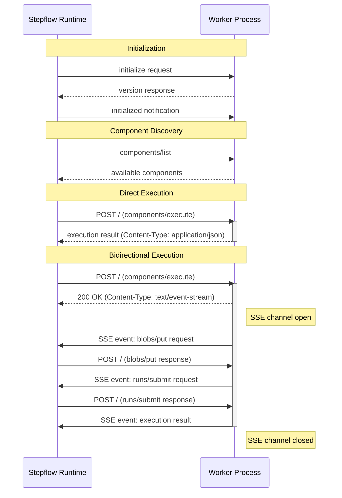

# Implementing Workers

This guide describes how to implement a Stepflow worker (component server) in any programming language. Workers are standalone processes that provide components for workflow execution, communicating with the Stepflow runtime using a JSON-RPC 2.0 based protocol.

While the [Python SDK](./custom-components.md) provides a high-level API that handles protocol details automatically, you can implement workers in any language by following this specification.

## What is a Worker?

A **worker** is a process that hosts one or more workflow components and executes them on behalf of the Stepflow runtime. Workers are registered with the runtime through [routing configuration](../../configuration.md), which maps component paths (like `/my_worker/process_data`) to specific worker processes. Workers:

- Provide a list of supported component paths
- Receive component execution requests when workflows invoke those paths
- Execute components and return results
- Can make calls back to the runtime (e.g., for blob storage)
- Run as independent processes, enabling language flexibility and fault isolation



## Requirements Overview

This section uses RFC 2119 terminology:
- **MUST**: Absolute requirement for protocol compliance
- **SHOULD**: Recommended for production-quality implementations
- **MAY**: Optional features

### Protocol Requirements

| Requirement | Description |
|------------|-------------|
| **Streamable HTTP Transport** | Workers MUST support HTTP transport; MUST support SSE if bidirectional communication is used |
| **JSON-RPC 2.0 Messages** | All messages MUST follow JSON-RPC 2.0 format |
| **Immediate Response** | Workers SHOULD return `application/json` when possible |
| **Initialization Handshake** | Workers MUST implement the `initialize`/`initialized` handshake |
| **Component Methods** | Workers MUST implement `components/list`, `components/info`, and `components/execute` |
| **Error Handling** | Workers MUST return proper JSON-RPC errors with standardized codes |
| **Bidirectional Requests** | Workers MAY make bidirectional requests (blob storage, subflow execution) during component execution |
| **SSE Streaming** | Workers MUST use `text/event-stream` response format if bidirectional requests may be made during execution |
| **Bidirectional Responses** | Workers MUST handle runtime responses if they use SSE streaming |

### Observability Requirements

| Requirement | Description |
|------------|-------------|
| **OTLP Tracing** | Workers SHOULD support OpenTelemetry Protocol (OTLP) for distributed tracing |
| **OTLP Logging** | Workers SHOULD support OTLP for structured log export |
| **Diagnostic Context** | Workers SHOULD include `flow_id`, `run_id`, `step_id` in log diagnostic context |
| **Trace Context** | Workers SHOULD include `trace_id`, `span_id` in logs when tracing is enabled |
| **Context Propagation** | Workers SHOULD propagate observability context in bidirectional calls |

### Best Practices

| Requirement | Description |
|------------|-------------|
| **Health Endpoint** | Workers SHOULD provide a `/health` endpoint for load balancer health checks |
| **JSON Schemas** | Workers SHOULD provide input/output JSON schemas for components |
| **Schema Inference** | Workers SHOULD implement `components/infer_schema` for static type checking |
| **Graceful Shutdown** | Workers SHOULD handle shutdown signals gracefully |
| **Structured Logging** | Workers SHOULD use structured JSON logging format |

## Transport: Streamable HTTP

Workers communicate over HTTP using the Streamable HTTP transport, which supports bidirectional communication through Server-Sent Events (SSE).

For complete transport details including request/response formats, headers, SSE streaming, and port announcement, see the [Transport documentation](../../protocol/transport.md).

**Key requirements:**
- Workers MUST expose a POST `/` endpoint for JSON-RPC messages (MAY expose additional endpoints)
- Workers SHOULD expose a GET `/health` endpoint for health checks
- Workers MUST support `application/json` response format
- Workers MUST use `text/event-stream` (SSE) response format for any execution where bidirectional requests may be made
- When starting as a subprocess, workers MUST print `{"port": N}` to stdout

**Response format selection:**
- Use `application/json` for simple request-response (initialization, component listing, executions without bidirectional calls)
- Use `text/event-stream` when the component execution may make bidirectional requests (e.g., blob storage, subflow execution)
- The decision is based on whether bidirectional calls are *possible*, not whether they will actually occur (e.g., the Python SDK uses SSE if the handler accepts a context parameter)

## Protocol Methods

Workers must implement the following JSON-RPC methods. See the [Protocol Methods Reference](../../protocol/methods/index.md) for detailed request/response schemas and examples.

### Initialization (MUST)

Workers MUST complete the initialization handshake before accepting other requests:

1. Runtime sends `initialize` with `runtime_protocol_version`
2. Worker responds with `server_protocol_version` (current version: `1`)
3. Runtime sends `initialized` notification

See [Initialization Methods](../../protocol/methods/initialization.md) for details.

### Component Methods (MUST)

| Method | Description |
|--------|-------------|
| `components/list` | Return all available components with optional schemas |
| `components/info` | Return metadata for a specific component |
| `components/execute` | Execute a component with input data and observability context |

See [Component Methods](../../protocol/methods/components.md) for details.

### Bidirectional Methods (MAY)

During `components/execute`, workers MAY call back to the runtime for blob storage and subflow execution. Using any bidirectional method requires SSE streaming (see [Transport](#transport-streamable-http)).

#### Blob Storage

| Method | Description |
|--------|-------------|
| `blobs/put` | Store JSON data, receive content-addressed ID (`sha256:...`) |
| `blobs/get` | Retrieve JSON data by blob ID |

See [Blob Storage Methods](../../protocol/methods/blobs.md) for details.

#### Subflow Execution

| Method | Description |
|--------|-------------|
| `runs/submit` | Submit a workflow for execution, optionally waiting for completion |
| `runs/get` | Get the status and results of a workflow run |

**`runs/submit` parameters:**
- `flow_id`: Blob ID of the workflow to execute (store the flow definition with `blobs/put` first)
- `inputs`: Array of input values (one per run item for batch execution)
- `wait`: If `true`, block until the run completes and return results
- `max_concurrency`: Limit concurrent item execution (optional)
- `overrides`: Step overrides for the subflow (optional)

**`runs/get` parameters:**
- `run_id`: UUID of the run to query
- `wait`: If `true`, block until the run completes
- `include_results`: If `true`, include individual item results
- `result_order`: `"byIndex"` (original order) or `"byCompletion"` (completion order)

Both methods return a `RunStatus` with `run_id`, `status`, item statistics, and optionally results.

## Error Handling

Workers MUST return JSON-RPC error responses for failures. Use standard error codes (e.g., `-32004` for component execution failures) with descriptive messages and optional `data` for debugging context.

See [Error Handling](../../protocol/errors.md) for the complete error codes reference.

## Observability

### ObservabilityContext

The `observability` object is passed with protocol requests to enable distributed tracing and structured logging:

```json
{
  "trace_id": "a1b2c3d4e5f67890a1b2c3d4e5f67890",
  "span_id": "1234567890abcdef",
  "run_id": "run-12345",
  "flow_id": "sha256:abc123...",
  "step_id": "process_step"
}
```

| Field | Format | Description |
|-------|--------|-------------|
| `trace_id` | 32-char hex | OpenTelemetry trace ID (128-bit) |
| `span_id` | 16-char hex | OpenTelemetry span ID (64-bit) |
| `run_id` | string | Workflow run identifier |
| `flow_id` | blob ID | Flow definition blob ID |
| `step_id` | string | Step identifier within the flow |

**Field Presence:**
- `trace_id`, `span_id`: Present when tracing is enabled
- `run_id`, `flow_id`: Present for workflow execution (not during init/discovery)
- `step_id`: Present for step-level execution

### Implementing Tracing (SHOULD)

Workers SHOULD implement OpenTelemetry tracing:

1. **Extract parent context** from `trace_id` and `span_id`
2. **Create child spans** for component execution
3. **Propagate context** in bidirectional calls

```python
# Pseudocode example
def execute_component(request):
    # Extract parent span context
    parent_context = create_span_context(
        trace_id=request.observability.trace_id,
        span_id=request.observability.span_id,
        is_remote=True
    )

    # Create child span
    with tracer.start_span("component.execute", parent=parent_context) as span:
        span.set_attribute("stepflow.component", request.component)
        span.set_attribute("stepflow.step_id", request.observability.step_id)
        span.set_attribute("stepflow.run_id", request.observability.run_id)

        # Execute component logic
        result = do_execute(request.input)

        return result
```

### Implementing Logging (SHOULD)

Workers SHOULD use structured JSON logging with diagnostic context:

```json
{
  "timestamp": "2025-01-15T10:30:00.000Z",
  "level": "INFO",
  "message": "Processing records",
  "logger": "my_worker.components",
  "flow_id": "sha256:abc123...",
  "run_id": "run-12345",
  "step_id": "process_step",
  "trace_id": "a1b2c3d4e5f67890a1b2c3d4e5f67890",
  "span_id": "1234567890abcdef"
}
```

**Recommended approach:**
1. Set diagnostic context when handling `components/execute`
2. Use a logging filter to inject context fields automatically
3. Export logs via OTLP or write to stderr as structured JSON

### Environment Variables

Workers SHOULD support these environment variables for observability configuration:

| Variable | Description | Default |
|----------|-------------|---------|
| `STEPFLOW_OTLP_ENDPOINT` | OTLP collector endpoint (e.g., `http://localhost:4317`) | none |
| `STEPFLOW_SERVICE_NAME` | Service name for traces/logs | `stepflow-worker` |
| `STEPFLOW_TRACE_ENABLED` | Enable tracing | `true` if endpoint set |
| `STEPFLOW_LOG_LEVEL` | Log level (DEBUG, INFO, WARNING, ERROR) | `INFO` |
| `STEPFLOW_LOG_DESTINATION` | Where to log (stderr, file, otlp) | `otlp` if endpoint set, else `stderr` |

## Implementation Checklist

Use this checklist when implementing a worker:

### Required (MUST)

- [ ] HTTP server listening on configurable port
- [ ] POST `/` endpoint for JSON-RPC messages
- [ ] Content-Type header validation (`application/json`)
- [ ] Handle `initialize` request and respond with protocol version
- [ ] Wait for `initialized` notification before accepting other requests
- [ ] Implement `components/list` returning available components
- [ ] Implement `components/info` returning component metadata
- [ ] Implement `components/execute` with input validation
- [ ] Return proper JSON-RPC error responses
- [ ] Print `{"port": N}` to stdout on startup (subprocess mode)

### Required IF Using Bidirectional Communication (Conditional MUST)

If any component may make bidirectional requests (blob storage, subflow execution), the worker MUST:

- [ ] Return `text/event-stream` response format for executions where bidirectional calls may occur
- [ ] Implement SSE streaming with proper event formatting
- [ ] Handle runtime responses and route them to the waiting request
- [ ] Track pending requests by JSON-RPC message ID

### Recommended (SHOULD)

- [ ] GET `/health` endpoint
- [ ] JSON schemas for component inputs/outputs
- [ ] `components/infer_schema` implementation
- [ ] OpenTelemetry tracing with parent context extraction
- [ ] Structured JSON logging with diagnostic context
- [ ] OTLP export for traces and logs
- [ ] Graceful shutdown handling
- [ ] Observability context propagation in bidirectional calls

## Example: Minimal Worker

Here's a minimal worker implementation outline:

```
1. Start HTTP server
2. Print {"port": N} to stdout

3. On POST /:
   a. Parse JSON-RPC message
   b. If "initialize":
      - Store runtime protocol version
      - Respond with server_protocol_version: 1
   c. If "initialized" (notification):
      - Mark server as ready
   d. If "components/list":
      - Return list of components
   e. If "components/info":
      - Return component metadata
   f. If "components/execute":
      - Validate input
      - Execute component (may include bidirectional calls)
      - Return result via SSE or JSON response
   g. If response to pending bidirectional call:
      - Route to waiting request

4. On shutdown signal:
   - Complete pending requests
   - Close connections
   - Exit
```

## Reference Implementations

- **Python SDK**: See [sdks/python/stepflow-py](https://github.com/datastax/stepflow/tree/main/sdks/python/stepflow-py) for a complete implementation
- **Protocol Schema**: See [schemas/protocol.json](https://github.com/datastax/stepflow/blob/main/schemas/protocol.json) for message definitions

## See Also

- [Protocol Overview](../../protocol/index.md) - Complete protocol specification
- [Transport](../../protocol/transport.md) - HTTP transport details
- [Error Handling](../../protocol/errors.md) - Error codes reference
- [Custom Components](./custom-components.md) - Python SDK guide
