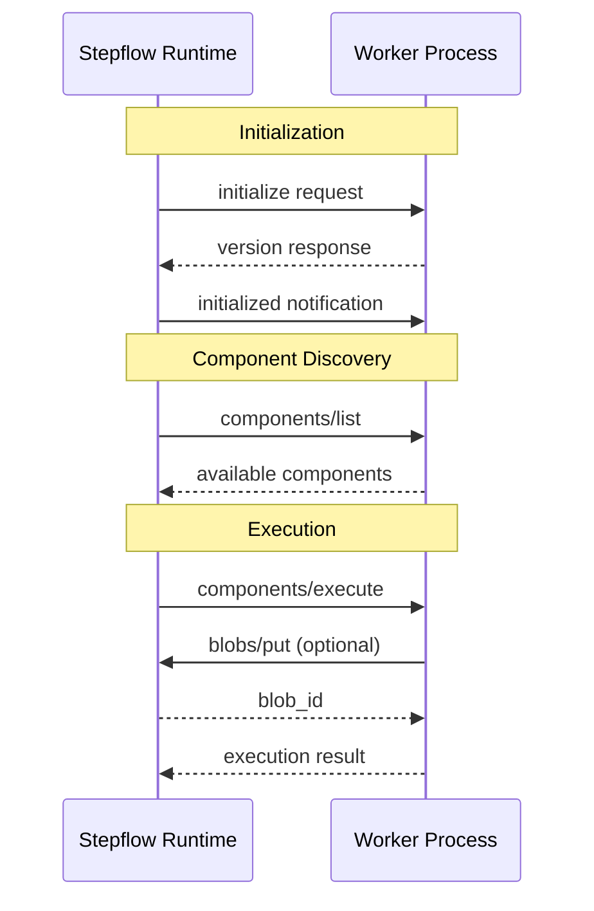

# Implementing Workers

This guide describes how to implement a Stepflow worker (component server) in any programming language. Workers are standalone processes that provide components for workflow execution, communicating with the Stepflow runtime using a JSON-RPC 2.0 based protocol.

While the [Python SDK](./custom-components.md) provides a high-level API that handles protocol details automatically, you can implement workers in any language by following this specification.

## What is a Worker?

A **worker** is a process that hosts one or more workflow components and executes them on behalf of the Stepflow runtime. Workers are registered with the runtime through [routing configuration](../../configuration/index.md), which maps component paths (like `/my_worker/process_data`) to specific worker processes. Workers:

- Register components at specific paths through runtime configuration
- Receive component execution requests when workflows invoke those paths
- Execute business logic and return results
- Can make calls back to the runtime (e.g., for blob storage)
- Run as independent processes, enabling language flexibility and fault isolation



## Requirements Overview

This section uses RFC 2119 terminology:
- **MUST**: Absolute requirement for protocol compliance
- **SHOULD**: Recommended for production-quality implementations
- **MAY**: Optional features

### Protocol Requirements (MUST)

| Requirement | Description |
|------------|-------------|
| **Streamable HTTP Transport** | Workers MUST support HTTP transport with SSE for bidirectional communication |
| **JSON-RPC 2.0 Messages** | All messages MUST follow JSON-RPC 2.0 format |
| **Initialization Handshake** | Workers MUST implement the `initialize`/`initialized` handshake |
| **Component Methods** | Workers MUST implement `components/list`, `components/info`, and `components/execute` |
| **Error Handling** | Workers MUST return proper JSON-RPC errors with standardized codes |
| **Bidirectional Support** | Workers MUST handle runtime responses during execution (for blob operations) |

### Observability Requirements (SHOULD)

| Requirement | Description |
|------------|-------------|
| **OTLP Tracing** | Workers SHOULD support OpenTelemetry Protocol (OTLP) for distributed tracing |
| **OTLP Logging** | Workers SHOULD support OTLP for structured log export |
| **Diagnostic Context** | Workers SHOULD include `flow_id`, `run_id`, `step_id` in log diagnostic context |
| **Trace Context** | Workers SHOULD include `trace_id`, `span_id` in logs when tracing is enabled |
| **Context Propagation** | Workers SHOULD propagate observability context in bidirectional calls |

### Best Practices (SHOULD)

| Requirement | Description |
|------------|-------------|
| **Health Endpoint** | Workers SHOULD provide a `/health` endpoint for load balancer health checks |
| **JSON Schemas** | Workers SHOULD provide input/output JSON schemas for components |
| **Schema Inference** | Workers SHOULD implement `components/infer_schema` for static type checking |
| **Graceful Shutdown** | Workers SHOULD handle shutdown signals gracefully |
| **Structured Logging** | Workers SHOULD use structured JSON logging format |

## Transport: Streamable HTTP

Workers communicate over HTTP using the Streamable HTTP transport, which supports bidirectional communication through Server-Sent Events (SSE).

For complete transport details including request/response formats, headers, SSE streaming, and port announcement, see the [Transport documentation](../../protocol/transport.md).

**Key requirements:**
- Workers MUST expose a POST `/` endpoint for JSON-RPC messages (MAY expose additional endpoints)
- Workers SHOULD expose a GET `/health` endpoint for health checks
- Workers MUST support both `application/json` and `text/event-stream` response formats
- When starting as a subprocess, workers MUST print `{"port": N}` to stdout

## Protocol Methods

### Initialization

The initialization handshake MUST occur before any other communication.

**1. Runtime sends `initialize` request:**
```json
{
  "jsonrpc": "2.0",
  "id": "init-001",
  "method": "initialize",
  "params": {
    "runtime_protocol_version": 1,
    "observability": {
      "trace_id": "a1b2c3d4e5f67890a1b2c3d4e5f67890",
      "span_id": "1234567890abcdef"
    }
  }
}
```

**2. Worker responds with supported version:**
```json
{
  "jsonrpc": "2.0",
  "id": "init-001",
  "result": {
    "server_protocol_version": 1
  }
}
```

**3. Runtime sends `initialized` notification:**
```json
{
  "jsonrpc": "2.0",
  "method": "initialized",
  "params": {}
}
```

Workers MUST NOT accept other requests until receiving the `initialized` notification.

**Protocol Version:** The current protocol version is `1`. Workers MUST respond with the version they support. The runtime will terminate the connection if versions are incompatible.

### Component Discovery

#### `components/list`

Returns all available components.

**Request:**
```json
{
  "jsonrpc": "2.0",
  "id": "list-001",
  "method": "components/list",
  "params": {}
}
```

**Response:**
```json
{
  "jsonrpc": "2.0",
  "id": "list-001",
  "result": {
    "components": [
      {
        "component": "/my_worker/process_data",
        "description": "Process and transform data records",
        "input_schema": {
          "type": "object",
          "properties": {
            "records": {"type": "array"},
            "operation": {"type": "string"}
          },
          "required": ["records", "operation"]
        },
        "output_schema": {
          "type": "object",
          "properties": {
            "processed": {"type": "array"},
            "count": {"type": "integer"}
          }
        }
      }
    ]
  }
}
```

#### `components/info`

Returns detailed information about a specific component.

**Request:**
```json
{
  "jsonrpc": "2.0",
  "id": "info-001",
  "method": "components/info",
  "params": {
    "component": "/my_worker/process_data"
  }
}
```

**Response:**
```json
{
  "jsonrpc": "2.0",
  "id": "info-001",
  "result": {
    "info": {
      "component": "/my_worker/process_data",
      "description": "Process and transform data records",
      "input_schema": {...},
      "output_schema": {...}
    }
  }
}
```

### Component Execution

#### `components/execute`

Executes a component with the provided input.

**Request:**
```json
{
  "jsonrpc": "2.0",
  "id": "exec-001",
  "method": "components/execute",
  "params": {
    "component": "/my_worker/process_data",
    "input": {
      "records": [{"id": 1, "value": "test"}],
      "operation": "uppercase"
    },
    "attempt": 1,
    "observability": {
      "trace_id": "a1b2c3d4e5f67890a1b2c3d4e5f67890",
      "span_id": "1234567890abcdef",
      "run_id": "run-12345",
      "flow_id": "sha256:abc123...",
      "step_id": "process_step"
    }
  }
}
```

**Response:**
```json
{
  "jsonrpc": "2.0",
  "id": "exec-001",
  "result": {
    "output": {
      "processed": [{"id": 1, "value": "TEST"}],
      "count": 1
    }
  }
}
```

**Parameters:**
- `component`: The component path to execute
- `input`: Input data (validated against component's input schema)
- `attempt`: Retry attempt number (1-based), useful for retry logic
- `observability`: Context for tracing and logging (see [Observability](#observability))

### Bidirectional: Blob Storage

During component execution, workers can store and retrieve data using blob storage.

#### `blobs/put`

Store data and receive a content-addressed ID.

**Request (Worker → Runtime):**
```json
{
  "jsonrpc": "2.0",
  "id": "blob-put-001",
  "method": "blobs/put",
  "params": {
    "data": {"large_result": "..."},
    "blob_type": "data",
    "observability": {
      "trace_id": "a1b2c3d4e5f67890a1b2c3d4e5f67890",
      "span_id": "fedcba0987654321",
      "run_id": "run-12345",
      "flow_id": "sha256:abc123...",
      "step_id": "process_step"
    }
  }
}
```

**Response (Runtime → Worker):**
```json
{
  "jsonrpc": "2.0",
  "id": "blob-put-001",
  "result": {
    "blob_id": "sha256:e3b0c44298fc1c149afbf4c8996fb92427ae41e4649b934ca495991b7852b855"
  }
}
```

#### `blobs/get`

Retrieve data by blob ID.

**Request (Worker → Runtime):**
```json
{
  "jsonrpc": "2.0",
  "id": "blob-get-001",
  "method": "blobs/get",
  "params": {
    "blob_id": "sha256:e3b0c44298fc1c149afbf4c8996fb92427ae41e4649b934ca495991b7852b855",
    "observability": {...}
  }
}
```

**Response (Runtime → Worker):**
```json
{
  "jsonrpc": "2.0",
  "id": "blob-get-001",
  "result": {
    "data": {"large_result": "..."},
    "blob_type": "data"
  }
}
```

**Blob Types:**
- `flow`: Workflow definition blobs
- `data`: General data blobs

**Blob IDs:** Content-addressed using SHA-256 (format: `sha256:<64-hex-chars>`). The same data always produces the same ID.

## Error Handling

Workers MUST return JSON-RPC error responses for failures:

```json
{
  "jsonrpc": "2.0",
  "id": "exec-001",
  "error": {
    "code": -32004,
    "message": "Component execution failed",
    "data": {
      "component": "/my_worker/process_data",
      "reason": "Invalid input format"
    }
  }
}
```

### Standard Error Codes

| Code | Name | When to Use |
|------|------|-------------|
| -32700 | Parse Error | Invalid JSON received |
| -32600 | Invalid Request | Missing required fields |
| -32601 | Method Not Found | Unknown method name |
| -32602 | Invalid Params | Schema validation failure |
| -32603 | Internal Error | Server implementation error |

### Stepflow Error Codes

| Code | Name | When to Use |
|------|------|-------------|
| -32000 | Server Error | Generic server error |
| -32001 | Component Not Found | Unknown component |
| -32002 | Server Not Initialized | Request before initialization |
| -32003 | Invalid Input Schema | Input validation failure |
| -32004 | Component Execution Failed | Business logic error |
| -32005 | Resource Unavailable | External dependency failure |
| -32006 | Timeout | Operation timeout |
| -32008 | Blob Not Found | Invalid blob ID |

See [Error Handling](../../protocol/errors.md) for the complete list.

## Observability

### ObservabilityContext

The `observability` object is passed with protocol requests to enable distributed tracing and structured logging:

```json
{
  "trace_id": "a1b2c3d4e5f67890a1b2c3d4e5f67890",
  "span_id": "1234567890abcdef",
  "run_id": "run-12345",
  "flow_id": "sha256:abc123...",
  "step_id": "process_step"
}
```

| Field | Format | Description |
|-------|--------|-------------|
| `trace_id` | 32-char hex | OpenTelemetry trace ID (128-bit) |
| `span_id` | 16-char hex | OpenTelemetry span ID (64-bit) |
| `run_id` | string | Workflow run identifier |
| `flow_id` | blob ID | Flow definition blob ID |
| `step_id` | string | Step identifier within the flow |

**Field Presence:**
- `trace_id`, `span_id`: Present when tracing is enabled
- `run_id`, `flow_id`: Present for workflow execution (not during init/discovery)
- `step_id`: Present for step-level execution

### Implementing Tracing (SHOULD)

Workers SHOULD implement OpenTelemetry tracing:

1. **Extract parent context** from `trace_id` and `span_id`
2. **Create child spans** for component execution
3. **Propagate context** in bidirectional calls

```python
# Pseudocode example
def execute_component(request):
    # Extract parent span context
    parent_context = create_span_context(
        trace_id=request.observability.trace_id,
        span_id=request.observability.span_id,
        is_remote=True
    )

    # Create child span
    with tracer.start_span("component.execute", parent=parent_context) as span:
        span.set_attribute("stepflow.component", request.component)
        span.set_attribute("stepflow.step_id", request.observability.step_id)
        span.set_attribute("stepflow.run_id", request.observability.run_id)

        # Execute component logic
        result = do_execute(request.input)

        return result
```

### Implementing Logging (SHOULD)

Workers SHOULD use structured JSON logging with diagnostic context:

```json
{
  "timestamp": "2025-01-15T10:30:00.000Z",
  "level": "INFO",
  "message": "Processing records",
  "logger": "my_worker.components",
  "flow_id": "sha256:abc123...",
  "run_id": "run-12345",
  "step_id": "process_step",
  "trace_id": "a1b2c3d4e5f67890a1b2c3d4e5f67890",
  "span_id": "1234567890abcdef"
}
```

**Recommended approach:**
1. Set diagnostic context when handling `components/execute`
2. Use a logging filter to inject context fields automatically
3. Export logs via OTLP or write to stderr as structured JSON

### Environment Variables

Workers SHOULD support these environment variables for observability configuration:

| Variable | Description | Default |
|----------|-------------|---------|
| `STEPFLOW_OTLP_ENDPOINT` | OTLP collector endpoint (e.g., `http://localhost:4317`) | none |
| `STEPFLOW_SERVICE_NAME` | Service name for traces/logs | `stepflow-worker` |
| `STEPFLOW_TRACE_ENABLED` | Enable tracing | `true` if endpoint set |
| `STEPFLOW_LOG_LEVEL` | Log level (DEBUG, INFO, WARNING, ERROR) | `INFO` |
| `STEPFLOW_LOG_DESTINATION` | Where to log (stderr, file, otlp) | `otlp` if endpoint set, else `stderr` |

## Health Check Endpoint

Workers SHOULD implement a health check endpoint:

```http
GET /health HTTP/1.1
Host: localhost:8080
```

**Response:**
```json
{
  "status": "healthy",
  "instanceId": "abc123def456",
  "timestamp": "2025-01-15T10:30:00.000Z",
  "service": "my-worker"
}
```

This enables:
- Load balancer health checks
- Kubernetes liveness/readiness probes
- Monitoring and alerting

## Implementation Checklist

Use this checklist when implementing a worker:

### Required (MUST)

- [ ] HTTP server listening on configurable port
- [ ] POST `/` endpoint for JSON-RPC messages
- [ ] Accept header validation (`application/json` and `text/event-stream`)
- [ ] Content-Type header validation (`application/json`)
- [ ] Handle `initialize` request and respond with protocol version
- [ ] Wait for `initialized` notification before accepting other requests
- [ ] Implement `components/list` returning available components
- [ ] Implement `components/info` returning component metadata
- [ ] Implement `components/execute` with input validation
- [ ] Return proper JSON-RPC error responses
- [ ] SSE streaming for bidirectional communication during execution
- [ ] Handle runtime responses (for `blobs/put`, `blobs/get` results)
- [ ] Print `{"port": N}` to stdout on startup (subprocess mode)

### Recommended (SHOULD)

- [ ] GET `/health` endpoint
- [ ] JSON schemas for component inputs/outputs
- [ ] `components/infer_schema` implementation
- [ ] OpenTelemetry tracing with parent context extraction
- [ ] Structured JSON logging with diagnostic context
- [ ] OTLP export for traces and logs
- [ ] Graceful shutdown handling
- [ ] Observability context propagation in bidirectional calls

## Example: Minimal Worker

Here's a minimal worker implementation outline:

```
1. Start HTTP server
2. Print {"port": N} to stdout

3. On POST /:
   a. Parse JSON-RPC message
   b. If "initialize":
      - Store runtime protocol version
      - Respond with server_protocol_version: 1
   c. If "initialized" (notification):
      - Mark server as ready
   d. If "components/list":
      - Return list of components
   e. If "components/info":
      - Return component metadata
   f. If "components/execute":
      - Validate input
      - Execute component (may include bidirectional calls)
      - Return result via SSE or JSON response
   g. If response to pending bidirectional call:
      - Route to waiting request

4. On shutdown signal:
   - Complete pending requests
   - Close connections
   - Exit
```

## Reference Implementations

- **Python SDK**: See [sdks/python/stepflow-py](https://github.com/datastax/stepflow/tree/main/sdks/python/stepflow-py) for a complete implementation
- **Protocol Schema**: See [schemas/protocol.json](https://github.com/datastax/stepflow/blob/main/schemas/protocol.json) for message definitions

## See Also

- [Protocol Overview](../../protocol/index.md) - Complete protocol specification
- [Transport](../../protocol/transport.md) - HTTP transport details
- [Error Handling](../../protocol/errors.md) - Error codes reference
- [Custom Components](./custom-components.md) - Python SDK guide
