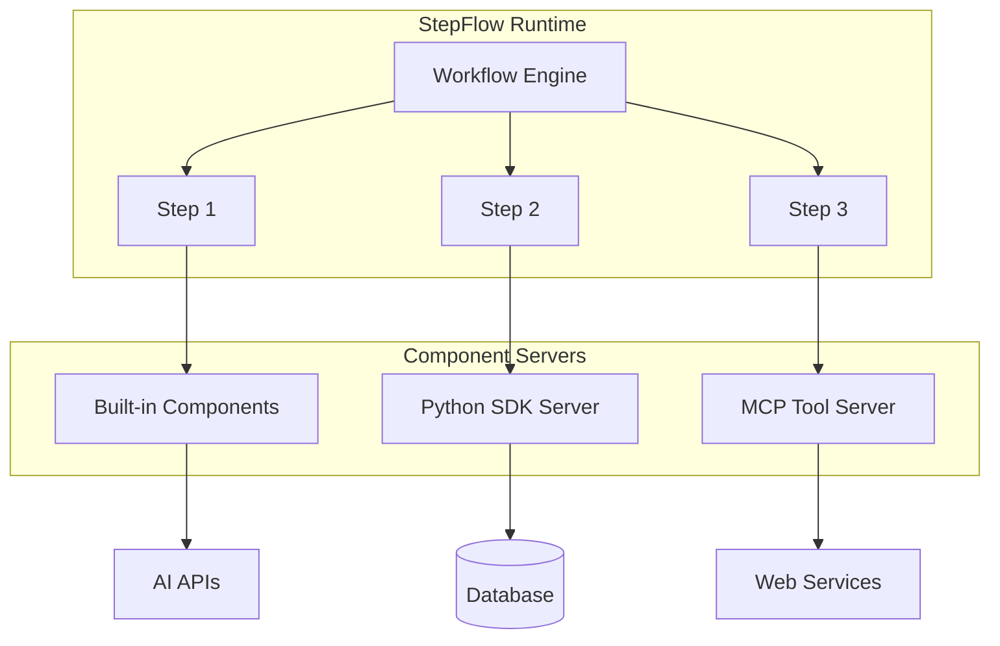

# Components Overview

Components are the fundamental building blocks of StepFlow workflows. Each step in a workflow executes a specific component that performs a discrete operation—from calling AI models and processing data to interacting with external services.

## What are Components?

Components are reusable, isolated units of functionality that:

- **Accept structured input** defined by JSON schemas
- **Perform specific operations** like API calls, data transformations, or computations
- **Return structured output** that can be used by subsequent steps
- **Run in isolation** from the StepFlow runtime for security and stability

## Component Architecture



## Types of Components

### 1. Built-in Components

StepFlow provides a comprehensive set of built-in components that handle common operations:

- **AI Integration**: `builtin://openai`, `builtin://create_messages`
- **Data Storage**: `builtin://put_blob`, `builtin://get_blob`
- **File Operations**: `builtin://load_file`
- **Workflow Control**: `builtin://eval` for nested workflows

[Learn more about built-in components →](./builtins.md)

### 2. Custom Components

Create your own components using StepFlow SDKs:

- **Python SDK**: Build components in Python with full async support
- **TypeScript SDK**: Create high-performance Node.js components (coming soon)
- **Any Language**: Implement the StepFlow Protocol directly

[Learn more about custom components →](../examples/custom-components.md).

### 3. MCP Tool Components

Use tools from Model Context Protocol (MCP) servers as components:

- Access file systems, databases, and APIs through MCP
- Leverage the growing ecosystem of MCP tools
- No additional wrapping needed—MCP tools work directly as components

[Learn more about MCP tools →](../examples/mcp-tools.md).

## How Components Work

### 1. Component Discovery

Components are made available through plugins configured in `stepflow-config.yml`:

```yaml
plugins:
  - name: builtin
    type: builtin
  - name: my_components
    type: stepflow
    transport: stdio
    command: python
    args: ["my_component_server.py"]
  - name: mcp_tools
    type: mcp
    command: npx
    args: ["-y", "@modelcontextprotocol/server-filesystem"]
```

### 2. Component Execution

When a workflow step executes:

1. StepFlow sends the input data to the component
2. The component processes the data in its isolated environment
3. The component returns structured output
4. Output becomes available for subsequent steps

### 3. Data Flow

Components communicate through structured JSON data:

```yaml
steps:
  - id: load_data
    component: /builtin/load_file
    input:
      path: "data.json"

  - id: process
    component: /my_components/analyze_text
    input:
      text: { $from: { step: load_data }, path: "data.content" }

  - id: store_result
    component: /builtin/put_blob
    input:
      data: { $from: { step: process } }
```

## Component Features

### Schema Validation

All component inputs and outputs are validated against JSON schemas:

- Ensures type safety across workflow steps
- Provides clear error messages for invalid data
- Enables IDE autocomplete and validation

### Async Support

Components can handle asynchronous operations efficiently:

- Make concurrent API calls
- Process data in parallel
- Handle long-running operations

### State Management

Components can interact with StepFlow's state system:

- Store intermediate results as blobs
- Retrieve previously stored data
- Share data across workflow executions

### Error Handling

Components provide structured error handling:

- Return specific error codes and messages
- Support retry logic and fallback behavior
- Maintain workflow stability on failures

## Getting Started

### Using Built-in Components

Start with StepFlow's built-in components for common tasks:

```yaml
name: "AI Analysis Workflow"
steps:
  - id: prepare_prompt
    component: /builtin/create_messages
    input:
      system_instructions: "You are a helpful assistant"
      user_prompt: "Analyze this text for sentiment"

  - id: call_ai
    component: /builtin/openai
    input:
      messages: { $from: { step: prepare_prompt }, path: "messages" }
      max_tokens: 150
```

### Creating Custom Components

Build your own components for specialized functionality:

1. Choose an SDK (Python, TypeScript, or implement the protocol directly)
2. Define input/output schemas
3. Implement the component logic
4. Configure the component server in `stepflow-config.yml`

[See custom component examples →](../examples/custom-components.md)

## Best Practices

### Component Design

- **Single Responsibility**: Each component should do one thing well
- **Clear Schemas**: Define precise input/output schemas
- **Error Handling**: Handle errors gracefully with informative messages
- **Performance**: Optimize for concurrent execution where possible

### Security

- Components run in isolated processes
- No direct access to the StepFlow runtime
- Limited to defined inputs and outputs
- Configurable permissions and capabilities

### Testing

- Unit test components independently
- Use mock contexts for testing
- Validate schemas and edge cases
- Test error conditions and timeouts

## Next Steps

- [Explore built-in components](./builtins.md) for common operations
- [Learn the StepFlow Protocol](../protocol/index.md) to build components in any language
- [See component examples](../examples/custom-components.md) for implementation patterns
- [Configure plugins](../runtime/config.md) to make components available to workflows