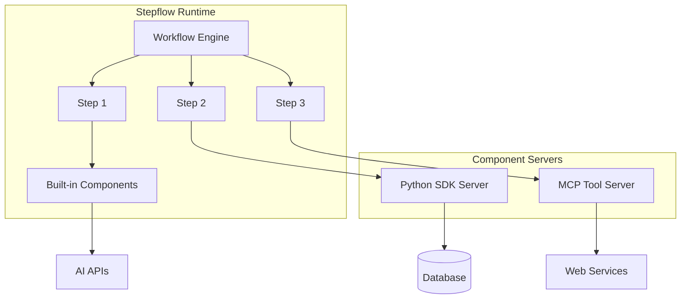

# Components Overview

Components are the building blocks of Stepflow workflows, providing the actual business logic that the workflow orchestrator coordinates.
Each step in a flow executes a specific component that implements a specific operation.

Stepflow provides a set of built-in components for common tasks, and the ability to create custom components using Stepflow SDKs or the Model Context Protocol (MCP). The Stepflow orchestrator manages the execution flow and data passing between components, while component servers handle the actual processing logic.

## Types of Components

### 1. Built-in Components

Stepflow provides a variety of built-in components that handle common operations:

- **Data Storage**: `/put_blob`, `/get_blob` for storing and retrieving data managed by the Stepflow runtime
- **AI Integration**: `/openai`, `/create_messages` demonstrating interaction with AI APIs
- **File Operations**: `/load_file` demonstrating interaction with the local file system
- **Workflow Control**: `/eval` for executing nested workflows

[Learn more about built-in components →](./builtins/index.md)

### 2. Stepflow Component Server

Use existing copmonent servers or create your own custom components using Stepflow SDKs:

- **Python SDK**: Build components in Python with full async support
- **TypeScript SDK**: Create high-performance Node.js components (coming soon)
- **Any Language**: Implement the Stepflow Protocol directly

[Learn more about component servers →](./component-server/index.md).

:::info User-Defined Functions (UDFs)
Many of the SDKs also support user-defined functions (UDFs).
These are typically impemented as a component provided by the SDK that takes code as an input and executes it.
[Learn more about user-defined functions →](./component-server/udfs.md).
:::

### 3. MCP Tool Components

Use tools from Model Context Protocol (MCP) servers as components:

- Access file systems, databases, and APIs through MCP
- Leverage the growing ecosystem of MCP tools
- No additional wrapping needed—MCP tools work directly as components

[Learn more about MCP tools →](./mcp-tools.md).

## Component Architecture

Stepflow's architecture separates the **workflow orchestrator** from **component servers**, enabling flexible deployment and scaling:

- **Orchestrator**: Manages workflow execution, data flow, and state persistence
- **Component Servers**: Provide business logic and can run locally or remotely

Most components run in separate processes, ensuring security and stability.
During development, the Stepflow orchestrator manages component server processes locally.
In production, component servers can be separately deployed and scaled across multiple machines or containers.
For instance, a component server running ML models can be deployed on GPU-enabled hardware while the orchestrator runs on standard compute nodes.

The diagram below shows how the Stepflow orchestrator interacts with multiple component servers.

## Next Steps

- [Explore built-in components](./builtins/index.md) for common operations
- [Learn how to create custom components](./component-server/custom-components.md) using Stepflow SDKs
- [Create steps](../flows/steps.md) to use components in a flow