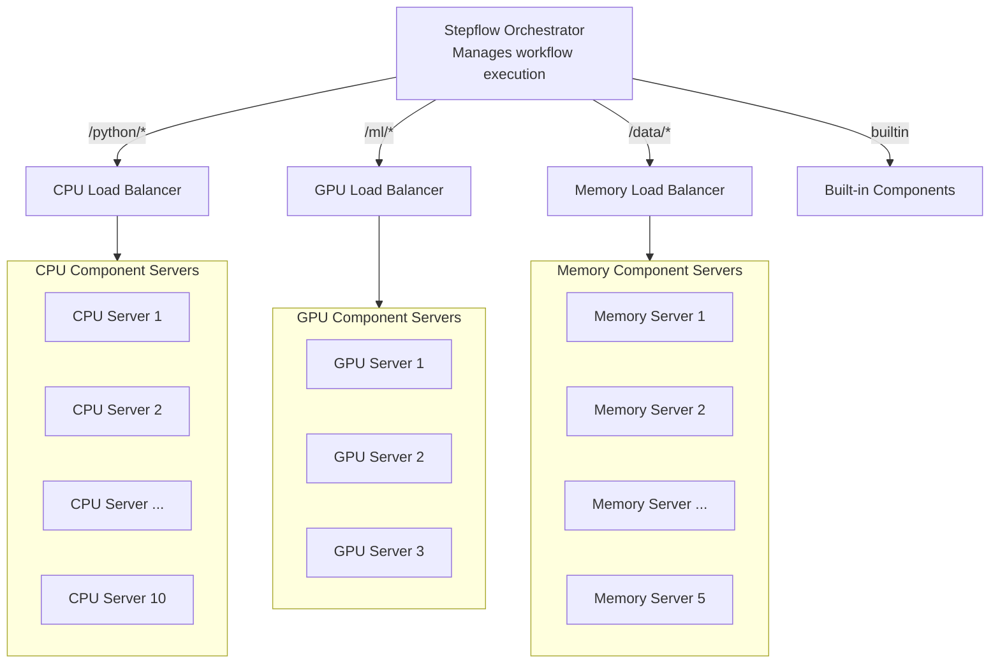

# Production Deployment

Stepflow's architecture enables flexible production deployments that scale component execution independently from workflow orchestration. This section covers key concepts and components for deploying Stepflow in production environments.

## Overview

In production, Stepflow separates concerns between:

- **Workflow Orchestrator**: Manages workflow execution, data flow, and state persistence
- **Component Servers**: Provide business logic and can be scaled independently
- **Load Balancer**: Routes requests to component servers with SSE support and instance affinity

This separation allows you to:
- Scale different types of components independently based on resource requirements
- Deploy components on specialized hardware (GPUs, high-memory nodes, etc.)
- Maintain simple orchestration while distributing compute-intensive work
- Handle high-throughput batch processing efficiently

## Architecture Patterns

### Resource-Based Component Segregation

Different component servers can be deployed with different resource profiles:

```yaml
# Configuration routing to different component server classes
plugins:
  builtin:
    type: builtin
  
  # CPU-intensive components
  cpu_components:
    type: stepflow
    url: "http://cpu-components-lb.stepflow.svc.cluster.local:8080"

  # GPU-accelerated components (ML models)
  gpu_components:
    type: stepflow
    url: "http://gpu-components-lb.stepflow.svc.cluster.local:8080"

  # Memory-intensive components (large data processing)
  memory_components:
    type: stepflow
    url: "http://memory-components-lb.stepflow.svc.cluster.local:8080"

routes:
  "/ml/{*component}":
    - plugin: gpu_components
  "/data/{*component}":
    - plugin: memory_components
  "/python/{*component}":
    - plugin: cpu_components
  "/{*component}":
    - plugin: builtin
```

### Deployment Topology



Each component server class:
- Has its own load balancer for intelligent routing
- Scales independently based on workload
- Runs on appropriate hardware (CPU, GPU, high-memory nodes)
- Maintains instance affinity for bidirectional communication

## Key Components

### 1. Load Balancer

The [Stepflow Load Balancer](./load-balancer.md) provides:
- SSE-aware load balancing for streaming responses
- Instance affinity routing for bidirectional communication
- Automatic backend discovery via DNS
- Health checking and failover

**Use cases:**
- Distributing requests across multiple component server pods
- Maintaining connection affinity for stateful operations
- Enabling horizontal scaling of component servers

### 2. Component Server Classes

Deploy different component servers for different workloads:

**CPU-Optimized:**
- General-purpose Python components
- Data transformation and validation
- API integrations
- Deployment: Standard compute nodes, high replica count

**GPU-Accelerated:**
- ML model inference
- Image/video processing
- Large language models
- Deployment: GPU nodes, fewer replicas, higher cost

**Memory-Intensive:**
- Large dataset processing
- In-memory caching
- Data aggregation
- Deployment: High-memory nodes, moderate replica count

### 3. Configuration Management

Use [Configuration](../configuration.md) and [Variables](../flows/variables.md) to manage environment-specific settings:

**Configuration** controls infrastructure:
- Define plugin routes to different component server classes
- Configure state storage backends
- Set component server connection details

**Variables** parameterize workflows:
- API endpoints and credentials that differ between environments
- Feature flags and configuration options
- Resource limits and timeouts
- Environment identifiers (dev, staging, production)

This separation allows the same workflow definition to run across environments by only changing configuration and variables, not the workflow itself.

## Example: Kubernetes Deployment

The [Kubernetes Batch Demo](https://github.com/stepflow-ai/stepflow/tree/main/examples/kubernetes-batch-demo) provides a complete working example of:

- Stepflow orchestrator deployed in Kubernetes
- Multiple component server replicas with load balancing
- SSE-aware load balancer with instance affinity
- Batch execution with distributed compute
- Health checking and automatic failover

**Key features demonstrated:**
- Component servers scale from 3 to 20+ replicas
- Load balancer distributes requests evenly
- Bidirectional communication (blob storage) works correctly
- Batch workflows process 1000+ items efficiently

## Scaling Strategies

### Horizontal Scaling

Scale component servers based on load:

```yaml
# Kubernetes HorizontalPodAutoscaler
apiVersion: autoscaling/v2
kind: HorizontalPodAutoscaler
metadata:
  name: cpu-components
spec:
  scaleTargetRef:
    apiVersion: apps/v1
    kind: Deployment
    name: cpu-components
  minReplicas: 5
  maxReplicas: 50
  metrics:
  - type: Resource
    resource:
      name: cpu
      target:
        type: Utilization
        averageUtilization: 70
```

### Resource-Based Routing

Route components to appropriate hardware:

```yaml
# GPU component server deployment
spec:
  template:
    spec:
      nodeSelector:
        accelerator: nvidia-tesla-v100
      containers:
      - name: gpu-components
        resources:
          limits:
            nvidia.com/gpu: 1
```

### Load Balancer Scaling

Scale load balancers independently:

```yaml
# Load balancer deployment
spec:
  replicas: 2  # Start with 2 for HA
  # Scale up to 10 based on connection count
```

## State Management

### Development
- In-memory state store
- Single orchestrator instance
- Fast, simple, ephemeral

### Production
- SQLite or PostgreSQL state store
- Persistent workflow state
- Multiple orchestrator instances (with PostgreSQL)
- Durable execution with fault tolerance

See [Configuration - State Store](../configuration.md#state-store-configuration) for details.

## Best Practices

### 1. Separate Component Classes

Group components by resource requirements:
- **Light**: API calls, simple transformations → CPU servers
- **Medium**: Data processing, batch operations → Memory servers  
- **Heavy**: ML inference, GPU workloads → GPU servers

### 2. Use Load Balancers

Deploy load balancers for each component class:
- Enables horizontal scaling
- Provides health checking
- Maintains instance affinity
- Simplifies configuration

### 3. Monitor and Scale

Track key metrics:
- Component server CPU/memory usage
- Request latency and throughput
- Error rates and health status
- Queue depths and backpressure

### 4. Plan for Failures

Design for resilience:
- Multiple load balancer replicas
- Health checks with automatic failover
- Retry logic in workflows
- Persistent state storage

## Next Steps

- **[Load Balancer](./load-balancer.md)** - Detailed load balancer documentation
- **[Configuration](../configuration.md)** - Configure routing and plugins
- **[Variables](../flows/variables.md)** - Environment-specific workflow parameters
- **[Batch Execution](../flows/batch-execution.md)** - High-throughput processing patterns
- **[Kubernetes Example](https://github.com/stepflow-ai/stepflow/tree/main/examples/kubernetes-batch-demo)** - Complete working example

## Future Topics

This section will be expanded with:
- Multi-region deployments
- Service mesh integration
- Observability and monitoring
- Security and authentication
- CI/CD pipelines
- Cost optimization strategies