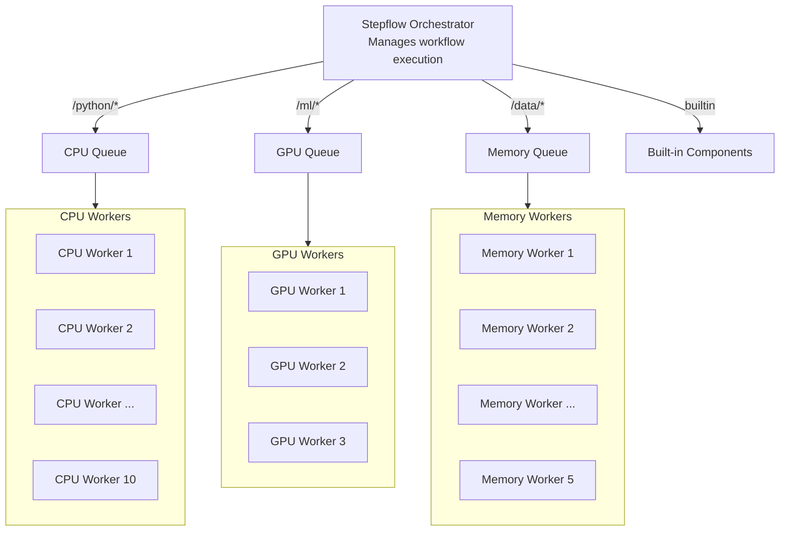

# Production Deployment

Stepflow's architecture enables flexible production deployments that scale component execution independently from workflow orchestration. This section covers key concepts and components for deploying Stepflow in production environments.

## Overview

In production, Stepflow separates concerns between:

- **Workflow Orchestrator**: Manages workflow execution, data flow, and state persistence
- **Workers**: Provide business logic and can be scaled independently
- **Task Queues**: Route tasks to workers via named gRPC queues

This separation allows you to:
- Scale different types of components independently based on resource requirements
- Deploy components on specialized hardware (GPUs, high-memory nodes, etc.)
- Maintain simple orchestration while distributing compute-intensive work
- Handle high-throughput batch processing efficiently

## Architecture Patterns

### Resource-Based Component Segregation

Different workers can be deployed with different resource profiles:

```yaml
# Configuration routing to different worker pools
plugins:
  builtin:
    type: builtin
  
  # CPU-intensive components
  cpu_components:
    type: grpc
    queueName: cpu

  # GPU-accelerated components (ML models)
  gpu_components:
    type: grpc
    queueName: gpu

  # Memory-intensive components (large data processing)
  memory_components:
    type: grpc
    queueName: memory

routes:
  "/ml/{*component}":
    - plugin: gpu_components
  "/data/{*component}":
    - plugin: memory_components
  "/python/{*component}":
    - plugin: cpu_components
  "/{*component}":
    - plugin: builtin
```

### Deployment Topology


```mermaid
flowchart TB
    Orch[Stepflow Orchestrator<br/>Manages workflow execution]
    
    Orch -->|/python/*| CPULB[CPU Queue]
    Orch -->|/ml/*| GPULB[GPU Queue]
    Orch -->|/data/*| MemLB[Memory Queue]
    Orch -->|builtin| Builtin[Built-in Components]
    
    subgraph CPU[CPU Workers]
        CPU1[CPU Worker 1]
        CPU2[CPU Worker 2]
        CPU3[CPU Worker ...]
        CPU4[CPU Worker 10]
    end

    subgraph GPU[GPU Workers]
        GPU1[GPU Worker 1]
        GPU2[GPU Worker 2]
        GPU3[GPU Worker 3]
    end

    subgraph MEM[Memory Workers]
        MEM1[Memory Worker 1]
        MEM2[Memory Worker 2]
        MEM3[Memory Worker ...]
        MEM4[Memory Worker 5]
    end
    
    CPULB --> CPU
    GPULB --> GPU
    MemLB --> MEM
```

Each worker pool:
- Pulls tasks from a dedicated named queue
- Scales independently based on workload
- Runs on appropriate hardware (CPU, GPU, high-memory nodes)
- Communicates with the orchestrator via gRPC

## Key Components

### 1. Task Routing

Workers connect to the orchestrator's `TasksService` and pull tasks from named queues. The gRPC pull-based protocol provides:
- Named queue-based task routing
- Heartbeat-based crash detection
- Automatic retry on transport failures
- Horizontal scaling across multiple worker instances

**Use cases:**
- Distributing tasks across multiple worker pods
- Scaling worker pools independently
- Enabling horizontal scaling of workers

### 2. Worker Pools

Deploy different workers for different workloads:

**CPU-Optimized:**
- General-purpose Python components
- Data transformation and validation
- API integrations
- Deployment: Standard compute nodes, high replica count

**GPU-Accelerated:**
- ML model inference
- Image/video processing
- Large language models
- Deployment: GPU nodes, fewer replicas, higher cost

**Memory-Intensive:**
- Large dataset processing
- In-memory caching
- Data aggregation
- Deployment: High-memory nodes, moderate replica count

### 3. Configuration Management

Use [Configuration](../configuration.md) and [Variables](../flows/variables.md) to manage environment-specific settings:

**Configuration** controls infrastructure:
- Define plugin routes to different worker pools
- Configure state storage backends
- Set worker connection details

**Variables** parameterize workflows:
- API endpoints and credentials that differ between environments
- Feature flags and configuration options
- Resource limits and timeouts
- Environment identifiers (dev, staging, production)

This separation allows the same workflow definition to run across environments by only changing configuration and variables, not the workflow itself.

## Example: Kubernetes Deployment

The [Kubernetes Batch Demo](https://github.com/stepflow-ai/stepflow/tree/main/examples/kubernetes-batch-demo) provides a complete working example of:

- Stepflow orchestrator deployed in Kubernetes
- Multiple worker replicas pulling from named queues
- gRPC-based task dispatch and completion
- Batch execution with distributed compute
- Heartbeat-based health monitoring and automatic failover

**Key features demonstrated:**
- Workers scale from 3 to 20+ replicas
- Tasks distributed across worker pool via named queues
- Bidirectional communication (sub-run submission) works correctly
- Batch workflows process 1000+ items efficiently

## Scaling Strategies

### Horizontal Scaling

Scale workers based on load:

```yaml
# Kubernetes HorizontalPodAutoscaler
apiVersion: autoscaling/v2
kind: HorizontalPodAutoscaler
metadata:
  name: cpu-components
spec:
  scaleTargetRef:
    apiVersion: apps/v1
    kind: Deployment
    name: cpu-components
  minReplicas: 5
  maxReplicas: 50
  metrics:
  - type: Resource
    resource:
      name: cpu
      target:
        type: Utilization
        averageUtilization: 70
```

### Resource-Based Routing

Route components to appropriate hardware:

```yaml
# GPU worker deployment
spec:
  template:
    spec:
      nodeSelector:
        accelerator: nvidia-tesla-v100
      containers:
      - name: gpu-components
        resources:
          limits:
            nvidia.com/gpu: 1
```

## State Management

### Development
- In-memory state store
- Single orchestrator instance
- Fast, simple, ephemeral

### Production
- SQLite or PostgreSQL state store
- Persistent workflow state
- Multiple orchestrator instances (with PostgreSQL)
- Durable execution with fault tolerance

See [Persistence and Recovery](./persistence-recovery.md) for the full architecture, and [Configuration - State Store](../configuration.md#state-store-configuration) for configuration options.

## Best Practices

### 1. Separate Component Classes

Group components by resource requirements:
- **Light**: API calls, simple transformations → CPU workers
- **Medium**: Data processing, batch operations → Memory workers
- **Heavy**: ML inference, GPU workloads → GPU workers

### 2. Use Named Queues

Configure separate named queues for each component class:
- Enables horizontal scaling per worker pool
- Provides heartbeat-based health monitoring
- Automatic crash detection and retry
- Simplifies configuration

### 3. Monitor and Scale

Track key metrics:
- Worker CPU/memory usage
- Request latency and throughput
- Error rates and health status
- Queue depths and backpressure

### 4. Plan for Failures

Design for resilience:
- Multiple load balancer replicas
- Health checks with automatic failover
- Retry logic in workflows
- Persistent state storage

## Next Steps

- **[Persistence and Recovery](./persistence-recovery.md)** - Durable execution and crash recovery
- **[Load Balancer](./load-balancer.md)** - Detailed load balancer documentation
- **[Configuration](../configuration.md)** - Configure routing and plugins
- **[Variables](../flows/variables.md)** - Environment-specific workflow parameters
- **[Batch Execution](../flows/batch-execution.md)** - High-throughput processing patterns
- **[Kubernetes Example](https://github.com/stepflow-ai/stepflow/tree/main/examples/kubernetes-batch-demo)** - Complete working example

## Learn More

- Read the [FAQ](../faq.md) for comparisons with other orchestration and workflow technologies
- Learn about the [Stepflow Protocol](../protocol/index.md) that enables this architecture

## Future Topics

This section will be expanded with:
- Multi-region deployments
- Service mesh integration
- Observability and monitoring
- Security and authentication
- CI/CD pipelines
- Cost optimization strategies