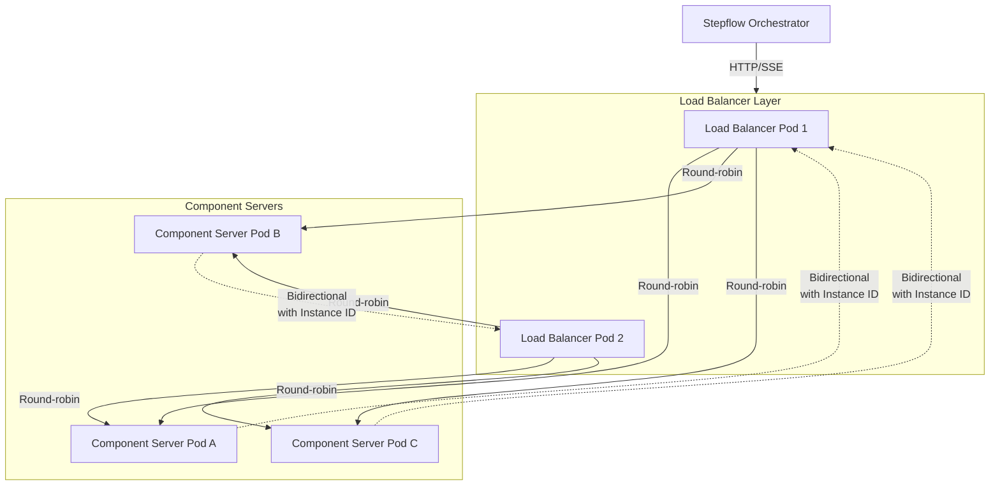

# Stepflow Load Balancer

The Stepflow Load Balancer is a high-performance, SSE-aware load balancer built with Pingora (Rust) that enables distributed component server deployments in production environments. It provides intelligent routing with instance affinity for bidirectional communication patterns.

## Overview

The load balancer sits between the Stepflow orchestrator and component server pods, providing:

- **Backend Discovery**: Automatic discovery of component server instances via DNS
- **Health Checking**: Continuous health monitoring of backend servers
- **Load Distribution**: Round-robin and least-connections algorithms
- **SSE Streaming**: Native Server-Sent Events (SSE) support with stream preservation
- **Instance Affinity**: Routes bidirectional requests back to the correct component instance
- **High Performance**: Async Rust implementation with low latency overhead

## Architecture



## Key Features

### 1. SSE-Aware Load Balancing

Unlike traditional load balancers, the Stepflow Load Balancer understands Server-Sent Events:

- **Stream Detection**: Automatically detects SSE responses by `Content-Type: text/event-stream`
- **Stream Preservation**: Maintains long-lived connections without timeouts
- **Chunked Transfer**: Properly handles chunked transfer encoding for SSE
- **Backpressure Handling**: Manages flow control between upstream and downstream

### 2. Instance Affinity Routing

Enables bidirectional communication between component servers and the orchestrator:

**How it works:**
1. Component server sends SSE response with `Stepflow-Instance-Id` header
2. Orchestrator stores the instance ID for that execution
3. When component makes callback (e.g., blob storage), orchestrator includes instance ID
4. Load balancer routes the response back to the specific component instance

**Example flow:**
```
Initial Request:
Orchestrator → Load Balancer → Component Pod-A
                (round-robin)

SSE Response:
Component Pod-A → Load Balancer → Orchestrator
(includes: Stepflow-Instance-Id: pod-A)

Bidirectional Callback:
Orchestrator → Load Balancer → Component Pod-A
(includes: Stepflow-Instance-Id: pod-A)  ↑
                                    (affinity routing)
```

### 3. Backend Discovery

Automatically discovers component server instances:

- **DNS-Based**: Queries Kubernetes headless service for pod IPs
- **Dynamic Updates**: Detects new pods and removed pods
- **Health-Based**: Only routes to healthy backends
- **No Configuration**: No need to manually configure backend addresses

### 4. Health Checking

Continuous monitoring of backend health:

- **Active Checks**: Periodic health endpoint polling
- **Passive Checks**: Monitors request success/failure rates
- **Automatic Recovery**: Unhealthy backends automatically removed and re-added
- **Configurable**: Health check interval and failure thresholds

## Deployment

### Kubernetes Deployment

```yaml
apiVersion: apps/v1
kind: Deployment
metadata:
  name: stepflow-load-balancer
  namespace: stepflow
spec:
  replicas: 2  # High availability
  selector:
    matchLabels:
      app: stepflow-load-balancer
  template:
    metadata:
      labels:
        app: stepflow-load-balancer
    spec:
      containers:
      - name: load-balancer
        image: ghcr.io/stepflow-ai/stepflow/stepflow-load-balancer:alpine-0.6.0
        ports:
        - name: http
          containerPort: 8080
        env:
        - name: UPSTREAM_SERVICE
          value: "component-server.stepflow.svc.cluster.local:8080"
        - name: RUST_LOG
          value: "info"
        resources:
          requests:
            cpu: 100m
            memory: 128Mi
          limits:
            cpu: 500m
            memory: 256Mi
        livenessProbe:
          tcpSocket:
            port: http
          initialDelaySeconds: 10
          periodSeconds: 30
        readinessProbe:
          tcpSocket:
            port: http
          initialDelaySeconds: 5
          periodSeconds: 10
---
apiVersion: v1
kind: Service
metadata:
  name: stepflow-load-balancer
  namespace: stepflow
spec:
  selector:
    app: stepflow-load-balancer
  ports:
  - name: http
    port: 8080
    targetPort: http
  type: ClusterIP
```

### Configuration

The load balancer is configured via environment variables:

| Variable | Description | Default | Required |
|----------|-------------|---------|----------|
| `UPSTREAM_SERVICE` | DNS name and port of component server service | - | Yes |
| `RUST_LOG` | Log level (error, warn, info, debug, trace) | `info` | No |
| `HEALTH_CHECK_INTERVAL` | Health check interval in seconds | `10` | No |
| `HEALTH_CHECK_TIMEOUT` | Health check timeout in seconds | `5` | No |
| `MAX_FAILURES` | Max consecutive failures before marking unhealthy | `3` | No |

**Example:**
```yaml
env:
- name: UPSTREAM_SERVICE
  value: "component-server.stepflow.svc.cluster.local:8080"
- name: RUST_LOG
  value: "debug"
- name: HEALTH_CHECK_INTERVAL
  value: "15"
```

### Stepflow Configuration

Configure the Stepflow orchestrator to route through the load balancer:

```yaml
# stepflow-config.yml
plugins:
  builtin:
    type: builtin
  
  k8s_components:
    type: stepflow
    transport: http
    url: "http://stepflow-load-balancer.stepflow.svc.cluster.local:8080"

routes:
  "/python/{*component}":
    - plugin: k8s_components
  "/{*component}":
    - plugin: builtin
```

## Use Cases

### 1. Distributed Component Execution

Scale component servers independently from the orchestrator:

```yaml
# Component servers: 10 replicas
# Load balancer: 2 replicas
# Orchestrator: 1 replica

# Handles 1000+ concurrent component executions
# Distributes load across all component server pods
```

### 2. High-Throughput Batch Processing

Process large batches with distributed compute:

```yaml
# Batch workflow with 10,000 items
# Component servers: 20 replicas
# Each server handles ~500 items
# Load balancer distributes evenly
```

### 3. Bidirectional Component Operations

Components that need to call back to the orchestrator:

```python
# Component that stores blobs during execution
@server.component
async def process_with_storage(input: Input, ctx: StepflowContext) -> Output:
    # Process data
    result = process(input.data)
    
    # Store intermediate result (bidirectional call)
    blob_id = await ctx.put_blob(result)
    
    # Continue processing
    final_result = finalize(blob_id)
    return Output(result=final_result)
```

The load balancer ensures the blob storage response routes back to the correct component instance.

### 4. Multi-Region Deployments

Deploy component servers in different regions:

```yaml
# Region A: Load balancer + Component servers
# Region B: Load balancer + Component servers
# Orchestrator routes to nearest load balancer
```

## Performance Characteristics

### Latency

- **Overhead**: ~1-2ms per request (Rust async)
- **SSE Streaming**: Near-zero latency for stream forwarding
- **Instance Routing**: ~0.5ms additional for affinity lookup

### Throughput

- **Requests/sec**: ~10,000 per load balancer pod
- **Concurrent Connections**: ~5,000 per pod
- **SSE Streams**: ~1,000 concurrent streams per pod

### Resource Usage

- **CPU**: 100m baseline, 500m under load
- **Memory**: 128Mi baseline, 256Mi under load
- **Network**: Minimal overhead (async forwarding)

## Monitoring

### Health Endpoint

The load balancer exposes a health endpoint:

```bash
curl http://load-balancer:8080/health
```

Response:
```json
{
  "status": "healthy",
  "backends": {
    "total": 3,
    "healthy": 3,
    "unhealthy": 0
  }
}
```

### Metrics

Key metrics to monitor:

- **Backend Health**: Number of healthy vs unhealthy backends
- **Request Rate**: Requests per second through load balancer
- **Error Rate**: Failed requests (5xx responses)
- **Latency**: P50, P95, P99 request latency
- **Active Connections**: Current open connections

### Logging

Configure log level via `RUST_LOG`:

```yaml
env:
- name: RUST_LOG
  value: "stepflow_load_balancer=debug,pingora=info"
```

**Log levels:**
- `error`: Only errors
- `warn`: Warnings and errors
- `info`: General information (default)
- `debug`: Detailed debugging
- `trace`: Very verbose (includes all requests)

## Troubleshooting

### No Backends Available

**Symptom**: Load balancer returns 503 Service Unavailable

**Causes:**
1. Component server pods not running
2. DNS resolution failing
3. All backends failing health checks

**Solutions:**
```bash
# Check component server pods
kubectl get pods -l app=component-server

# Check DNS resolution
kubectl run -it --rm debug --image=curlimages/curl --restart=Never -- \
  nslookup component-server.stepflow.svc.cluster.local

# Check load balancer logs
kubectl logs -l app=stepflow-load-balancer
```

### Instance Affinity Not Working

**Symptom**: Bidirectional requests fail or timeout

**Causes:**
1. Component server not sending `Stepflow-Instance-Id` header
2. Orchestrator not including instance ID in callbacks
3. Backend pod restarted (instance ID changed)

**Solutions:**
```bash
# Verify component server sends instance ID
kubectl logs -l app=component-server | grep "Stepflow-Instance-Id"

# Check load balancer routing logs
kubectl logs -l app=stepflow-load-balancer | grep "instance_id"

# Verify SSE stream headers
curl -N http://component-server:8080/... -v
```

### High Latency

**Symptom**: Requests taking longer than expected

**Causes:**
1. Backend servers overloaded
2. Network congestion
3. Health check failures causing retries

**Solutions:**
```bash
# Check backend CPU/memory
kubectl top pods -l app=component-server

# Scale component servers
kubectl scale deployment component-server --replicas=10

# Check load balancer metrics
kubectl logs -l app=stepflow-load-balancer | grep "latency"
```

## Best Practices

### 1. High Availability

Deploy multiple load balancer replicas:

```yaml
spec:
  replicas: 2  # Minimum for HA
```

### 2. Resource Limits

Set appropriate resource limits:

```yaml
resources:
  requests:
    cpu: 100m      # Baseline
    memory: 128Mi
  limits:
    cpu: 500m      # Burst capacity
    memory: 256Mi
```

### 3. Health Checks

Configure health checks for both load balancer and backends:

```yaml
# Load balancer health
livenessProbe:
  tcpSocket:
    port: http
  initialDelaySeconds: 10
  periodSeconds: 30

# Backend health checks via env vars
env:
- name: HEALTH_CHECK_INTERVAL
  value: "10"
- name: MAX_FAILURES
  value: "3"
```

### 4. Logging

Use structured logging in production:

```yaml
env:
- name: RUST_LOG
  value: "info"  # Avoid debug/trace in production
```

### 5. Scaling

Scale load balancer based on connection count:

```yaml
# Horizontal Pod Autoscaler
apiVersion: autoscaling/v2
kind: HorizontalPodAutoscaler
metadata:
  name: stepflow-load-balancer
spec:
  scaleTargetRef:
    apiVersion: apps/v1
    kind: Deployment
    name: stepflow-load-balancer
  minReplicas: 2
  maxReplicas: 10
  metrics:
  - type: Resource
    resource:
      name: cpu
      target:
        type: Utilization
        averageUtilization: 70
```

## Comparison with Alternatives

### vs. NGINX

| Feature | Stepflow Load Balancer | NGINX |
|---------|----------------------|-------|
| SSE Support | Native, optimized | Basic, requires tuning |
| Instance Affinity | Built-in | Requires custom config |
| Backend Discovery | Automatic (DNS) | Manual configuration |
| Performance | ~10k req/s | ~10k req/s |
| Resource Usage | Low (Rust async) | Low |
| Configuration | Environment vars | Config files |

**When to use Stepflow Load Balancer:**
- Need SSE streaming support
- Require instance affinity routing
- Want automatic backend discovery
- Prefer minimal configuration

**When to use NGINX:**
- Need advanced routing rules
- Require TLS termination
- Want mature ecosystem
- Need HTTP/2 or HTTP/3

### vs. Kubernetes Service

| Feature | Stepflow Load Balancer | K8s Service |
|---------|----------------------|-------------|
| Load Balancing | Round-robin + least-conn | Round-robin only |
| Instance Affinity | Yes | Session affinity only |
| Health Checking | Active + passive | Readiness probes |
| SSE Streaming | Optimized | Works but not optimized |

**When to use Stepflow Load Balancer:**
- Need instance affinity for bidirectional communication
- Want advanced load balancing algorithms
- Require SSE-specific optimizations

**When to use K8s Service:**
- Simple load balancing sufficient
- No bidirectional communication
- Prefer native Kubernetes primitives

## Related Documentation

- [Batch Execution](../flows/batch-execution.md) - High-throughput batch processing
- [Configuration](../configuration.md) - Stepflow configuration for distributed deployments
- [Kubernetes Example](https://github.com/stepflow-ai/stepflow/tree/main/examples/kubernetes-batch-demo) - Complete working example