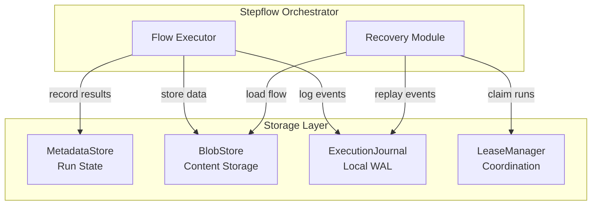
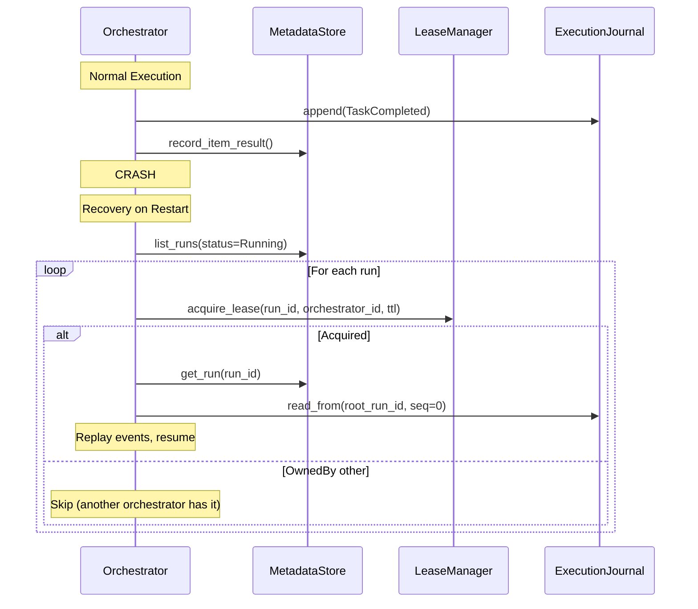
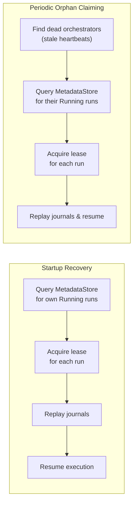

# Persistence and Recovery

Stepflow provides durable workflow execution through a modular persistence architecture. This enables workflows to survive process restarts, crashes, and distributed orchestration across multiple nodes.

## Architecture Overview

The persistence system is built on three core abstractions:



| Trait | Purpose | Scope |
|-------|---------|-------|
| **MetadataStore** | Durable storage of runs and results | Global (shared across orchestrators) |
| **BlobStore** | Content-addressed data storage | Global (shared across orchestrators) |
| **ExecutionJournal** | Write-ahead log of execution events | Local (per-orchestrator, for recovery) |
| **LeaseManager** | Run ownership coordination | Global (for distributed deployments) |

## MetadataStore

The MetadataStore handles durable storage of workflow execution state:

- **Runs**: Workflow execution records with status, metadata, and orchestrator ownership
- **Item Results**: Per-item outputs for batch workflows
- **Orchestrator Tracking**: Each run record stores which orchestrator owns it (`orchestrator_id`), enabling targeted recovery queries

## BlobStore

The BlobStore provides content-addressed storage for immutable data:

- **Flow Definitions**: Workflow YAML/JSON stored by content hash
- **Inputs/Outputs**: Step inputs and outputs for inspection and debugging
- **Data Blobs**: Arbitrary JSON data stored by components

```yaml
# SQLite configuration (recommended for single-node)
storageConfig:
  type: sqlite
  databaseUrl: "sqlite:/path/to/stepflow.db?mode=rwc"
  autoMigrate: true
  maxConnections: 10
```

### Available Implementations

| Implementation | Use Case |
|---------------|----------|
| **InMemory** | Development, testing, ephemeral workflows |
| **SQLite** | Single-node production, durable local storage |

Future implementations will include NATS KV, PostgreSQL and other databases for distributed deployments.

## ExecutionJournal

The ExecutionJournal provides write-ahead logging of execution events. Events are recorded as tasks complete, enabling state reconstruction after a crash. The journal only stores state-changing events (task completions, run lifecycle) - not informational events like task starts.

### Journal Organization

Journals are keyed by `root_run_id`, meaning all events for an execution tree (parent flow + all subflows) are stored in a single journal. This design provides:

- **Unified sequence space**: Total ordering across all runs in the tree
- **Simplified recovery**: Load one journal to reconstruct the entire execution tree
- **Atomic garbage collection**: Delete one journal when the root run completes

Each journal entry contains both `run_id` (the specific run) and `root_run_id` (the journal key), allowing filtering during replay:

```rust
struct JournalEntry {
    run_id: Uuid,       // Specific run this event belongs to
    root_run_id: Uuid,  // Journal key (same for all entries in tree)
    timestamp: DateTime<Utc>,
    event: JournalEvent,
}
```

Subflows are identified by their `RunCreated` event with `parent_run_id` set, rather than a separate event type.

### How Journal Recovery Works

1. **During Execution**: Events are appended to the journal as workflow progresses
2. **On Startup**: Journal entries are replayed to reconstruct in-progress run state
3. **After Recovery**: Execution resumes from where it left off



### Journal Configuration

Both InMemoryStateStore and SqliteStateStore implement ExecutionJournal. The journal is automatically enabled when you configure a state store:

```yaml
# Journal is automatically available with SQLite
storageConfig:
  type: sqlite
  databaseUrl: "sqlite:stepflow.db?mode=rwc"
  autoMigrate: true
```

## LeaseManager

The LeaseManager coordinates run ownership in multi-orchestrator deployments:

- **Lease Acquisition**: Ensures only one orchestrator executes a given run
- **Ownership Enforcement**: Only the lease owner can renew or release a lease
- **Heartbeats**: Track active orchestrators with configurable TTL
- **Graceful Shutdown**: Release all leases at once so other orchestrators can immediately reclaim runs

```rust
// Lease lifecycle
trait LeaseManager {
    fn acquire_lease(run_id, orchestrator_id, ttl) -> LeaseResult;
    fn renew_lease(run_id, orchestrator_id, ttl) -> LeaseResult;
    fn release_lease(run_id, orchestrator_id);
    fn release_all(orchestrator_id);           // graceful shutdown
    fn heartbeat(orchestrator_id, ttl);
    fn get_lease(run_id) -> Option<LeaseInfo>;
    fn list_orchestrators() -> Vec<OrchestratorInfo>;
    fn watch_orphans() -> Option<Receiver<Uuid>>; // push-based orphan detection
}
```

The lease manager is intentionally kept focused on coordination primitives — it does **not** query the metadata store or journal. Recovery logic lives in the recovery module and uses the metadata store as the source of truth for identifying runs that need recovery (see [Recovery Process](#recovery-process) below).

### Ownership Semantics

Lease operations enforce ownership:

- **acquire_lease**: If the run is already leased by a different orchestrator, returns `OwnedBy { owner, expires_at }` instead of acquiring. Re-acquiring your own lease (same owner) succeeds.
- **renew_lease**: Fails with `NotOwner` if called by a non-owner.
- **release_lease**: Fails with `NotOwner` if called by a non-owner.
- **release_all**: Releases all leases for the given orchestrator in a single operation.

These semantics are enforced by the compliance test suite, which all implementations must pass.

### Configuration

For single-node deployments, the default `NoOpLeaseManager` is used:

```yaml
# Default: No lease management (single orchestrator)
leaseManager:
  type: none
```

Future implementations will include etcd-based lease management for distributed deployments. The trait is designed to align with distributed coordination systems like etcd, which use native TTL-based leases — when an orchestrator crashes, its leases expire and attached keys are automatically deleted.

### Recovery Configuration

Configure how the orchestrator handles recovery on startup and during execution:

```yaml
recovery:
  # Enable periodic orphan claiming during execution (default: true)
  enabled: true

  # Interval between orphan check attempts in seconds (default: 30)
  checkIntervalSecs: 30

  # Maximum runs to recover on startup (default: 100)
  maxStartupRecovery: 100

  # Maximum orphaned runs to claim per check interval (default: 10)
  maxClaimsPerCheck: 10
```

| Setting | Default | Description |
|---------|---------|-------------|
| `enabled` | `true` | Enable periodic orphan claiming during execution |
| `checkIntervalSecs` | `30` | Seconds between orphan check attempts |
| `maxStartupRecovery` | `100` | Maximum runs to recover when orchestrator starts |
| `maxClaimsPerCheck` | `10` | Maximum orphans to claim in each periodic check |

**Why periodic claiming?** When orchestrators scale down or crash, their runs become orphaned. Periodic claiming allows remaining orchestrators to pick up these runs without requiring a restart.

## Recovery Process

Recovery happens in two situations:

1. **On Startup**: The orchestrator recovers any pending runs from the journal
2. **During Execution**: A background task periodically checks for orphaned runs



### How Recovery Identifies and Claims Runs

Each run record in the MetadataStore tracks which orchestrator owns it (`orchestrator_id`). This enables efficient, targeted recovery queries instead of scanning all running runs.

**Startup recovery** (orchestrator restarts with same ID):

1. Query MetadataStore for runs with `Running` status **and** `orchestrator_id = self`
2. **Acquire a lease** for each via the LeaseManager — same-owner acquire succeeds immediately
3. Load the flow definition from the BlobStore
4. Replay journal events to reconstruct in-memory state
5. Resume execution from where it left off

**Periodic orphan claiming** (another orchestrator died):

1. Check `list_orchestrators()` for stale heartbeats to identify dead orchestrators
2. Query MetadataStore for runs with `Running` status **and** `orchestrator_id = dead_orch`
3. **Acquire a lease** for each — succeeds because the dead orchestrator's leases have expired
4. Update the run's `orchestrator_id` to self
5. Load, replay, and resume as above

Lease acquisition happens **before** loading run details, so only the lease holder pays the cost of journal replay and flow loading.

This design separates concerns cleanly:
- The **MetadataStore** knows which runs exist, their status, and which orchestrator owns them
- The **LeaseManager** handles coordination (lease safety) — but does not query metadata
- The **Recovery module** combines both to safely resume interrupted runs

### Self-Healing Ownership

The **LeaseManager is the source of truth** for run ownership. The `orchestrator_id` on run records in the MetadataStore is an optimization for efficient discovery, and may become stale. The recovery module self-heals metadata in two directions:

- **Acquired an orphaned run**: Writes our orchestrator ID to the run record so future queries find it under our ownership.
- **Lease owned by another orchestrator**: Writes the actual owner back to the run record, correcting stale orphan status.

This means `orphan_runs_by_stale_orchestrators` does **not** require a perfectly accurate live set:

| Inaccuracy | Effect | Resolution |
|---|---|---|
| **Superset** (dead orchestrator listed as live) | Dead orchestrator's runs not orphaned this pass | Discovered in a future iteration when the dead orchestrator drops out of the live set |
| **Subset** (live orchestrator missing from set) | Live orchestrator's runs incorrectly marked orphaned | `acquire_lease` returns `OwnedBy`, recovery writes actual owner back to metadata |

Both cases converge to correct state — a superset delays recovery, a subset causes a harmless extra `acquire_lease` round-trip that self-heals the record.

### Scalability of Recovery

The `orchestrator_id` on run records means recovery queries are **targeted**: a restarting orchestrator queries only its own runs, not all 10,000 Running runs in the system.

For the general case (100 orchestrators, 100 runs each = 10,000 total Running runs), the recovery cost for a single restarting orchestrator is:
- **MetadataStore query**: `list_runs(status=Running, orchestrator_id=self)` returns exactly the ~100 runs owned by this orchestrator (indexed query)
- **Lease acquisition**: One `acquire_lease` call per run. With deterministic orchestrator IDs, same-owner acquire succeeds immediately (~1-2ms each)
- **Journal replay**: Only for successfully claimed runs

This means recovery scales with the number of runs **per orchestrator**, not the total number of runs in the system.

### Graceful Shutdown

When receiving SIGTERM (e.g., during Kubernetes pod termination), the server:
1. Stops accepting new requests
2. Cancels the orphan claiming background task
3. Waits for background tasks to complete
4. Calls `release_all` on the lease manager to immediately release all leases
5. Shuts down cleanly

The `release_all` call allows other orchestrators to immediately reclaim runs without waiting for leases to expire. For distributed backends like etcd, this can be implemented as a single RPC (e.g., revoking the orchestrator's etcd lease revokes all attached keys).

### What Gets Recovered

| State | Source | Notes |
|-------|--------|-------|
| Flow definition | MetadataStore | Immutable, content-addressed |
| Run inputs/variables | ExecutionJournal | Extracted from RunCreated event |
| Completed tasks | ExecutionJournal | Replayed to reconstruct state |
| In-flight tasks | ExecutionJournal | Re-executed after recovery |
| Item results | MetadataStore | Already persisted |

## Deployment Patterns

### Single Node (Development/Testing)

```yaml
storageConfig:
  type: inMemory

# Optional: Use SQLite for persistence
# storageConfig:
#   type: sqlite
#   databaseUrl: "sqlite::memory:"
```

- No durability (data lost on restart)
- Fastest performance
- Good for testing and development

### Single Node with Persistence

```yaml
storageConfig:
  type: sqlite
  databaseUrl: "sqlite:/var/lib/stepflow/state.db?mode=rwc"
  autoMigrate: true
```

- Workflows survive restarts
- Recovery replays journal on startup
- Suitable for most single-server deployments

### Multi-Orchestrator (Future)

```yaml
storageConfig:
  type: sqlite  # Or PostgreSQL/NATS KV
  databaseUrl: "..."

leaseManager:
  type: etcd  # Coming soon
  endpoints:
    - "http://etcd-1:2379"
    - "http://etcd-2:2379"
    - "http://etcd-3:2379"
```

- Multiple orchestrators share workload
- Leases ensure single-execution guarantee
- Automatic failover via orphan claiming

## Best Practices

### 1. Choose Appropriate Storage

| Scenario | Recommendation |
|----------|----------------|
| Development | InMemory |
| CI/CD testing | SQLite (`:memory:`) |
| Single-node production | SQLite (file-based) |
| Multi-node production | PostgreSQL + etcd (future) |

### 2. Handle Recovery Failures

Recovery logs errors but continues with other runs. Monitor for:
- Missing flow definitions
- Corrupt journal entries
- Lease contention

### 3. Consider Journal Compaction

For long-running workflows, journal entries accumulate. Future versions will support compaction after checkpointing.

### 4. Plan for Distributed Mode

If you anticipate needing multiple orchestrators:
- Start with SQLite but design for state store abstraction
- Keep workflow definitions immutable
- Avoid orchestrator-local state in components

## Trait Reference

### MetadataStore Methods

```rust
trait MetadataStore {
    // Run management
    fn create_run(params);
    fn get_run(run_id) -> Option<RunDetails>;
    fn list_runs(filters) -> Vec<RunSummary>;
    fn update_run_status(run_id, status);

    // Orchestrator ownership
    fn update_run_orchestrator(run_id, orchestrator_id: Option<String>);
    fn orphan_runs_by_stale_orchestrators(live_ids: &[String]) -> usize;

    // Results
    fn record_item_result(run_id, item_index, result);
    fn get_item_results(run_id, order) -> Vec<ItemResult>;
}
```

### BlobStore Methods

```rust
trait BlobStore {
    // Content-addressed storage
    fn put_blob(data, blob_type) -> BlobId;
    fn get_blob(blob_id) -> Option<BlobData>;

    // Flow-specific helpers
    fn store_flow(workflow) -> BlobId;
    fn get_flow(flow_id) -> Option<Flow>;
}
```

### ExecutionJournal Methods

```rust
trait ExecutionJournal {
    // Append uses entry.root_run_id as the journal key
    fn append(entry) -> SequenceNumber;

    // All methods below are keyed by root_run_id (one journal per execution tree)
    fn read_from(root_run_id, from_sequence, limit) -> Vec<(SequenceNumber, JournalEntry)>;
    fn latest_sequence(root_run_id) -> Option<SequenceNumber>;
    fn checkpoint(root_run_id, sequence);
    fn get_checkpoint(root_run_id) -> Option<SequenceNumber>;
    fn compact(root_run_id);
    fn list_active_roots() -> Vec<RootJournalInfo>;
}
```

### LeaseManager Methods

```rust
trait LeaseManager {
    fn acquire_lease(run_id, orchestrator_id, ttl) -> LeaseResult;
    fn renew_lease(run_id, orchestrator_id, ttl) -> LeaseResult;
    fn release_lease(run_id, orchestrator_id);
    fn release_all(orchestrator_id);              // default: no-op
    fn heartbeat(orchestrator_id, ttl);
    fn get_lease(run_id) -> Option<LeaseInfo>;
    fn list_orchestrators() -> Vec<OrchestratorInfo>;
    fn watch_orphans() -> Option<Receiver<Uuid>>; // default: None
}
```

## Next Steps

- **[Configuration](../configuration.md)** - State store configuration options
- **[Deployment Overview](./index.md)** - Production deployment patterns
- **[Load Balancer](./load-balancer.md)** - Scaling component servers
