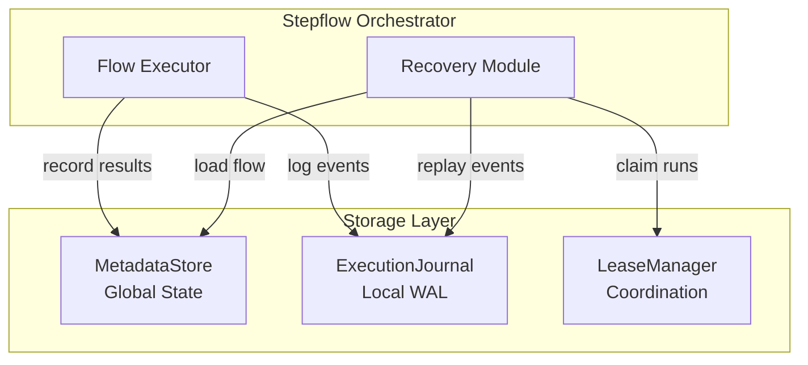
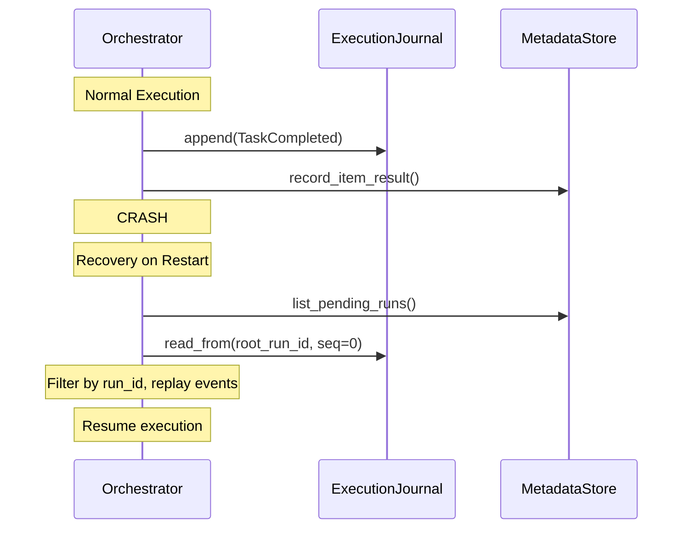
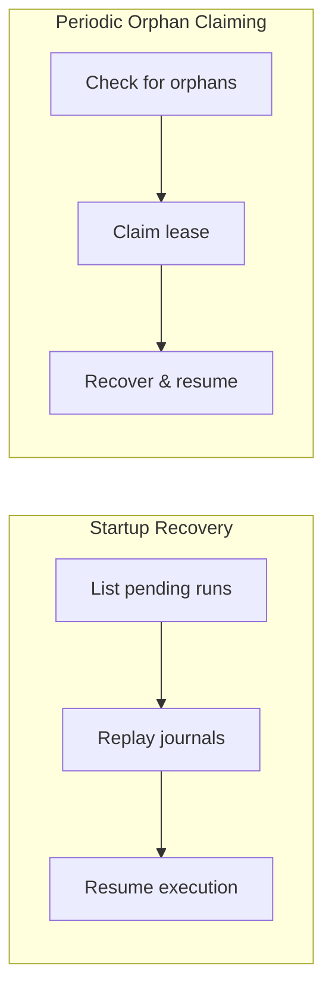

# Persistence and Recovery

Stepflow provides durable workflow execution through a modular persistence architecture. This enables workflows to survive process restarts, crashes, and distributed orchestration across multiple nodes.

## Architecture Overview

The persistence system is built on three core abstractions:



| Trait | Purpose | Scope |
|-------|---------|-------|
| **MetadataStore** | Durable storage of runs, results, and blobs | Global (shared across orchestrators) |
| **ExecutionJournal** | Write-ahead log of execution events | Local (per-orchestrator, for recovery) |
| **LeaseManager** | Run ownership coordination | Global (for distributed deployments) |

## MetadataStore

The MetadataStore handles durable storage of workflow state that needs to be accessible across orchestrator instances:

- **Blobs**: Content-addressed data storage (inputs, outputs, flow definitions)
- **Runs**: Workflow execution records with status and metadata
- **Item Results**: Per-item outputs for batch workflows

```yaml
# SQLite configuration (recommended for single-node)
storageConfig:
  type: sqlite
  databaseUrl: "sqlite:/path/to/stepflow.db?mode=rwc"
  autoMigrate: true
  maxConnections: 10
```

### Available Implementations

| Implementation | Use Case |
|---------------|----------|
| **InMemory** | Development, testing, ephemeral workflows |
| **SQLite** | Single-node production, durable local storage |

Future implementations will include NATS KV, PostgreSQL and other databases for distributed deployments.

## ExecutionJournal

The ExecutionJournal provides write-ahead logging of execution events. Events are recorded as tasks complete, enabling state reconstruction after a crash. The journal only stores state-changing events (task completions, run lifecycle) - not informational events like task starts.

### Journal Organization

Journals are keyed by `root_run_id`, meaning all events for an execution tree (parent flow + all subflows) are stored in a single journal. This design provides:

- **Unified sequence space**: Total ordering across all runs in the tree
- **Simplified recovery**: Load one journal to reconstruct the entire execution tree
- **Atomic garbage collection**: Delete one journal when the root run completes

Each journal entry contains both `run_id` (the specific run) and `root_run_id` (the journal key), allowing filtering during replay:

```rust
struct JournalEntry {
    run_id: Uuid,       // Specific run this event belongs to
    root_run_id: Uuid,  // Journal key (same for all entries in tree)
    timestamp: DateTime<Utc>,
    event: JournalEvent,
}
```

Subflows are identified by their `RunCreated` event with `parent_run_id` set, rather than a separate event type.

### How Journal Recovery Works

1. **During Execution**: Events are appended to the journal as workflow progresses
2. **On Startup**: Journal entries are replayed to reconstruct in-progress run state
3. **After Recovery**: Execution resumes from where it left off



### Journal Configuration

Both InMemoryStateStore and SqliteStateStore implement ExecutionJournal. The journal is automatically enabled when you configure a state store:

```yaml
# Journal is automatically available with SQLite
storageConfig:
  type: sqlite
  databaseUrl: "sqlite:stepflow.db?mode=rwc"
  autoMigrate: true
```

## LeaseManager

The LeaseManager coordinates run ownership in multi-orchestrator deployments:

- **Lease Acquisition**: Ensures only one orchestrator executes a given run
- **Heartbeats**: Track active orchestrators
- **Orphan Detection**: Identify runs from crashed orchestrators
- **Recovery Claiming**: Atomically claim orphaned runs for recovery

```rust
// Lease lifecycle
trait LeaseManager {
    fn acquire_lease(run_id, orchestrator_id, ttl) -> LeaseResult;
    fn renew_lease(run_id, orchestrator_id, ttl) -> LeaseResult;
    fn release_lease(run_id, orchestrator_id);
    fn claim_orphaned_runs(orchestrator_id, max_claims, ttl) -> Vec<Uuid>;
}
```

### Configuration

For single-node deployments, the default `NoOpLeaseManager` is used:

```yaml
# Default: No lease management (single orchestrator)
leaseManager:
  type: none
```

Future implementations will include etcd-based lease management for distributed deployments.

### Recovery Configuration

Configure how the orchestrator handles recovery on startup and during execution:

```yaml
recovery:
  # Enable periodic orphan claiming during execution (default: true)
  enabled: true

  # Interval between orphan check attempts in seconds (default: 30)
  checkIntervalSecs: 30

  # Maximum runs to recover on startup (default: 100)
  maxStartupRecovery: 100

  # Maximum orphaned runs to claim per check interval (default: 10)
  maxClaimsPerCheck: 10
```

| Setting | Default | Description |
|---------|---------|-------------|
| `enabled` | `true` | Enable periodic orphan claiming during execution |
| `checkIntervalSecs` | `30` | Seconds between orphan check attempts |
| `maxStartupRecovery` | `100` | Maximum runs to recover when orchestrator starts |
| `maxClaimsPerCheck` | `10` | Maximum orphans to claim in each periodic check |

**Why periodic claiming?** When orchestrators scale down or crash, their runs become orphaned. Periodic claiming allows remaining orchestrators to pick up these runs without requiring a restart.

## Recovery Process

Recovery happens in two situations:

1. **On Startup**: The orchestrator recovers any pending runs from the journal
2. **During Execution**: A background task periodically checks for orphaned runs



### Graceful Shutdown

When receiving SIGTERM (e.g., during Kubernetes pod termination), the server:
1. Stops accepting new requests
2. Cancels the orphan claiming background task
3. Waits for background tasks to complete
4. Shuts down cleanly

**Note**: Active runs continue until their leases expire. With short TTLs (e.g., 30s), other orchestrators will claim them quickly.

### Recovery Steps

1. **Claim Runs**: Query lease manager for runs that need recovery
2. **Load Flow**: Retrieve workflow definition from MetadataStore
3. **Replay Journal**: Apply journal events to reconstruct RunState
4. **Resume Execution**: Continue from the last completed task

### What Gets Recovered

| State | Source | Notes |
|-------|--------|-------|
| Flow definition | MetadataStore | Immutable, content-addressed |
| Run inputs/variables | MetadataStore | Stored at run creation |
| Completed tasks | ExecutionJournal | Replayed to reconstruct state |
| In-flight tasks | ExecutionJournal | Re-executed after recovery |
| Item results | MetadataStore | Already persisted |

## Deployment Patterns

### Single Node (Development/Testing)

```yaml
storageConfig:
  type: inMemory

# Optional: Use SQLite for persistence
# storageConfig:
#   type: sqlite
#   databaseUrl: "sqlite::memory:"
```

- No durability (data lost on restart)
- Fastest performance
- Good for testing and development

### Single Node with Persistence

```yaml
storageConfig:
  type: sqlite
  databaseUrl: "sqlite:/var/lib/stepflow/state.db?mode=rwc"
  autoMigrate: true
```

- Workflows survive restarts
- Recovery replays journal on startup
- Suitable for most single-server deployments

### Multi-Orchestrator (Future)

```yaml
storageConfig:
  type: sqlite  # Or PostgreSQL/NATS KV
  databaseUrl: "..."

leaseManager:
  type: etcd  # Coming soon
  endpoints:
    - "http://etcd-1:2379"
    - "http://etcd-2:2379"
    - "http://etcd-3:2379"
```

- Multiple orchestrators share workload
- Leases ensure single-execution guarantee
- Automatic failover via orphan claiming

## Best Practices

### 1. Choose Appropriate Storage

| Scenario | Recommendation |
|----------|----------------|
| Development | InMemory |
| CI/CD testing | SQLite (`:memory:`) |
| Single-node production | SQLite (file-based) |
| Multi-node production | PostgreSQL + etcd (future) |

### 2. Handle Recovery Failures

Recovery logs errors but continues with other runs. Monitor for:
- Missing flow definitions
- Corrupt journal entries
- Lease contention

### 3. Consider Journal Compaction

For long-running workflows, journal entries accumulate. Future versions will support compaction after checkpointing.

### 4. Plan for Distributed Mode

If you anticipate needing multiple orchestrators:
- Start with SQLite but design for state store abstraction
- Keep workflow definitions immutable
- Avoid orchestrator-local state in components

## Trait Reference

### MetadataStore Methods

```rust
trait MetadataStore {
    // Blob storage
    fn put_blob(data, blob_type) -> BlobId;
    fn get_blob(blob_id) -> BlobData;
    fn store_flow(workflow) -> BlobId;
    fn get_flow(flow_id) -> Option<Flow>;

    // Run management
    fn create_run(params);
    fn get_run(run_id) -> Option<RunDetails>;
    fn list_runs(filters) -> Vec<RunSummary>;
    fn update_run_status(run_id, status);

    // Results
    fn record_item_result(run_id, item_index, result);
    fn get_item_results(run_id, order) -> Vec<ItemResult>;

    // Recovery
    fn list_pending_runs(limit) -> Vec<RunSummary>;
}
```

### ExecutionJournal Methods

```rust
trait ExecutionJournal {
    // Append uses entry.root_run_id as the journal key
    fn append(entry) -> SequenceNumber;

    // All methods below are keyed by root_run_id (one journal per execution tree)
    fn read_from(root_run_id, from_sequence, limit) -> Vec<(SequenceNumber, JournalEntry)>;
    fn latest_sequence(root_run_id) -> Option<SequenceNumber>;
    fn checkpoint(root_run_id, sequence);
    fn get_checkpoint(root_run_id) -> Option<SequenceNumber>;
    fn compact(root_run_id);
    fn list_active_roots() -> Vec<RootJournalInfo>;
}
```

### LeaseManager Methods

```rust
trait LeaseManager {
    fn acquire_lease(run_id, orchestrator_id, ttl) -> LeaseResult;
    fn renew_lease(run_id, orchestrator_id, ttl) -> LeaseResult;
    fn release_lease(run_id, orchestrator_id);
    fn list_orphaned_runs() -> Vec<OrphanedRun>;
    fn claim_orphaned_runs(orchestrator_id, max_claims, ttl) -> Vec<Uuid>;
    fn heartbeat(orchestrator_id);
    fn get_lease(run_id) -> Option<LeaseInfo>;
    fn list_orchestrators() -> Vec<OrchestratorInfo>;
}
```

## Next Steps

- **[Configuration](../configuration.md)** - State store configuration options
- **[Deployment Overview](./index.md)** - Production deployment patterns
- **[Load Balancer](./load-balancer.md)** - Scaling component servers
