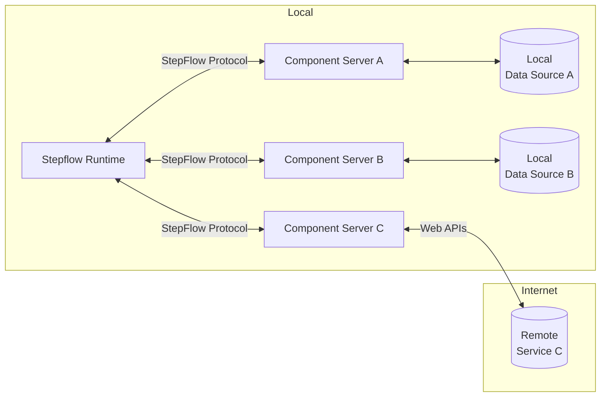

# StepFlow Introduction

StepFlow is an open standard for creating and running for Agentic AI workflows.

It consists of 3 main parts:

1. A format for writing workflows in JSON or YAML backed by a JSON schema.
    This allows any framework or UI tool to create workflows.
    It also allows other platforms to execute workflows.
2. A protocol for workflows to discover and execute components.
    The base protocol is uses JSON-RPC similarly to the Language Server Protocol (LSP) and Model Context Protocol (MCP).
    Component servers may optionally support more efficient transport mechanisms, negotiated during initialization.
3. An execution engine for workflows.
    The engine is written in Rust and supports running a single workflow, operating as a workflow service or embedding in other applications.

## Architecture

- **StepFlow Runtime**: Where the workflow is executed.
- **Component Servers**: Lightweight programs that each expose specific workflow components through the standardized StepFlow Protocol.
- **Local Data Sources**: Files, databases and services that Component Servers can securely access.
- **Remote Services**: External systems available over the internet (e.g., through APIs) that Copmonent Servers servers can connect to.

## Get Started

## Workflows

### Steps

A workflow is a sequence of *steps*.
Each step has a unique identifier and executes a specific component.
The input to a step can be created from inputs to the flow, the outputs of earlier steps, and literal values.

### Components

Components provide the logic executed by steps.
Each step specifies a specific component to execute.

Components are provided by plugins.
The most common component plugins are described below.

* Built-in components are provided by StepFlow and provide useful building blocks such as evaluation of sub-flows, looping, and conditional execution.
* The component protocol is a JSON-RPC protocol for a component server to provide components.
* Tools provided by MCP (Model Context Protocol) servers can also be used as components.