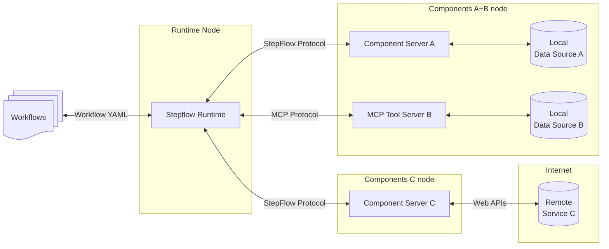

# StepFlow Introduction

StepFlow is an open protocol and runtime for building, executing, and scaling GenAI workflows across local and cloud environments.
Its modular architecture ensures secure, isolated execution of components—whether running locally or deployed to production.
With durability, fault-tolerance, and an open specification, StepFlow empowers anyone to create, share, and 

## Local Architecture

- **StepFlow Runtime**: Where the workflow is executed.
- **Component Servers**: Lightweight programs that each expose specific workflow components through the standardized StepFlow Protocol.
- **MCP Servers**: MCP servers can be used as component servers, with each tool treated as a component.
- **Local Data Sources**: Files, databases and services that Component Servers can securely access.
- **Remote Services**: External systems available over the internet (e.g., through APIs) that Copmonent Servers servers can connect to.

## Production Architecture

This same architecture allows separating the component servers into separate containers or k8s nodes for production deployment.
The same component server could be used by multiple runtimes, each with a different set of components available.
This provides efficient resource and the ability to isolate different security concerns.

## Next Steps

* See [Getting Started](./getting_started.md) for installation and running your first workflows.
* Read more about writing your own [Workflows](./workflows/index.md).
* Learn how to create your own components using the [StepFlow Protocol](./protocol/index.md).