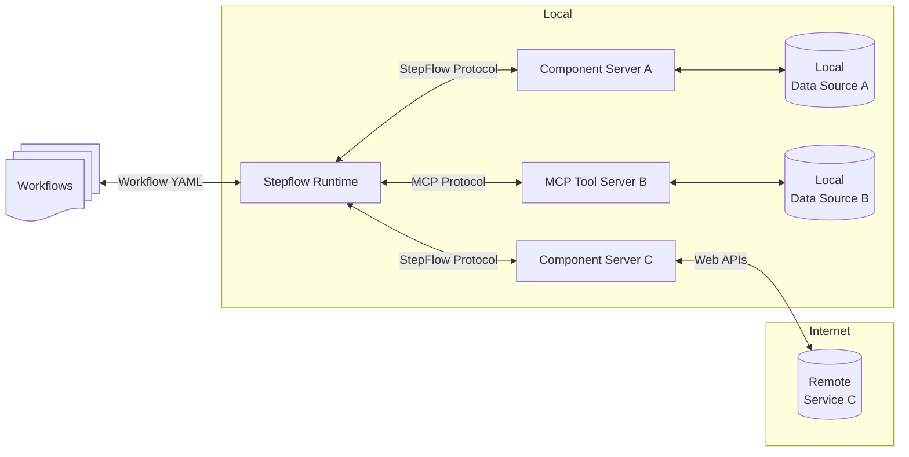

# StepFlow Introduction

StepFlow is an open standard for creating and running GenAI and Agentic workflows.

It consists of 3 main parts:

1. A format for writing workflows in JSON or YAML backed by a JSON schema.
    This allows any framework or UI tool to create workflows.
    It also allows other platforms to execute workflows.
2. A protocol for workflows to discover and execute components.
    The base protocol is uses JSON-RPC similarly to the Language Server Protocol (LSP) and Model Context Protocol (MCP).
    Component servers may optionally support more efficient transport mechanisms, negotiated during initialization.
3. An execution engine for workflows.
    The engine is written in Rust and supports running a single workflow, operating as a workflow service or embedding in other applications.

## Architecture

- **StepFlow Runtime**: Where the workflow is executed.
- **Component Servers**: Lightweight programs that each expose specific workflow components through the standardized StepFlow Protocol.
- **MCP Servers**: MCP servers can be used as component servers, with each tool treated as a component.
- **Local Data Sources**: Files, databases and services that Component Servers can securely access.
- **Remote Services**: External systems available over the internet (e.g., through APIs) that Copmonent Servers servers can connect to.

## Next Steps

* See [Getting Started](./getting_started.md) for installation and running your first workflows.
* Read more about writing your own [Workflows](./workflows/index.md).
* Learn how to create your own components using the [StepFlow Protocol](./protocol/index.md).