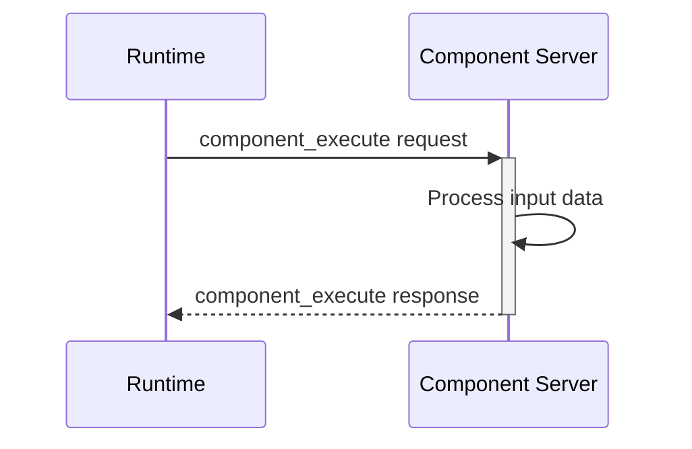
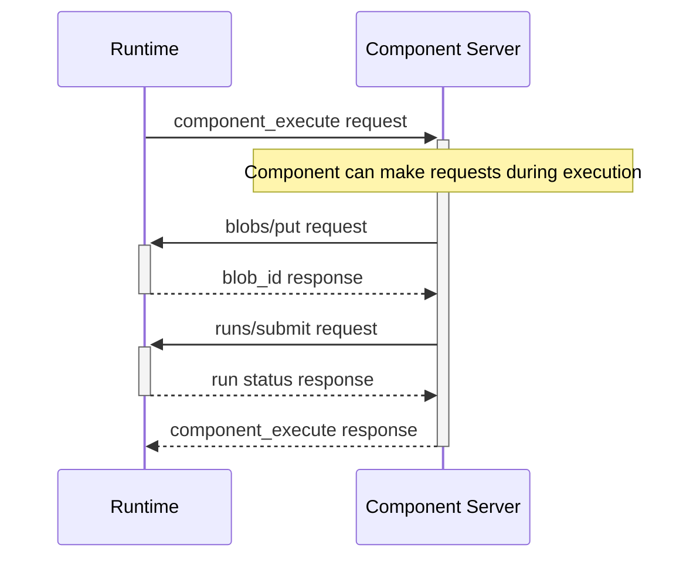

# Bidirectional Communication

The Stepflow Protocol supports bidirectional communication, enabling component servers to make requests back to the runtime during component execution. This capability enables powerful patterns like blob storage, run submission, and runtime introspection while maintaining the JSON-RPC request-response model.

## Overview

While the primary communication flow is Runtime → Component Server, the protocol enables Component Server → Runtime requests for:

- **Blob Storage**: Store and retrieve persistent data using content-addressable storage
- **Run Submission**: Submit and monitor sub-workflow executions
- **Resource Access**: Request additional resources or capabilities (future)

## Communication Model

### Unidirectional vs Bidirectional

**Traditional Model (Unidirectional):**

**Stepflow Model (Bidirectional):**

## Available Methods

Component servers can call these methods during execution:

### Blob Storage Methods
- **`blobs/put`**: Store JSON data, receive content-addressable blob ID
- **`blobs/get`**: Retrieve stored data by blob ID

See [Blob Storage Methods](./methods/blobs.md) for detailed specifications.

### Run Methods
- **`runs/submit`**: Submit a workflow run for execution
- **`runs/get`**: Retrieve run status and results

See [Run Methods](./methods/runs.md) for detailed specifications.
