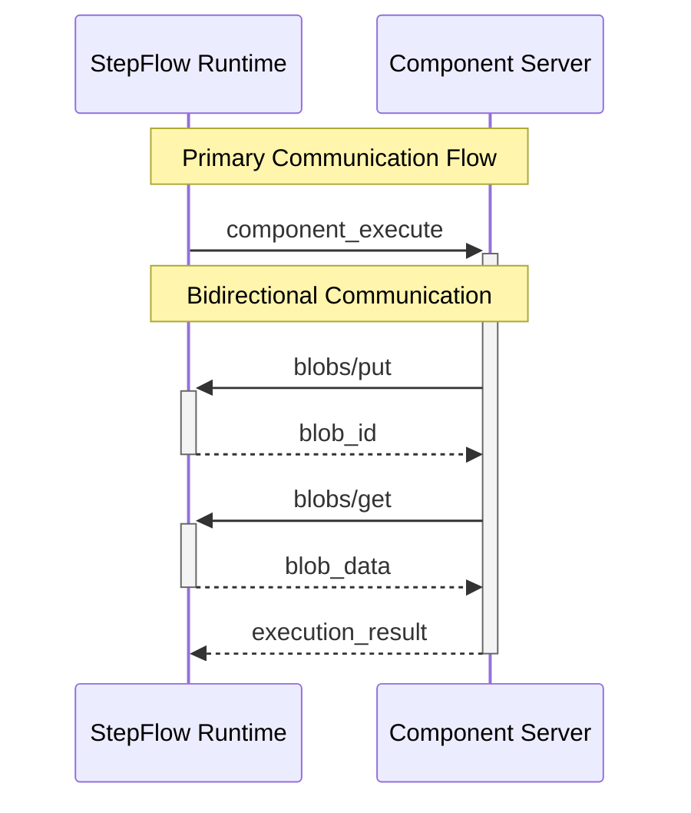

# Bidirectional Communication

StepFlow's protocol supports bidirectional communication, allowing component servers to make requests back to the StepFlow runtime. This enables powerful patterns like blob storage, state management, and runtime introspection.

## Overview

While the primary communication flow is from StepFlow → Component Server, components can also initiate requests back to the runtime for:

- **Blob Storage**: Store and retrieve persistent data
- **Runtime Queries**: Access workflow metadata and execution state
- **Resource Access**: Request additional resources or capabilities



## Blob Storage Methods

Blob storage provides content-addressable storage for JSON data with automatic deduplication.

### `blobs/put` - Store Data

Store JSON data as a blob and receive a content-addressable ID.

#### Request Format

```json
{
  "jsonrpc": "2.0",
  "id": "req-123",
  "method": "blobs/put",
  "params": {
    "data": {
      "user_id": "12345",
      "preferences": {
        "theme": "dark",
        "notifications": true
      },
      "last_login": "2024-01-15T10:30:00Z"
    }
  }
}
```

**Parameters:**
- **`data`** (required): Any JSON value to store as a blob

#### Response Format

```json
{
  "jsonrpc": "2.0",
  "id": "req-123",
  "result": {
    "blob_id": "sha256:a1b2c3d4e5f6..."
  }
}
```

**Result:**
- **`blob_id`**: SHA-256 hash of the stored data (content-addressable)

#### Key Features

- **Content Addressing**: Identical data produces identical blob IDs
- **Automatic Deduplication**: Same data stored multiple times uses same blob
- **Persistence**: Blobs persist for the lifetime of the workflow execution
- **Size Efficiency**: Large datasets stored once, referenced multiple times

#### Example Usage

```python
# In a Python component
async def store_user_data(input: UserInput, context: StepflowContext) -> UserOutput:
    # Process user data
    processed_data = process_user(input.user_data)

    # Store processed data as blob for reuse
    blob_id = await context.put_blob(processed_data)

    return UserOutput(
        blob_id=blob_id,
        summary=f"Stored {len(processed_data)} records"
    )
```

### `blobs/get` - Retrieve Data

Retrieve previously stored blob data using its content-addressable ID.

#### Request Format

```json
{
  "jsonrpc": "2.0",
  "id": "req-124",
  "method": "blobs/get",
  "params": {
    "blob_id": "sha256:a1b2c3d4e5f6..."
  }
}
```

**Parameters:**
- **`blob_id`** (required): The blob ID returned from a previous `blobs/put` call

#### Response Format

```json
{
  "jsonrpc": "2.0",
  "id": "req-124",
  "result": {
    "data": {
      "user_id": "12345",
      "preferences": {
        "theme": "dark",
        "notifications": true
      },
      "last_login": "2024-01-15T10:30:00Z"
    }
  }
}
```

**Result:**
- **`data`**: The original JSON data that was stored

#### Error Handling

```json
{
  "jsonrpc": "2.0",
  "id": "req-124",
  "error": {
    "code": -32000,
    "message": "Blob not found",
    "data": {
      "blob_id": "sha256:invalid..."
    }
  }
}
```

#### Example Usage

```python
# In a Python component
async def load_user_data(input: LoadInput, context: StepflowContext) -> LoadOutput:
    try:
        # Retrieve blob data
        user_data = await context.get_blob(input.blob_id)

        # Process the retrieved data
        analysis = analyze_user_data(user_data)

        return LoadOutput(
            success=True,
            analysis=analysis
        )
    except Exception as e:
        return LoadOutput(
            success=False,
            error=str(e)
        )
```

## Common Blob Storage Patterns

### User-Defined Functions (UDFs)

Store Python code as blobs for reuse across workflow steps:

```python
# Store UDF code
udf_code = {
    "input_schema": {
        "type": "object",
        "properties": {
            "numbers": {"type": "array", "items": {"type": "number"}}
        }
    },
    "code": "sum(input['numbers']) / len(input['numbers'])"
}

blob_id = await context.put_blob(udf_code)

# Later, execute the UDF
udf_definition = await context.get_blob(blob_id)
result = exec(udf_definition["code"], {"input": {"numbers": [1, 2, 3, 4, 5]}})
```

### Intermediate Results Caching

Cache expensive computation results:

```python
# Check if result already computed
cache_key = f"analysis_{hash(input_data)}"
try:
    cached_result = await context.get_blob(cache_key)
    return ProcessOutput(
        result=cached_result,
        from_cache=True
    )
except:
    # Compute and cache result
    result = expensive_computation(input_data)
    await context.put_blob(result)
    return ProcessOutput(
        result=result,
        from_cache=False
    )
```

### Configuration Storage

Store complex configuration objects:

```python
# Store environment-specific configuration
config = {
    "database": {
        "host": "prod-db.example.com",
        "pool_size": 20
    },
    "apis": {
        "timeout": 30,
        "retries": 3
    },
    "features": {
        "advanced_analytics": True,
        "beta_features": False
    }
}

config_blob_id = await context.put_blob(config)
```

## Runtime Communication Patterns

### Component Context Interface

The `StepflowContext` provides the interface for bidirectional communication:

```python
# Python SDK interface
class StepflowContext:
    async def put_blob(self, data: Any) -> str:
        """Store data as a blob and return blob_id"""

    async def get_blob(self, blob_id: str) -> Any:
        """Retrieve data from a blob"""

    # Future methods
    async def get_workflow_info(self) -> WorkflowInfo:
        """Get information about the current workflow"""

    async def get_step_info(self, step_id: str) -> StepInfo:
        """Get information about a specific step"""
```

### TypeScript SDK Interface

```typescript
// TypeScript SDK interface (future)
interface StepflowContext {
    putBlob(data: any): Promise<string>;
    getBlob(blobId: string): Promise<any>;

    // Future methods
    getWorkflowInfo(): Promise<WorkflowInfo>;
    getStepInfo(stepId: string): Promise<StepInfo>;
}
```