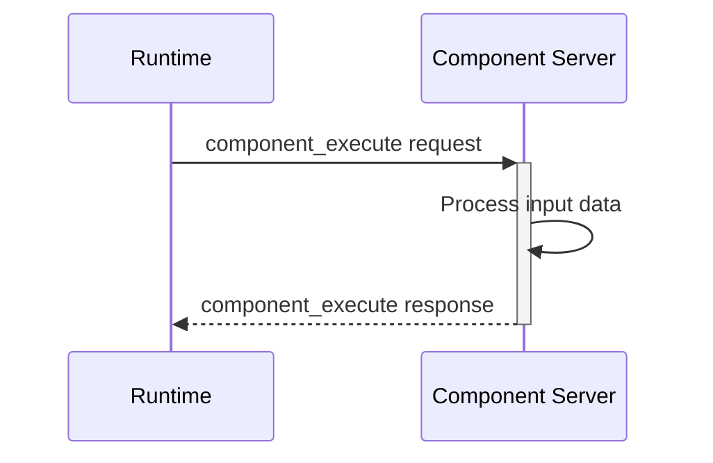
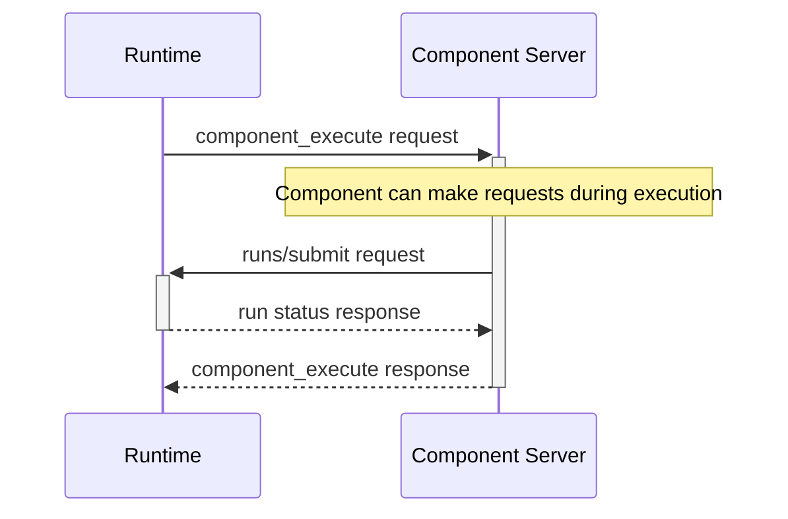

# Bidirectional Communication

The Stepflow Protocol supports bidirectional communication, enabling component servers to make requests back to the runtime during component execution. This capability enables powerful patterns like run submission and runtime introspection while maintaining the JSON-RPC request-response model.

## Overview

While the primary communication flow is Runtime → Component Server, the protocol enables Component Server → Runtime requests for:

- **Run Submission**: Submit and monitor sub-workflow executions
- **Resource Access**: Request additional resources or capabilities (future)

:::note Blob Storage
Blob storage uses a separate HTTP API rather than the bidirectional protocol. See [Blob Storage](./methods/blobs.md) for details.
:::

## Communication Model

### Unidirectional vs Bidirectional

**Traditional Model (Unidirectional):**

**Stepflow Model (Bidirectional):**

## Available Methods

Component servers can call these methods during execution:

### Run Methods
- **`runs/submit`**: Submit a workflow run for execution
- **`runs/get`**: Retrieve run status and results

See [Run Methods](./methods/runs.md) for detailed specifications.
