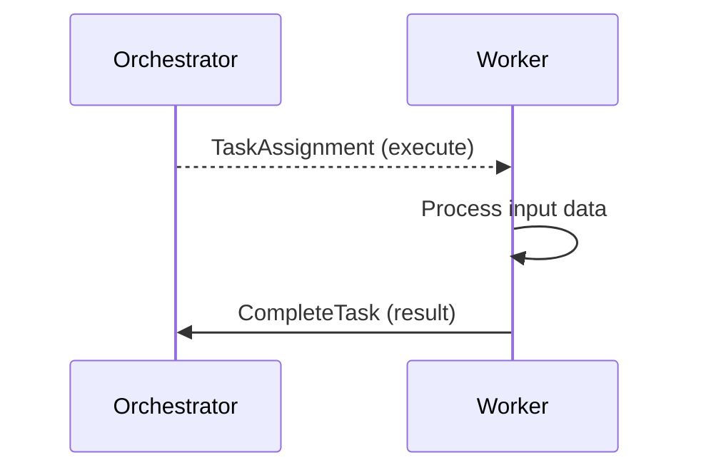
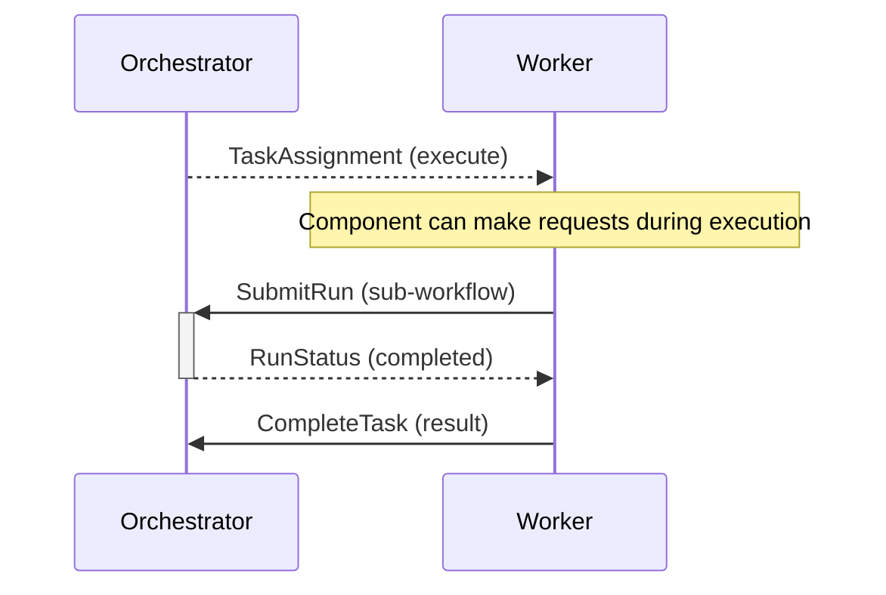

# Bidirectional Communication

The Stepflow Protocol supports bidirectional communication, enabling workers to make requests back to the orchestrator during component execution. Workers call `OrchestratorService` RPCs using the `orchestrator_service_url` provided in each task's `TaskContext`.

## Overview

While the primary communication flow is Orchestrator → Worker (via task assignments), the protocol enables Worker → Orchestrator requests for:

- **Run Submission**: Submit and monitor sub-workflow executions
- **Run Status**: Query run status with optional wait for completion
- **Resource Access**: Request additional resources or capabilities (future)

:::note Blob Storage
Blob storage uses a separate HTTP API rather than the bidirectional protocol. See [Blob Storage](./methods/blobs.md) for details.
:::

## Communication Model

### Unidirectional vs Bidirectional

**Traditional Model (Unidirectional):**

```mermaid
sequenceDiagram
    participant O as Orchestrator
    participant W as Worker

    O-->>W: TaskAssignment (execute)
    W->>W: Process input data
    W->>O: CompleteTask (result)
```

**Stepflow Model (Bidirectional):**

```mermaid
sequenceDiagram
    participant O as Orchestrator
    participant W as Worker

    O-->>W: TaskAssignment (execute)

    Note over W: Component can make requests during execution

    W->>+O: SubmitRun (sub-workflow)
    O-->>-W: RunStatus (completed)

    W->>O: CompleteTask (result)
```

## Available Methods

Workers can call these `OrchestratorService` methods during execution:

### Run Methods
- **`SubmitRun`**: Submit a workflow run for execution
- **`GetRun`**: Retrieve run status and results

See [Run Methods](./methods/runs.md) for detailed specifications.

### Heartbeat
- **`TaskHeartbeat`**: Signal liveness and report progress

See [Transport](./transport.md#heartbeats) for heartbeat details.

## Orchestrator Routing

Each `TaskAssignment` includes a `TaskContext` with the `orchestrator_service_url` that the worker must use for callbacks. This ensures requests reach the orchestrator instance that owns the run, which is important in multi-orchestrator deployments.

If the orchestrator returns `NOT_FOUND` or `UNAVAILABLE`, the worker can call `TasksService.GetOrchestratorForRun` on any orchestrator to discover the current owner. See [Error Handling](./errors.md#orchestrator-service-errors) for details.
