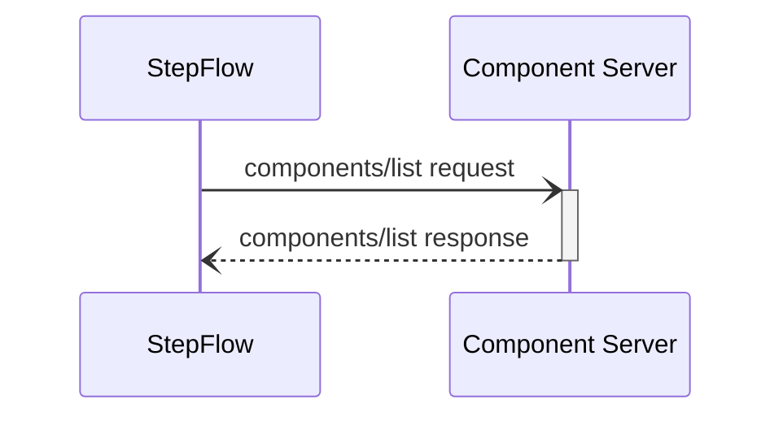
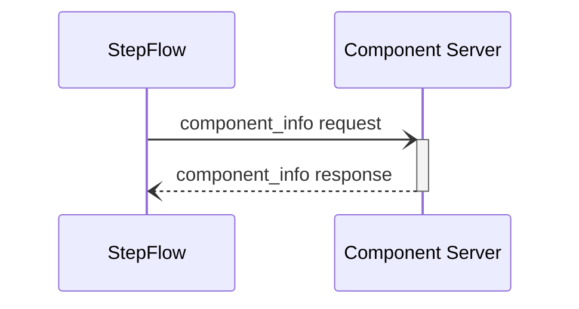
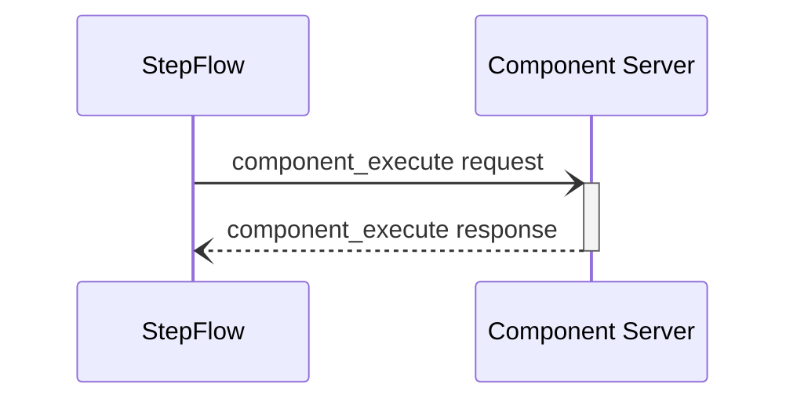

import SchemaDisplay from "@site/src/components/SchemaDisplay";

# Components

## Component Discovery

The component discovery process allows StepFlow to enumerate all available components from a component server. This is used for validation, tooling, and user interfaces.



### Request Format

<SchemaDisplay schema="https://stepflow.org/schemas/v1/protocol.json" path="$defs/ComponentListParams"/>

### Response Format

<SchemaDisplay schema="https://stepflow.org/schemas/v1/protocol.json" path="$defs/ComponentListResult"/>

### Usage Examples

The `components/list` method is typically called:
- During plugin initialization to discover available components
- By CLI tools like `stepflow list-components`
- By IDE extensions for autocompletion
- By workflow validation tools

Example request:
```json
{
  "jsonrpc": "2.0",
  "id": "list-1",
  "method": "components/list",
  "params": {}
}
```

Example response:
```json
{
  "jsonrpc": "2.0",
  "id": "list-1",
  "result": {
    "components": [
      {
        "name": "data_processor",
        "description": "Process and transform data according to rules"
      },
      {
        "name": "http_client",
        "description": "Make HTTP requests with retry logic"
      },
      {
        "name": "cache_manager",
        "description": "Store and retrieve cached data"
      }
    ]
  }
}
```

## Component Information

The component information request is used to retrieve metadata about a specific component, including its input and output schemas.



### Request Format

<SchemaDisplay schema="https://stepflow.org/schemas/v1/protocol.json" path="$defs/ComponentInfoParams"/>

### Response Format

<SchemaDisplay schema="https://stepflow.org/schemas/v1/protocol.json" path="$defs/ComponentInfoResult"/>

:::note
Components should also have fields for describing the UI aspects of providing their input.
One option here is to use something like https://jsonforms.io/docs/.
The `input_schema` would determine the shape of allowed data, while this other metadata would help generate the UI widget.
This could also include things like the icon to use for the component, etc.
:::

## Component Execution

The component execution request is used to run a specific component with provided input data. The component server processes the input according to its defined schema and returns the output.



### Request Format

<SchemaDisplay schema="https://stepflow.org/schemas/v1/protocol.json" path="$defs/ComponentExecuteParams"/>

:::note
The `workflow_id` and `step_id` parameter likely won't be needed by all components.
They may be useful for a variety of cases:

1. Tracing / logging messages so the component execution can be associated with the correct thing.
   However, this could be accomplished by tracing associated with the request ID.
2. If the component creates any state and may need to re-request the input.

An alternative could be allowing these to be inputs to the component, configured either in the workflow, or via the component info.
:::

### Response Format

<SchemaDisplay schema="https://stepflow.org/schemas/v1/protocol.json" path="$defs/ComponentExecuteResult"/>


### Error Handling

Component servers should return appropriate JSON-RPC error responses for various failure conditions. StepFlow defines standard error codes for consistent error handling across all components.

#### Standard Error Codes

| Code | Name | Description | When to Use |
|------|------|-------------|-------------|
| -32700 | Parse Error | Invalid JSON was received | Malformed JSON in request |
| -32600 | Invalid Request | The JSON sent is not a valid Request object | Missing required fields |
| -32601 | Method Not Found | The method does not exist | Unknown component or method |
| -32602 | Invalid Params | Invalid method parameter(s) | Schema validation failure |
| -32603 | Internal Error | Internal JSON-RPC error | Server implementation error |
| -32000 | Server Error | Generic server error | Component execution failure |
| -32001 | Component Not Found | Requested component does not exist | Unknown component name |
| -32002 | Server Not Initialized | Server has not been initialized | Missing initialization |
| -32003 | Invalid Input Schema | Input does not match component schema | Schema validation failure |
| -32004 | Component Execution Failed | Component failed during execution | Business logic error |
| -32005 | Resource Unavailable | Required resource is not available | External dependency failure |
| -32006 | Timeout | Operation timed out | Long-running operation timeout |
| -32007 | Permission Denied | Insufficient permissions | Authorization failure |

#### Error Response Format

```json
{
  "jsonrpc": "2.0",
  "id": "req-123",
  "error": {
    "code": -32001,
    "message": "Component not found",
    "data": {
      "component": "unknown_component",
      "available_components": ["data_processor", "http_client"],
      "suggestion": "Check component name spelling"
    }
  }
}
```

#### Error Response Fields

- **`code`** (required): Standard error code from the table above
- **`message`** (required): Human-readable error description
- **`data`** (optional): Additional structured error information

#### Common Error Scenarios

**Component Not Found:**
```json
{
  "jsonrpc": "2.0",
  "id": "req-123",
  "error": {
    "code": -32001,
    "message": "Component 'unknown_processor' not found",
    "data": {
      "component": "unknown_processor",
      "available_components": ["data_processor", "text_processor", "image_processor"]
    }
  }
}
```

**Invalid Input Schema:**
```json
{
  "jsonrpc": "2.0",
  "id": "req-124",
  "error": {
    "code": -32003,
    "message": "Input validation failed",
    "data": {
      "component": "data_processor",
      "validation_errors": [
        {
          "field": "data.records",
          "error": "Required field missing"
        },
        {
          "field": "data.rules.transformation",
          "error": "Must be one of: uppercase, lowercase, title"
        }
      ]
    }
  }
}
```

**Component Execution Failed:**
```json
{
  "jsonrpc": "2.0",
  "id": "req-125",
  "error": {
    "code": -32004,
    "message": "HTTP request failed",
    "data": {
      "component": "http_client",
      "url": "https://api.example.com/data",
      "http_status": 404,
      "retry_count": 3,
      "last_error": "Connection timeout after 30 seconds"
    }
  }
}
```

#### Error Handling Best Practices

**For Component Developers:**

1. **Use Appropriate Codes**: Choose the most specific error code for each situation
2. **Provide Context**: Include helpful details in the `data` field
3. **Be Consistent**: Use the same error patterns across all components
4. **Log Errors**: Log detailed error information for debugging

```python
# Python component error handling example
try:
    result = process_data(input.data)
    return ProcessOutput(result=result)
except ValidationError as e:
    raise JsonRpcError(
        code=-32003,
        message="Input validation failed",
        data={
            "component": "data_processor",
            "validation_errors": e.errors
        }
    )
except ExternalServiceError as e:
    raise JsonRpcError(
        code=-32005,
        message="External service unavailable",
        data={
            "component": "data_processor",
            "service": e.service_name,
            "retry_after": e.retry_after
        }
    )
```

**For StepFlow Runtime:**

1. **Parse Error Details**: Extract actionable information from error responses
2. **Retry Logic**: Implement appropriate retry behavior based on error types
3. **User Feedback**: Provide clear error messages to workflow authors
4. **Error Aggregation**: Collect and report error patterns for debugging