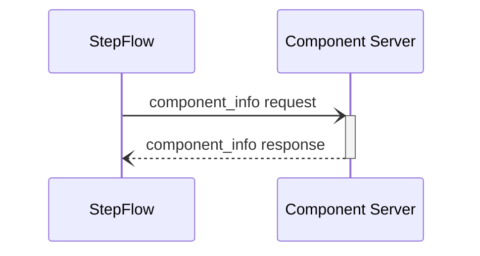
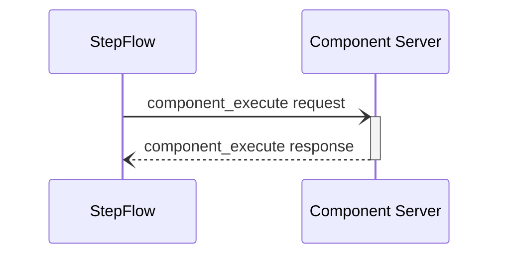
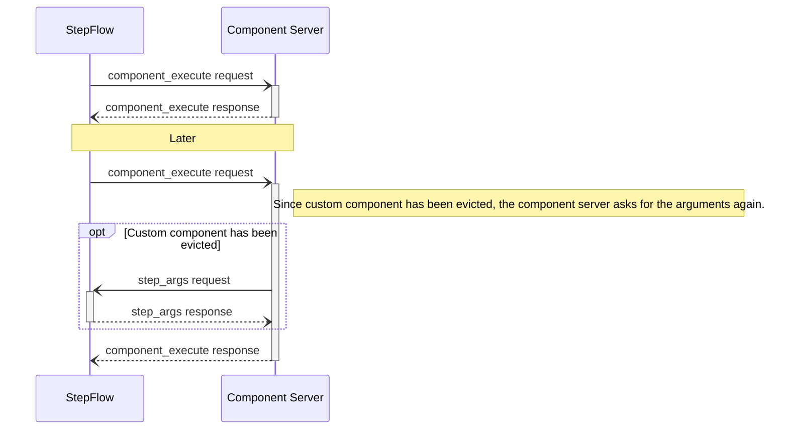

import SchemaDisplay from "@site/src/components/SchemaDisplay";

# Components

## Component Discovery

## Component Information

The component information request is used to retrieve metadata about a specific component, including its input and output schemas.

### Request Format

<SchemaDisplay schema="https://stepflow.org/schemas/protocol.json" path="$defs/ComponentInfoParams"/>

### Response Format

<SchemaDisplay schema="https://stepflow.org/schemas/protocol.json" path="$defs/ComponentInfoResult"/>

:::note
Components should also have fields for describing the UI aspects of providing their input.
One option here is to use something like https://jsonforms.io/docs/.
The `input_schema` would determine the shape of allowed data, while this other metadata would help generate the UI widget.
This could also include things like the icon to use for the component, etc.
:::

## Component Execution

The component execution request is used to run a specific component with provided input data. The component server processes the input according to its defined schema and returns the output.

### Request Format

<SchemaDisplay schema="https://stepflow.org/schemas/protocol.json" path="$defs/ComponentExecuteParams"/>

:::note
The `workflow_id` and `step_id` parameter likely won't be needed by all components.
They may be useful for a variety of cases:

1. Tracing / logging messages so the component execution can be associated with the correct thing.
   However, this could be accomplished by tracing associated with the request ID.
2. If the component creates any state and may need to re-request the input.

An alternative could be allowing these to be inputs to the component, configured either in the workflow, or via the component info.
:::

### Response Format

<SchemaDisplay schema="https://stepflow.org/schemas/protocol.json" path="$defs/ComponentExecuteResult"/>

### Error Handling

The component server may return errors in the following cases:
- Component not found (error code: -32601)
- Invalid input data (error code: -32000)
- Server not initialized (error code: -32002)

:::note
Flesh out the error protocol.
It would likely be nice to have a standard set of error codes, etc.
:::

## Dynamic Components

Dynamic components allow the component server to create a new compnonent that can be referenced later in the workflow.
Since a component is just a URL, the main capability here is that the workflow format allows the component to a step to depend on the result of an earlier step.

The first component executed creates a new component from it's arguments, and returns a URL for executing the component.
This allows it to to cache a connection or other information.

When the dynamically created component is executed, the componont server will attempt to re-use the state it created from the original call.
If that has been evicted or the component server was restarted, it may need to issue a `step_args` request to get arguments for the original creation step.

:::note

This means that the URL for the dynamically created component should also include the Workflow UUID and the Step ID, allowing the component to embed those in the dynamic component URL.

:::

### Step Arguments Request

`step_args` is a request sent from the component server to the workflow runtime to request the arguments from an earlier step.
It is most often used by dynamic components when the component server has been restarted or evicted the state for a dynamically created component.
The workflow runtime sends the arguments used for the given step -- typically the one previously used for creating the component -- allowing the component server to recreate it.

{/* <SchemaDisplay schema="https://stepflow.org/schemas/protocol.json" path="defs/StepArgumentsRequest"/> */}
TODO: StepArgumentsRequest schema definition needs to be updated

### Step Arguments Response

{/* <SchemaDisplay schema="https://stepflow.org/schemas/protocol.json" path="defs/StepArgumentsResponse"/> */}
TODO: StepArgumentsResponse schema definition needs to be updated