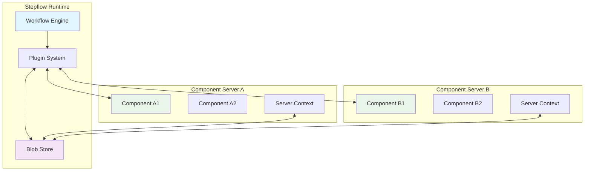
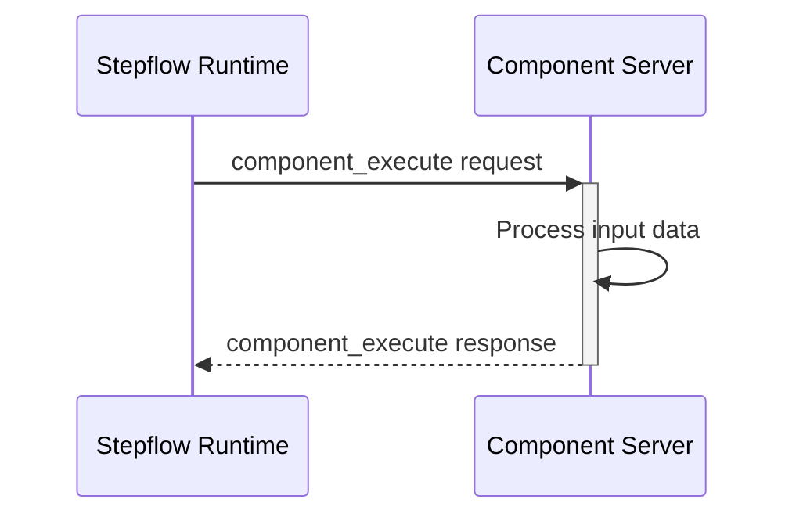
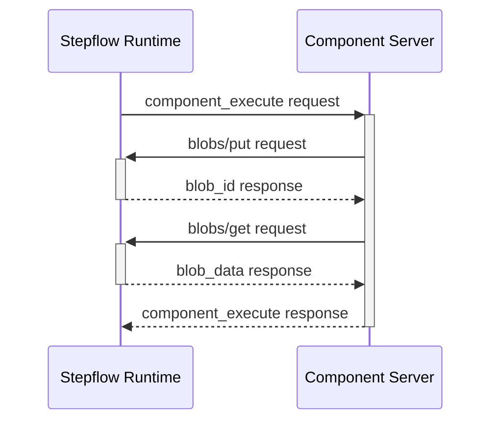
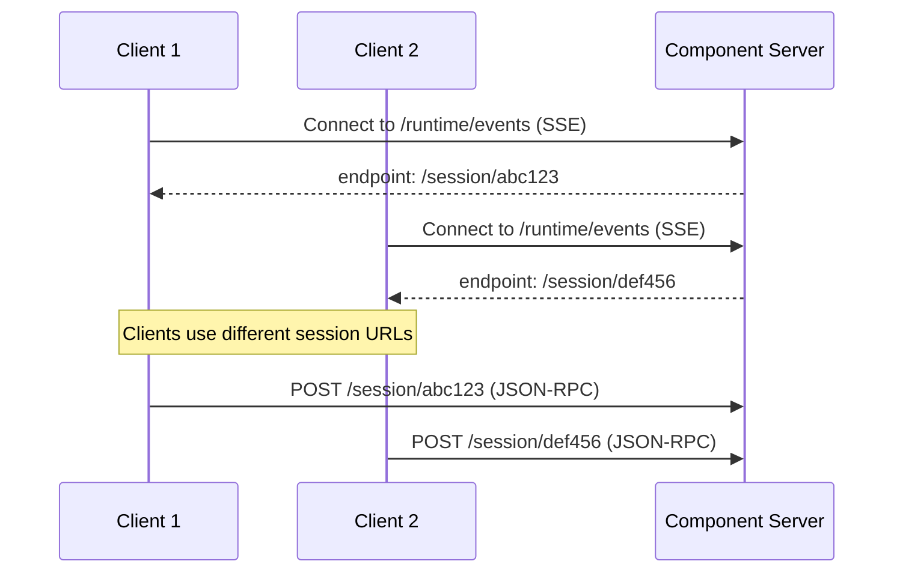

# Overview

The Stepflow Protocol is a JSON-RPC 2.0 based communication protocol designed for executing local and remote workflow components.
It supports multiple transport mechanisms and allows bidirectional communication between the Stepflow runtime and component servers.
This allows the component servers to use the Stepflow runtime for concerns like logging and blob storage while ensuring durabble execution.

## Architecture

The protocol defines communication between two primary entities:

- **Stepflow Runtime**: Orchestrates workflow execution and persistence and routes components to plugins
- **Component Server**: Hosts one or more workflow components and executes them on behalf of the runtime

## Core Concepts

### JSON-RPC Foundation
The protocol builds on JSON-RPC 2.0, providing:
- **Request/Response patterns** for method calls
- **Notification patterns** for one-way messages
- **Standardized error handling** with custom error codes
- **Message correlation** through request/response IDs

### Bidirectional Communication
Unlike traditional client-server models, the protocol supports bidirectional communication:
- **Runtime → Server**: Component execution, discovery, information requests
- **Server → Runtime**: Blob storage operations, workflow introspection, resource access

### Content-Addressable Storage
The protocol includes a built-in blob storage system:
- **Content-based IDs**: SHA-256 hashes ensure data integrity
- **Automatic deduplication**: Identical data shares the same blob ID
- **Cross-component sharing**: Blobs can be accessed by any component in a workflow
- **Type-aware storage**: Support for different blob types (JSON, binary, etc.)

### Multi-Transport Support
Component servers can communicate via different transport mechanisms:
- **STDIO Transport**: Process-based communication for local components
- **HTTP Transport**: Network-based communication for distributed components
- **Session isolation**: Optional MCP-style session negotiation for multi-client scenarios

See [Transport](./transport/) for details.

## Method Categories

The protocol organizes methods into logical categories:

### Initialization Methods
- `initialize` - Establish protocol version and capabilities
- `initialized` - Confirm initialization completion

### Component Methods
- `components/list` - Discover available components
- `components/info` - Get component metadata and schemas
- `components/execute` - Execute a component with input data

See [Component Methods](./methods/components.md) for details.

### Blob Storage Methods
- `blobs/put` - Store data and receive content-addressable ID
- `blobs/get` - Retrieve data by blob ID

See [Blob Methods](./methods/blobs.md) for details.

### Run Methods
- `runs/submit` - Submit a workflow run for execution
- `runs/get` - Retrieve run status and results

See [Run Methods](./methods/runs.md) for details.

## Communication Patterns

### Synchronous Execution
Simple component operations follow a request-response pattern:

### Bidirectional Operations
Components can make requests back to the runtime during execution:

See the [Bidirectional Communication](./bidirectional.md) document for more details.

### Session Management
HTTP transport supports session isolation for concurrent clients:

## Error Handling

The protocol defines standard error codes for consistent error handling:

- **-32xxx**: JSON-RPC standard errors (parse, invalid request, method not found)
- **-32000 to -32099**: Stepflow-specific errors (component not found, execution failed, etc.)

All errors include structured data for programmatic handling and user-friendly messages for debugging.

See the [Error Handling](./errors.md) document for a complete list of error codes and their meanings.

## Schema Integration

All protocol messages are defined with JSON Schema:
- **Request/response validation**: Ensures message conformity
- **Development tooling**: Enables auto-completion and validation in IDEs
- **Documentation generation**: Schemas serve as authoritative message specifications
- **Multi-language support**: Schemas generate types for Python, TypeScript, and other SDKs

See the [protocol schema](../reference/protocol-schema.mdx) for detailed message definitions.

## Next Steps

- **[Message Format](./message-format.md)**: JSON-RPC message structure and correlation
- **[Transport](./transport/)**: STDIO and HTTP transport specifications
- **[Methods](./methods/)**: Detailed method specifications with examples
- **[Error Handling](./errors.md)**: Complete error code reference
- **[Bidirectional Communication](./bidirectional.md)**: Advanced communication patterns