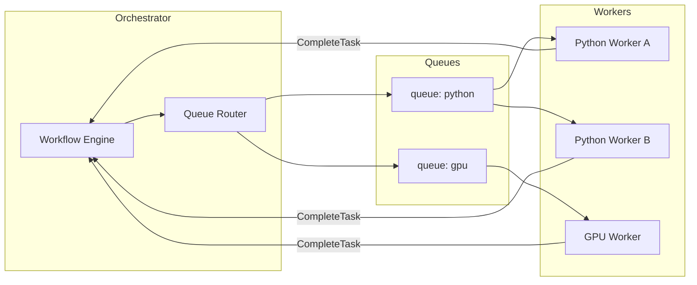
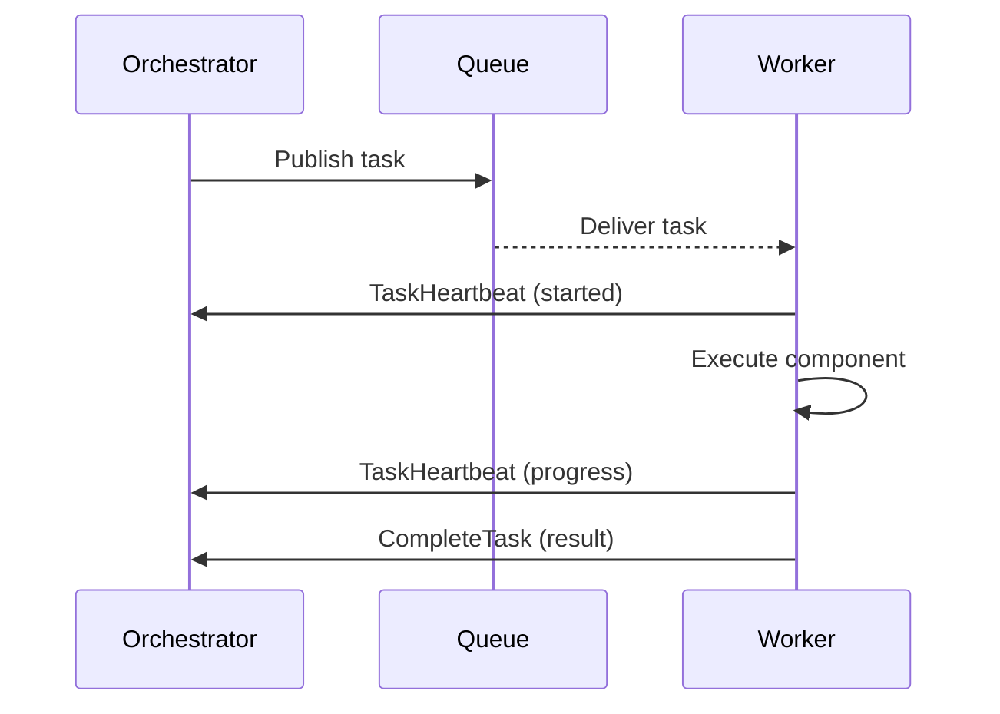

# Protocol Overview

Stepflow uses a **queue-based task protocol** to coordinate work between the orchestrator and workers. The orchestrator dispatches tasks onto named queues; workers pull tasks from those queues, execute them, and report results back. This design decouples the orchestrator from workers, enabling independent scaling, multiple transport backends, and fault-tolerant execution.

## Architecture


```mermaid
graph LR
    subgraph Orchestrator
        WE[Workflow Engine]
        QR[Queue Router]
    end

    subgraph Queues
        Q1["queue: python"]
        Q2["queue: gpu"]
    end

    subgraph Workers
        W1[Python Worker A]
        W2[Python Worker B]
        W3[GPU Worker]
    end

    WE --> QR
    QR --> Q1
    QR --> Q2
    Q1 --> W1
    Q1 --> W2
    Q2 --> W3

    W1 -->|CompleteTask| WE
    W2 -->|CompleteTask| WE
    W3 -->|CompleteTask| WE
```

1. The **orchestrator** executes a workflow and determines which component to invoke for each step.
2. It uses [routing rules](../configuration.md#routing-configuration) to map the component path to a plugin, which determines the **queue** to publish the task on.
3. A **worker** listening on that queue picks up the task, executes the component, and reports the result back to the orchestrator.

## Queue Backends

Stepflow supports multiple queue backends through its plugin system. All backends share the same task lifecycle — the only difference is how tasks are transported between the orchestrator and workers.

| Backend | Plugin Type | Transport | Best For |
|---------|------------|-----------|----------|
| **gRPC** | `type: grpc` | `PullTasks` streaming RPC | Single-orchestrator deployments, local development |
| **NATS** | `type: nats` | JetStream consumers | Multi-orchestrator, horizontal scaling, durable queues |

Future backends can be added by implementing the queue plugin interface.

### gRPC Queues

Workers connect to the orchestrator's `TasksService` and call `PullTasks` to open a long-lived stream. The orchestrator pushes task assignments through the stream as they become available.

```yaml
plugins:
  python:
    type: grpc
    queueName: python
    command: uv
    args: ["run", "stepflow_py", "--grpc"]
```

### NATS Queues

Tasks are published to NATS JetStream subjects. Workers run as durable consumers, enabling fan-out across multiple orchestrator instances and surviving restarts without task loss.

```yaml
plugins:
  python:
    type: nats
    natsUrl: "nats://localhost:4222"
    stream: STEPFLOW_TASKS
```

## Named Queues and Routing

Each plugin defines a default **queue name** (via `queueName`). Routes can override this per-path, allowing a single plugin to serve multiple worker pools:

```yaml
plugins:
  workers:
    type: grpc
    queueName: default

routes:
  "/ml/{*component}":
    - plugin: workers
      params:
        queueName: gpu    # Override: route to GPU worker pool
  "/python/{*component}":
    - plugin: workers      # Uses default queue name
  "/{*component}":
    - plugin: builtin
```

Workers subscribe to a specific queue name and only receive tasks routed to that queue.

## Worker Configuration

Workers discover the orchestrator and queue configuration through environment variables. When the orchestrator launches a worker as a subprocess, it sets these automatically:

| Variable | Description |
|----------|-------------|
| `STEPFLOW_TRANSPORT` | Queue backend: `grpc` or `nats` |
| `STEPFLOW_QUEUE_NAME` | Queue name to pull tasks from |
| `STEPFLOW_TASKS_URL` | Orchestrator gRPC address (for gRPC transport) |
| `STEPFLOW_BLOB_URL` | BlobService gRPC address |

For remote workers (deployed independently, e.g., in Kubernetes), these variables are configured in the worker's deployment manifest.

## Task Lifecycle

Every task follows the same lifecycle regardless of queue backend:


```mermaid
sequenceDiagram
    participant O as Orchestrator
    participant Q as Queue
    participant W as Worker

    O->>Q: Publish task
    Q-->>W: Deliver task
    W->>O: TaskHeartbeat (started)
    W->>W: Execute component
    W->>O: TaskHeartbeat (progress)
    W->>O: CompleteTask (result)
```

See [Task Lifecycle](./task-lifecycle.md) for the full details on task types, heartbeating, completion, retries, and bidirectional callbacks.

## Proto Definitions

The protocol is defined in Protocol Buffer files in `proto/stepflow/v1/`:

- `tasks.proto` — `TasksService`: PullTasks, GetOrchestratorForRun
- `orchestrator.proto` — `OrchestratorService`: CompleteTask, TaskHeartbeat, SubmitRun, GetRun
- `components.proto` — `ComponentsService`: ListRegisteredComponents (public API)
- `blobs.proto` — `BlobService`: PutBlob, GetBlob
- `common.proto` — Shared types: TaskErrorCode, ObservabilityContext

## Next Steps

- **[Task Lifecycle](./task-lifecycle.md)** — How tasks are dispatched, executed, and completed
- **[Error Handling](./errors.md)** — Error codes, retry behavior, and failure handling
- **[Blob Storage](./blobs.md)** — Content-addressable storage for data sharing
