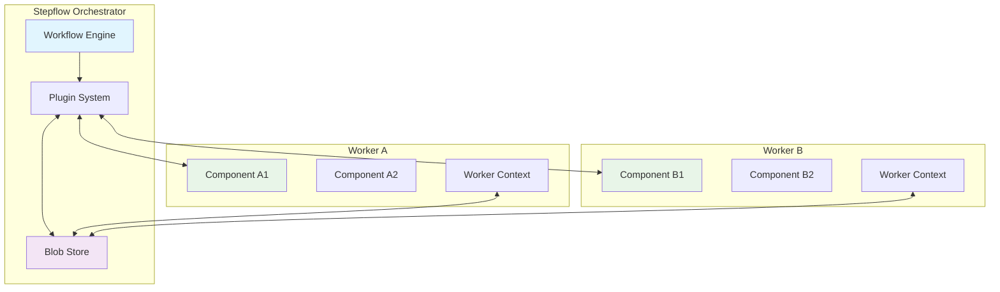
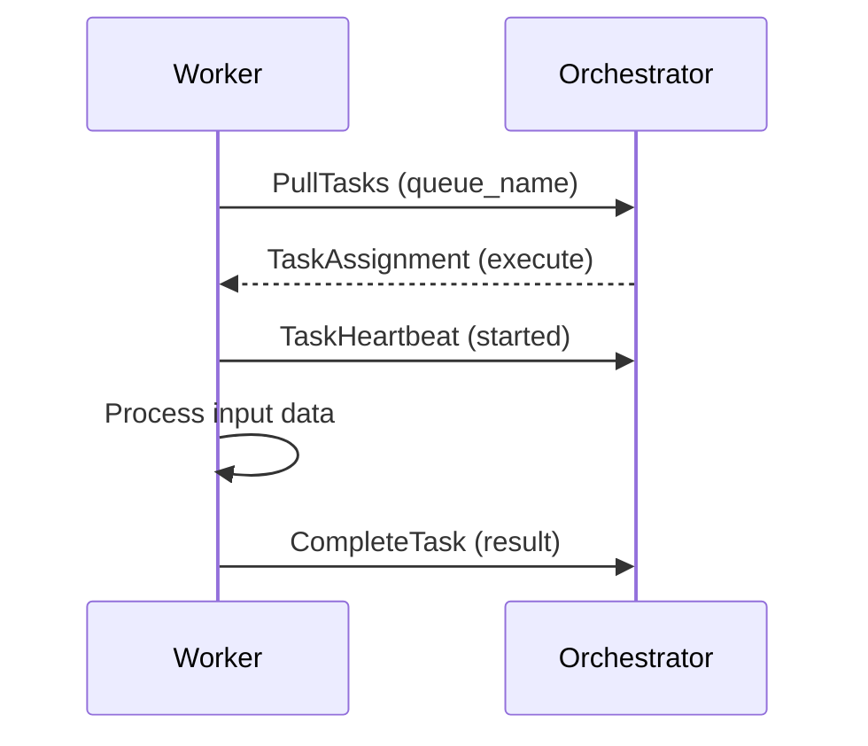
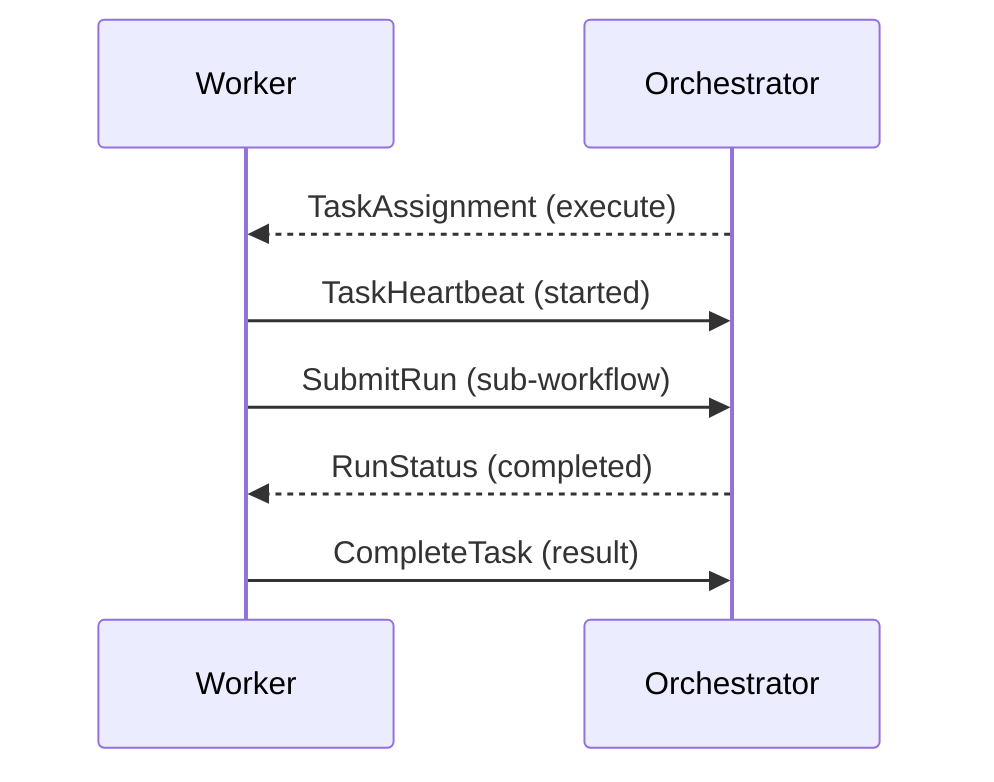

# Overview

The Stepflow Protocol is a gRPC-based communication protocol designed for executing local and remote workflow components.
It enables bidirectional communication between the Stepflow orchestrator and workers, allowing workers to pull tasks, report results, and access runtime services like blob storage and sub-workflow execution.

## Architecture

The protocol defines communication between two primary entities:

- **Stepflow Orchestrator**: Orchestrates workflow execution, persistence, and routes components to plugins
- **Worker**: Hosts one or more workflow components and executes them on behalf of the orchestrator

```mermaid
graph TB
    subgraph "Stepflow Orchestrator"
        WE[Workflow Engine]
        PS[Plugin System]
        BS[Blob Store]
    end

    subgraph "Worker A"
        CA1[Component A1]
        CA2[Component A2]
        CTX[Worker Context]
    end

    subgraph "Worker B"
        CB1[Component B1]
        CB2[Component B2]
        CTX2[Worker Context]
    end

    WE --> PS
    PS <--> CA1
    PS <--> CB1
    PS <--> BS
    CTX <--> BS
    CTX2 <--> BS

    style WE fill:#e1f5fe
    style BS fill:#f3e5f5
    style CA1 fill:#e8f5e8
    style CB1 fill:#e8f5e8
```

## Core Concepts

### gRPC Pull-Based Protocol
The protocol uses gRPC for all worker communication:
- **Task dispatch**: Workers pull tasks from the orchestrator via a streaming RPC (`PullTasks`)
- **Task completion**: Workers report results back via `CompleteTask`
- **Heartbeats**: Workers signal liveness during execution via `TaskHeartbeat`
- **Standardized error handling** with `TaskErrorCode` variants

### Bidirectional Communication
The protocol supports bidirectional communication:
- **Orchestrator → Worker**: Task assignments (component execution, component discovery)
- **Worker → Orchestrator**: Task completion, heartbeats, sub-run submission, run queries

### Content-Addressable Storage
The protocol includes a built-in blob storage system:
- **Content-based IDs**: SHA-256 hashes ensure data integrity
- **Automatic deduplication**: Identical data shares the same blob ID
- **Cross-component sharing**: Blobs can be accessed by any component in a workflow
- **HTTP API**: Blob operations use a separate HTTP API endpoint

### gRPC Transport
Workers communicate via gRPC with streaming for task dispatch:
- **Pull-based**: Workers call `PullTasks` and maintain a long-lived stream
- **Named queues**: Tasks are routed to workers via configurable queue names
- **Flexible deployment**: Workers can run locally (spawned by orchestrator) or remotely

See [Transport](./transport.md) for details.

## gRPC Services

The protocol defines the following gRPC services:

### TasksService (Orchestrator → Worker)
- `PullTasks` - Workers pull task assignments via server-side streaming
- `GetOrchestratorForRun` - Discover which orchestrator owns a run

### OrchestratorService (Worker → Orchestrator)
- `CompleteTask` - Report task results (success, failure, or component listing)
- `TaskHeartbeat` - Signal liveness and report progress during execution
- `SubmitRun` - Submit a sub-workflow for execution
- `GetRun` - Query run status with optional wait for completion

### ComponentsService (Public API)
- `ListRegisteredComponents` - Discover available components across all plugins

See [Methods](./methods/) for detailed specifications.

## Communication Patterns

### Task Execution
Component operations follow the pull-execute-complete pattern:

```mermaid
sequenceDiagram
    participant Worker as Worker
    participant Orchestrator as Orchestrator

    Worker->>Orchestrator: PullTasks (queue_name)
    Orchestrator-->>Worker: TaskAssignment (execute)
    Worker->>Orchestrator: TaskHeartbeat (started)
    Worker->>Worker: Process input data
    Worker->>Orchestrator: CompleteTask (result)
```

### Bidirectional Operations
Workers can make calls back to the orchestrator during execution:

```mermaid
sequenceDiagram
    participant Worker as Worker
    participant Orchestrator as Orchestrator

    Orchestrator-->>Worker: TaskAssignment (execute)
    Worker->>Orchestrator: TaskHeartbeat (started)
    Worker->>Orchestrator: SubmitRun (sub-workflow)
    Orchestrator-->>Worker: RunStatus (completed)
    Worker->>Orchestrator: CompleteTask (result)
```

See the [Bidirectional Communication](./bidirectional.md) document for more details.

## Error Handling

The protocol defines `TaskErrorCode` variants for consistent error handling:

- **Always retried**: `UNREACHABLE`, `TIMEOUT` (transport-level errors)
- **Retried with policy**: `COMPONENT_FAILED`, `RESOURCE_UNAVAILABLE` (with `onError: retry`)
- **Never retried**: `INVALID_INPUT`, `CANCELLED`, `COMPONENT_NOT_FOUND`, etc.

All errors include structured data for programmatic handling and user-friendly messages for debugging.

See the [Error Handling](./errors.md) document for a complete list of error codes and their meanings.

## Proto Definitions

The protocol is defined in Protocol Buffer files located in `proto/stepflow/v1/`:
- `tasks.proto` — TaskAssignment, PullTasks, worker task dispatch
- `orchestrator.proto` — CompleteTask, TaskHeartbeat, worker callbacks
- `components.proto` — ComponentsService (public component listing API)
- `common.proto` — Shared types (ObservabilityContext, TaskErrorCode)

## Next Steps

- **[Transport](./transport.md)**: gRPC transport specification
- **[Methods](./methods/)**: Detailed method specifications with examples
- **[Error Handling](./errors.md)**: Complete error code reference
- **[Implementing Workers](../workers/implementing-workers.md)**: Guide to building workers
