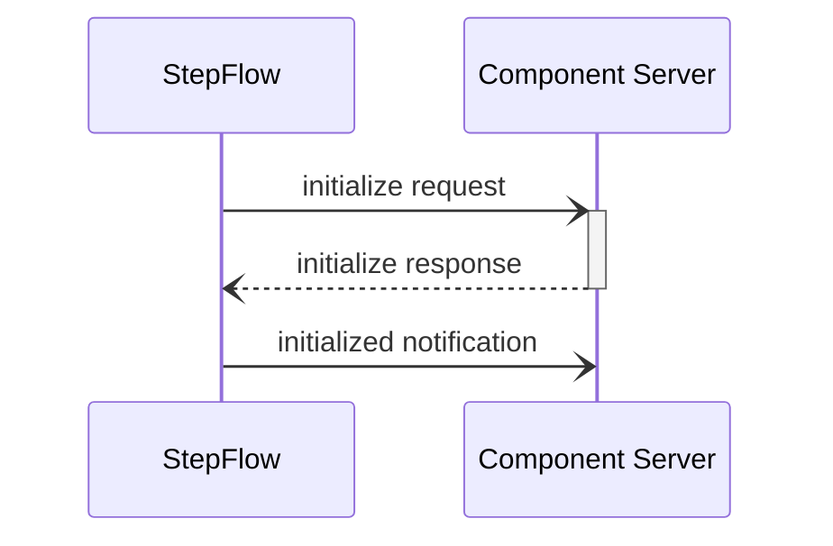

# Lifecycle

## Initialization

```mermaid
sequenceDiagram
    participant SF as StepFlow
    participant CS as Component Server
    SF-)+CS: initialize request
    CS--)-SF: initialize response
    SF-)CS: initialized notification
```

## Shutdown

:::note
Shutdown protocol isn't implemented yet but should match MCP
:::