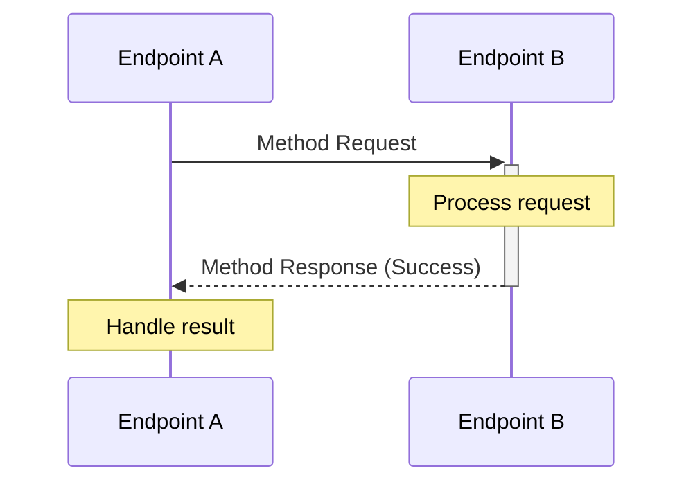
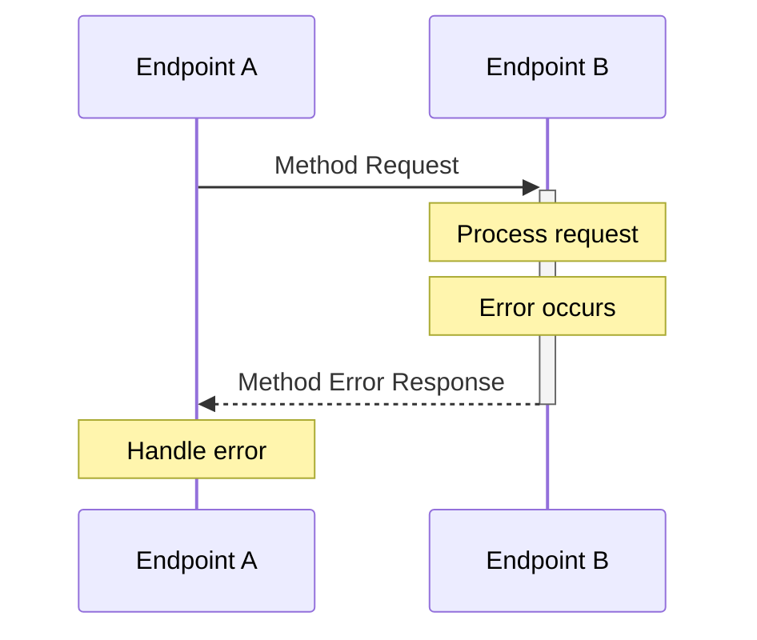
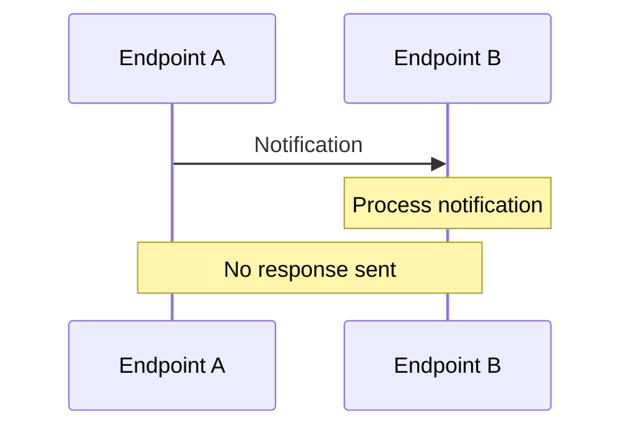
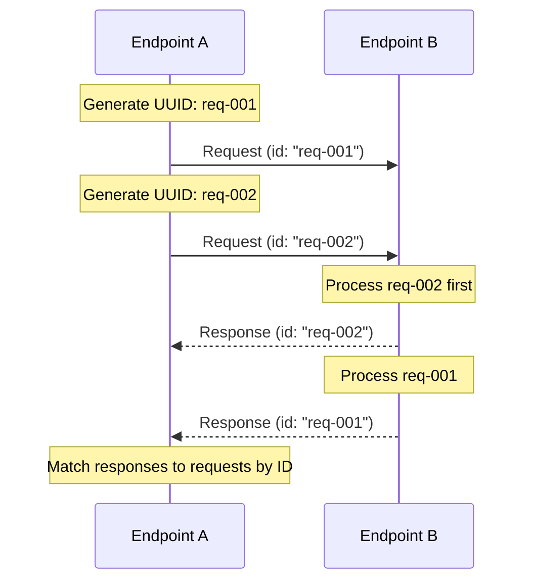
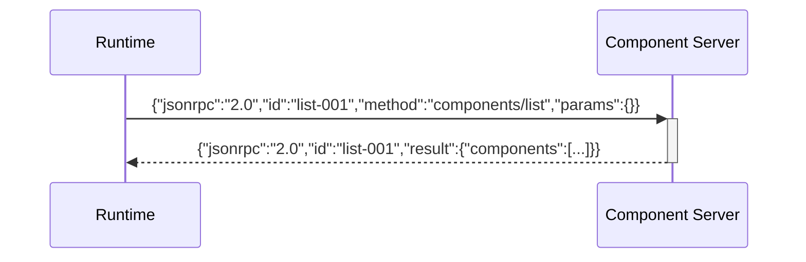
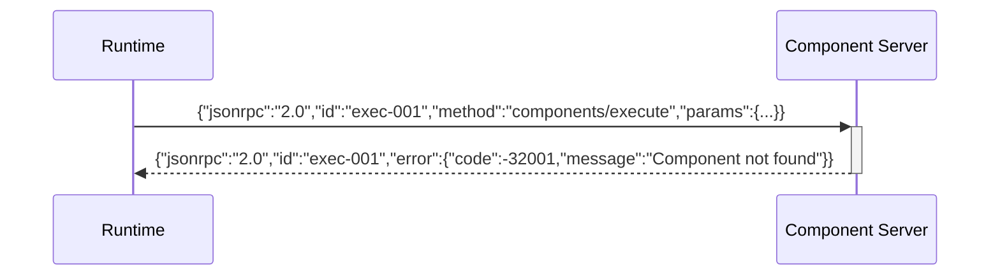
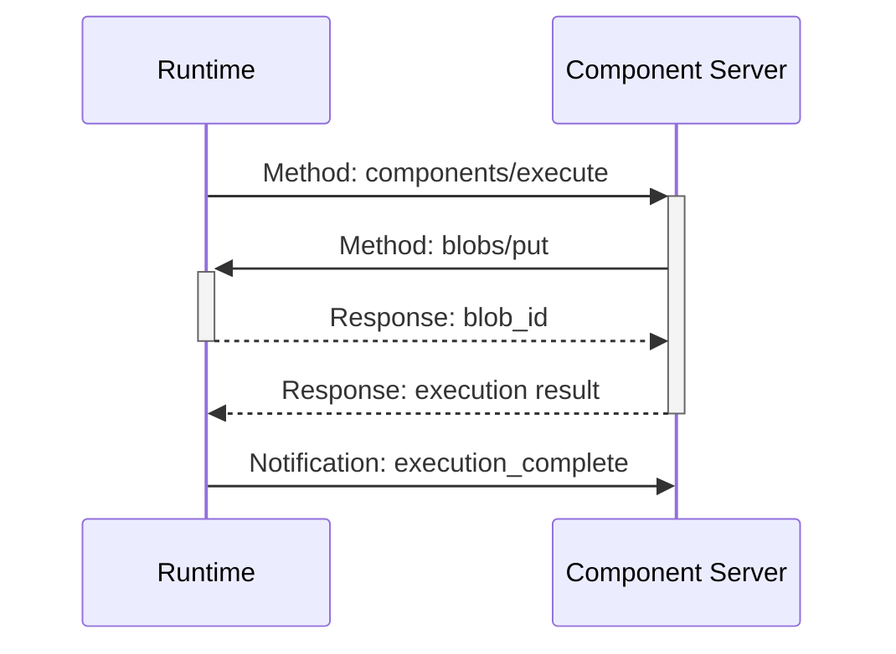

import SchemaDisplay from "@site/src/components/SchemaDisplay";

# Message Format

The Stepflow Protocol uses JSON-RPC 2.0 for all communication between the runtime and workers. This page describes the four types of messages and how they work together to enable method calls, responses, and notifications.

For transport-specific details, see [Transport](./transport.md).

## Message Types

The protocol uses four distinct message types:

1. **Method Request** - Initiates a method call and expects a response
2. **Method Response** - Successful reply to a method request
3. **Method Error** - Error reply to a method request
4. **Notification** - One-way message that expects no response

## Method Request-Response Pattern

Most protocol communication follows the request-response pattern where one endpoint calls a method on another and receives either a success response or an error response.

### Successful Method Call



#### Method Request Format

```json
{
  "jsonrpc": "2.0",
  "id": "req-uuid-123",
  "method": "components/execute",
  "params": {
    "component": {"name": "data_processor"},
    "input": {"records": [{"id": 1, "data": "example"}]}
  }
}
```

**Required Fields:**
- **`jsonrpc`**: Must be `"2.0"`
- **`id`**: Unique identifier for request correlation (typically UUID)
- **`method`**: Method name using Stepflow naming conventions

**Optional Fields:**
- **`params`**: Method parameters (omit if method takes no parameters)

#### Method Response Format (Success)

```json
{
  "jsonrpc": "2.0",
  "id": "req-uuid-123",
  "result": {
    "output": {
      "processed_records": [{"id": 1, "data": "EXAMPLE", "processed": true}],
      "summary": {"total": 1, "processed": 1, "errors": 0}
    }
  }
}
```

**Required Fields:**
- **`jsonrpc`**: Must be `"2.0"`
- **`id`**: Must match the request ID exactly
- **`result`**: The method's return value (any JSON value)

### Failed Method Call



#### Method Error Response Format

```json
{
  "jsonrpc": "2.0",
  "id": "req-uuid-123",
  "error": {
    "code": -32001,
    "message": "Component not found",
    "data": {
      "component": "unknown_processor",
      "available_components": ["data_processor", "text_analyzer"],
      "suggestion": "Check component name spelling"
    }
  }
}
```

**Required Fields:**
- **`jsonrpc`**: Must be `"2.0"`
- **`id`**: Must match the request ID (or `null` for parse errors)
- **`error`**: Error object with required `code` and `message` fields

**Error Object Fields:**
- **`code`**: Integer error code (see [Error Handling](./errors.md))
- **`message`**: Human-readable error description
- **`data`** (optional): Additional structured error information

## Notifications

Notifications are one-way messages that do not expect any response. They are used for events, status updates, and confirmations where no return value is needed.

### Notification Pattern



### Notification Format

```json
{
  "jsonrpc": "2.0",
  "method": "initialized",
  "params": {}
}
```

**Required Fields:**
- **`jsonrpc`**: Must be `"2.0"`
- **`method`**: Method name

**Optional Fields:**
- **`params`**: Notification parameters (omit if none needed)

**Key Difference:** Notifications have **no `id` field**, which signals that no response should be sent.

### Notification Examples

**Simple notification:**
```json
{
  "jsonrpc": "2.0",
  "method": "initialized",
  "params": {}
}
```

**Notification with parameters:**
```json
{
  "jsonrpc": "2.0",
  "method": "progress_update",
  "params": {
    "step_id": "data_processing",
    "progress": 0.75,
    "message": "Processing batch 3 of 4"
  }
}
```

## Message Correlation

The protocol uses UUIDs to correlate requests with their responses, enabling concurrent method calls and proper error handling.

### Correlation Flow



### Correlation Rules

1. **Unique IDs**: Each request must have a unique ID within the connection
2. **Exact matching**: Response ID must match request ID exactly
3. **ID reuse**: IDs may be reused after the response is received
4. **Concurrent requests**: Multiple outstanding requests are allowed
5. **Response order**: Responses may arrive in any order

## Complete Communication Examples

### Simple Method Call

Runtime calls a method on component server:



### Method Call with Error

Runtime calls method that fails:



### Bidirectional with Notification

Component execution with bidirectional call and final notification:

