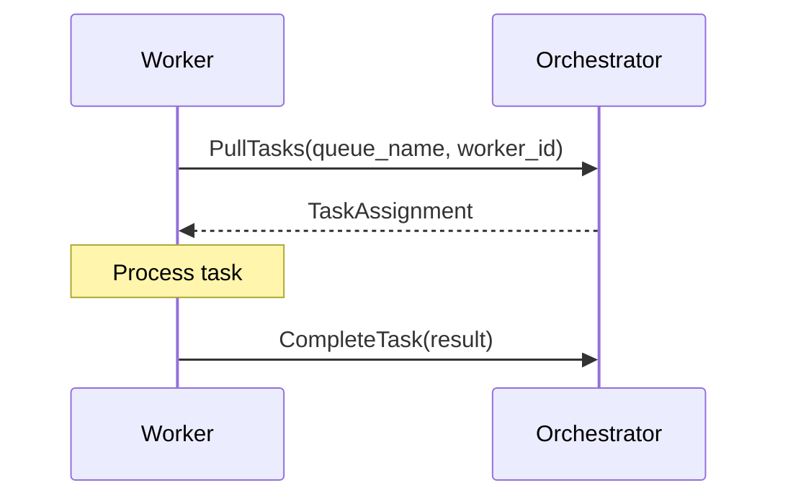
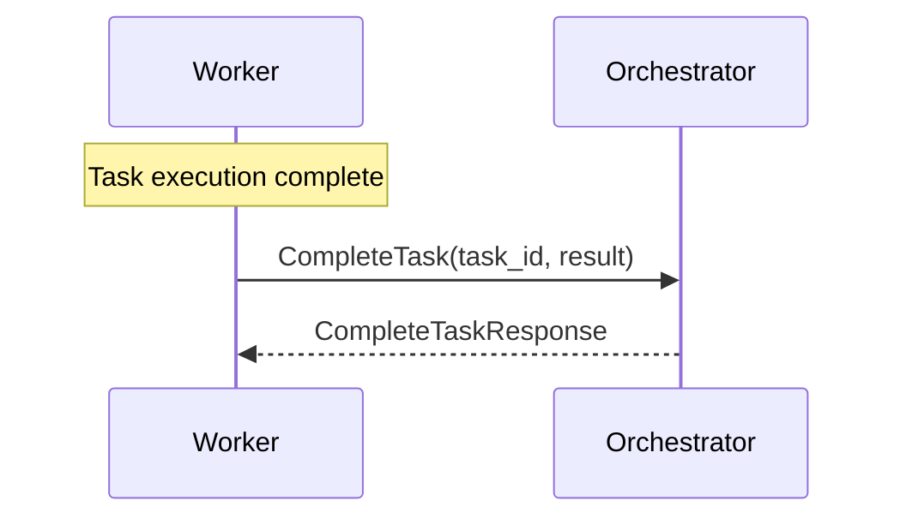
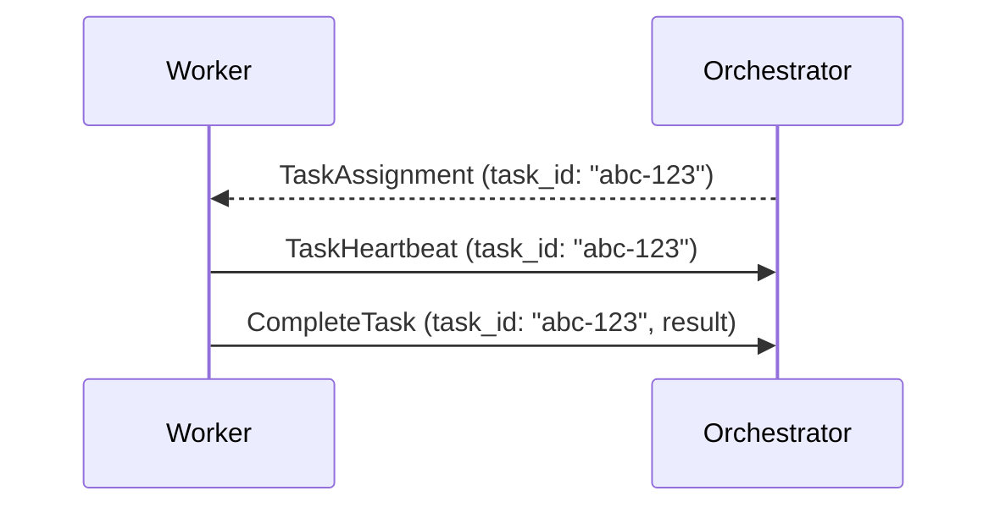

# Message Format

The Stepflow Protocol uses Protocol Buffers (protobuf) for all gRPC communication between the orchestrator and workers. This page describes the key message types and how they work together.

For transport-specific details, see [Transport](./transport.md).

## Message Types

The protocol uses several key message types defined in protobuf:

1. **TaskAssignment** — Sent from orchestrator to worker via the `PullTasks` stream
2. **CompleteTaskRequest** — Sent from worker to orchestrator to report results
3. **TaskHeartbeatRequest** — Sent from worker to orchestrator to signal liveness
4. **OrchestratorSubmitRunRequest** / **OrchestratorGetRunRequest** — Worker-to-orchestrator callbacks

## Task Assignment

The orchestrator sends `TaskAssignment` messages to workers through the `PullTasks` stream:

```mermaid
sequenceDiagram
    participant W as Worker
    participant O as Orchestrator

    W->>O: PullTasks(queue_name, worker_id)
    O-->>W: TaskAssignment
    Note over W: Process task
    W->>O: CompleteTask(result)
```

### TaskAssignment Fields

| Field | Type | Description |
|-------|------|-------------|
| `task_id` | string | Unique task identifier |
| `task` | oneof | Either `execute` (ComponentExecuteRequest) or `list_components` (ListComponentsRequest) |
| `context` | TaskContext | Orchestrator URL and root run ID |
| `heartbeat_interval_secs` | uint32 | Suggested heartbeat cadence (0 = none required) |

### ComponentExecuteRequest Fields

| Field | Type | Description |
|-------|------|-------------|
| `component` | string | Component path to execute |
| `input` | google.protobuf.Value | Input data |
| `attempt` | uint32 | 1-based monotonically increasing attempt counter |
| `observability` | ObservabilityContext | Trace/span IDs for distributed tracing |

### TaskContext Fields

| Field | Type | Description |
|-------|------|-------------|
| `orchestrator_service_url` | string | gRPC endpoint for OrchestratorService callbacks |
| `root_run_id` | string | UUID of root run in execution tree |

## Task Completion

Workers report results via `CompleteTask`:

```mermaid
sequenceDiagram
    participant W as Worker
    participant O as Orchestrator

    Note over W: Task execution complete
    W->>O: CompleteTask(task_id, result)
    O-->>W: CompleteTaskResponse
```

### CompleteTaskRequest Fields

| Field | Type | Description |
|-------|------|-------------|
| `task_id` | string | ID of the completed task |
| `result` | oneof | One of: `ComponentExecuteResponse` (success), `TaskError` (failure), or `ListComponentsResult` (discovery) |

### TaskError Fields

| Field | Type | Description |
|-------|------|-------------|
| `code` | TaskErrorCode | Error category (see [Error Handling](./errors.md)) |
| `message` | string | Human-readable error description |
| `data` | string | Optional structured error data (JSON) |

## Heartbeats

Workers signal liveness during execution:

| Field | Type | Description |
|-------|------|-------------|
| `task_id` | string | ID of the task being executed |
| `progress` | float | Optional progress indicator (0.0–1.0) |
| `status_message` | string | Optional status message |

The response indicates whether the task should continue (`IN_PROGRESS`) or abort (`ALREADY_CLAIMED`).

## Message Correlation

Tasks are correlated by their `task_id`, which is assigned by the orchestrator when the task is dispatched. All subsequent messages (heartbeats, completion) reference this ID.

```mermaid
sequenceDiagram
    participant W as Worker
    participant O as Orchestrator

    O-->>W: TaskAssignment (task_id: "abc-123")
    W->>O: TaskHeartbeat (task_id: "abc-123")
    W->>O: CompleteTask (task_id: "abc-123", result)
```

### Correlation Rules

1. **Unique task IDs**: Each task has a unique ID assigned by the orchestrator
2. **Exact matching**: All messages for a task must use the same task ID
3. **Orchestrator routing**: Workers use `orchestrator_service_url` from `TaskContext` to reach the correct orchestrator instance

## Orchestrator Callbacks

Workers can call back to the orchestrator during execution using `OrchestratorService`:

### SubmitRun

| Field | Type | Description |
|-------|------|-------------|
| `flow_id` | string | Blob ID of the workflow to execute |
| `inputs` | repeated Value | Array of input values |
| `wait` | bool | If true, wait for completion |
| `max_concurrency` | uint32 | Maximum concurrent item executions |
| `root_run_id` | string | Root run ID (from TaskContext) |

### GetRun

| Field | Type | Description |
|-------|------|-------------|
| `run_id` | string | UUID of the run to query |
| `wait` | bool | If true, wait for completion |
| `include_results` | bool | Include item results in response |
| `result_order` | string | Order: "byIndex" or "byCompletion" |
