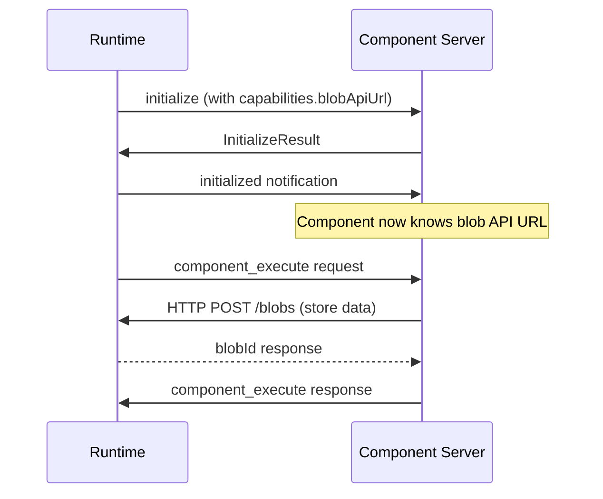

# Blob Storage

Blob storage provides content-addressable storage for JSON data, enabling efficient data sharing between components and across workflow steps.

## Overview

Stepflow provides a Blob HTTP API for storing and retrieving JSON data. Unlike other component-runtime communication which uses the bidirectional SSE protocol, blob operations use direct HTTP requests for better scalability.

Blobs are identified by SHA-256 hashes of their content, enabling:

- **Deterministic IDs**: Identical data always produces the same blob ID
- **Deduplication**: Same content stored once, referenced many times
- **Integrity**: SHA-256 hash verifies data hasn't been corrupted

## Initialization

The blob API URL is communicated to component servers during the `initialize` handshake via `RuntimeCapabilities`:



### Initialize Request with Capabilities

```json
{
  "jsonrpc": "2.0",
  "id": "init-001",
  "method": "initialize",
  "params": {
    "runtimeProtocolVersion": 1,
    "capabilities": {
      "blobApiUrl": "http://localhost:7837/api/v1/blobs"
    }
  }
}
```

The `blobApiUrl` field tells the component server where to send blob HTTP requests. If this field is present, the component server should use HTTP for all blob operations.

## HTTP API Endpoints

### Store Blob

**Endpoint:** `POST {blobApiUrl}`

Store JSON data and receive a content-addressable blob ID.

**Request:**
```json
{
  "data": {
    "processed_records": [
      {"id": "record_1", "name": "John", "status": "active"}
    ],
    "metadata": {
      "timestamp": "2024-01-15T10:30:00Z"
    }
  },
  "blobType": "data"
}
```

**Response:**
```json
{
  "blobId": "a1b2c3d4e5f6789012345678901234567890abcdef1234567890abcdef123456"
}
```

### Retrieve Blob

**Endpoint:** `GET {blobApiUrl}/{blob_id}`

Retrieve stored data by blob ID.

**Response:**
```json
{
  "data": {
    "processed_records": [
      {"id": "record_1", "name": "John", "status": "active"}
    ],
    "metadata": {
      "timestamp": "2024-01-15T10:30:00Z"
    }
  },
  "blobType": "data",
  "blobId": "a1b2c3d4e5f6789012345678901234567890abcdef1234567890abcdef123456"
}
```

## Deployment Configuration

Configure the Blob API in `stepflow-config.yml`:

```yaml
# Local development (default) - orchestrator serves blob endpoints
# No configuration needed

# Kubernetes with orchestrator serving blobs
blobApi:
  url: "http://orchestrator-service/api/v1/blobs"

# Kubernetes with separate blob service
blobApi:
  enabled: false  # Orchestrator doesn't serve blob endpoints
  url: "http://blob-service/api/v1/blobs"
```

**Configuration fields:**
- `blobApi.enabled` (default: `true`) - Whether the orchestrator serves blob HTTP endpoints
- `blobApi.url` (optional) - URL passed to workers during initialization

### Deployment Scenarios

| Scenario | `blobApi.enabled` | `blobApi.url` |
|----------|-------------------|---------------|
| Local development | (omit - defaults to true) | (omit) |
| K8s: orchestrator serves blobs | `true` or omit | `http://orchestrator-service/api/v1/blobs` |
| K8s: separate blob service | `false` | `http://blob-service/api/v1/blobs` |

## Python SDK Usage

The Python SDK handles blob API negotiation automatically:

```python
from stepflow_py import StepflowServer, StepflowContext

server = StepflowServer()

@server.component
async def my_component(input: dict, context: StepflowContext) -> dict:
    # Store data as a blob (uses HTTP API automatically)
    blob_id = await context.put_blob({"key": "value"})

    # Retrieve data by blob ID
    data = await context.get_blob(blob_id)

    return {"blob_id": blob_id, "data": data}
```

The SDK:
1. Receives `blobApiUrl` during initialization
2. Uses HTTP requests for `put_blob` and `get_blob` calls
3. Raises `RuntimeError` if blob operations are attempted without a configured URL

## Blob Types

- **`data`** (default) - General JSON data storage
- **`flow`** - Workflow definition storage

## Blob ID Format

Blob IDs are 64-character hexadecimal strings representing the SHA-256 hash of the blob content:

```
a1b2c3d4e5f6789012345678901234567890abcdef1234567890abcdef123456
```
