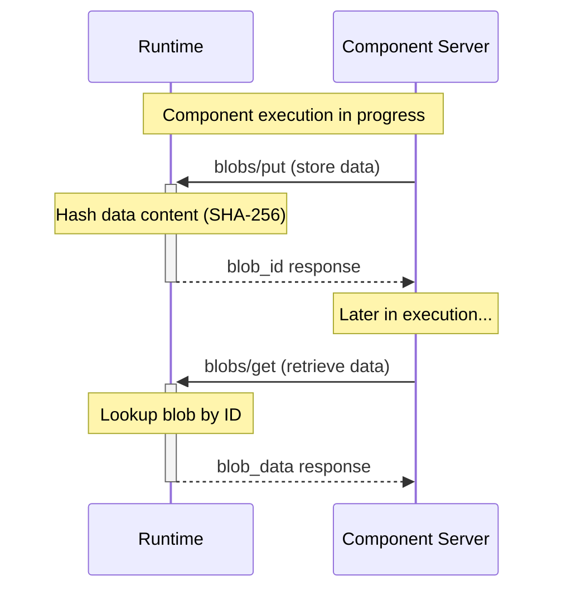

import SchemaDisplay from "@site/src/components/SchemaDisplay";

# Blob Storage

Blob storage methods provide content-addressable storage for JSON data, enabling efficient data sharing between components and across workflow steps.
These methods support the bidirectional communication pattern allowing components to store and retrieve data during execution.

## Overview

The blob storage methods provide a complete storage interface:

1. **`blobs/put`** - Store data and receive content-addressable ID
2. **`blobs/get`** - Retrieve data by blob ID

These methods are called by component servers during execution, not by the runtime directly.

## Blob Storage Sequence



## blobs/put Method

**Method Name:** `blobs/put`
**Direction:** Component Server → Runtime
**Type:** Request (expects response)

<SchemaDisplay schema="https://stepflow.org/schemas/v1/protocol.json" path="$defs/PutBlobParams"/>

<SchemaDisplay schema="https://stepflow.org/schemas/v1/protocol.json" path="$defs/PutBlobResult"/>

### Request Example

```json
{
  "jsonrpc": "2.0",
  "id": "put-blob-001",
  "method": "blobs/put",
  "params": {
    "data": {
      "processed_records": [
        {"id": "record_1", "data": {"name": "John", "status": "active"}}
      ],
      "metadata": {
        "timestamp": "2024-01-15T10:30:00Z",
        "version": "1.2.3"
      }
    },
    "blob_type": "Json"
  }
}
```

### Response Example

```json
{
  "jsonrpc": "2.0",
  "id": "put-blob-001",
  "result": {
    "blob_id": "sha256:a1b2c3d4e5f6789012345678901234567890abcdef1234567890abcdef123456"
  }
}
```

### Content-Addressable Properties

- **Deterministic IDs**: Identical data always produces the same blob_id
- **SHA-256 based**: Uses cryptographic hash for integrity and uniqueness
- **Blob ID format**: `sha256:<64-character-hexadecimal-hash>`

## blobs/get Method

**Method Name:** `blobs/get`
**Direction:** Component Server → Runtime
**Type:** Request (expects response)

<SchemaDisplay schema="https://stepflow.org/schemas/v1/protocol.json" path="$defs/GetBlobParams"/>

<SchemaDisplay schema="https://stepflow.org/schemas/v1/protocol.json" path="$defs/GetBlobResult"/>

### Request Example

```json
{
  "jsonrpc": "2.0",
  "id": "get-blob-001",
  "method": "blobs/get",
  "params": {
    "blob_id": "sha256:a1b2c3d4e5f6789012345678901234567890abcdef1234567890abcdef123456"
  }
}
```

### Response Example

```json
{
  "jsonrpc": "2.0",
  "id": "get-blob-001",
  "result": {
    "data": {
      "processed_records": [
        {"id": "record_1", "data": {"name": "John", "status": "active"}}
      ],
      "metadata": {
        "timestamp": "2024-01-15T10:30:00Z",
        "version": "1.2.3"
      }
    },
    "blob_type": "Json"
  }
}
```

