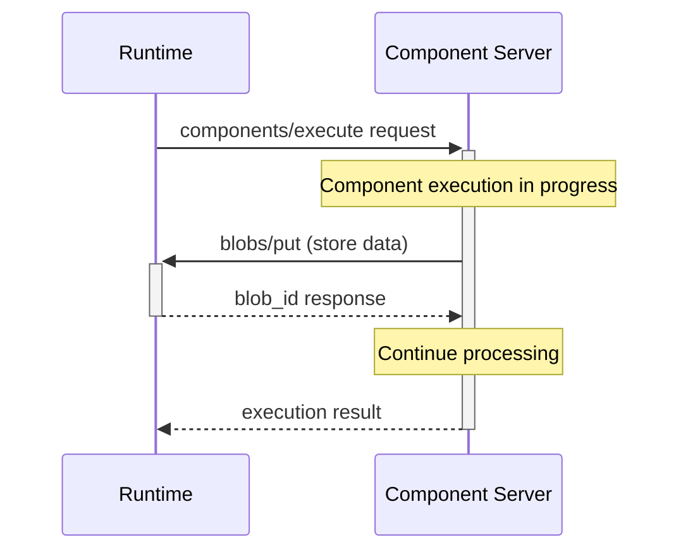

import SchemaDisplay from "@site/src/components/SchemaDisplay";

# Components

Component methods enable the discovery, introspection, and execution of workflow components. These methods form the core of the Stepflow Protocol and are used extensively during workflow execution.

## Overview

The component methods provide a complete lifecycle for working with components:

1. **`components/list`** - Discover all available components
2. **`components/info`** - Get detailed information about a specific component
3. **`components/execute`** - Execute a component with input data

## components/list Method

**Method Name:** `components/list`
**Direction:** Runtime → Component Server
**Type:** Request (expects response)

<SchemaDisplay schema="https://stepflow.org/schemas/v1/protocol.json" path="$defs/ComponentListParams"/>

<SchemaDisplay schema="https://stepflow.org/schemas/v1/protocol.json" path="$defs/ListComponentsResult"/>

### Request Example

```json
{
  "jsonrpc": "2.0",
  "id": "list-components-001",
  "method": "components/list",
  "params": {}
}
```

### Response Example

```json
{
  "jsonrpc": "2.0",
  "id": "list-components-001",
  "result": {
    "components": [
      {
        "name": "data_processor",
        "description": "Process and transform data records according to configurable rules"
      },
      {
        "name": "http_client",
        "description": "Make HTTP requests with automatic retry logic and response parsing"
      }
    ]
  }
}
```

## components/info Method

**Method Name:** `components/info`
**Direction:** Runtime → Component Server
**Type:** Request (expects response)

<SchemaDisplay schema="https://stepflow.org/schemas/v1/protocol.json" path="$defs/ComponentInfoParams"/>

<SchemaDisplay schema="https://stepflow.org/schemas/v1/protocol.json" path="$defs/ComponentInfoResult"/>

### Request Example

```json
{
  "jsonrpc": "2.0",
  "id": "component-info-001",
  "method": "components/info",
  "params": {
    "component": {
      "name": "data_processor",
      "path": "/python/data_processor"
    }
  }
}
```

### Response Example

```json
{
  "jsonrpc": "2.0",
  "id": "component-info-001",
  "result": {
    "info": {
      "name": "data_processor",
      "description": "Process and transform data records according to configurable rules",
      "input_schema": {
        "type": "object",
        "properties": {
          "records": {
            "type": "array",
            "items": {"type": "object"}
          },
          "rules": {
            "type": "object",
            "properties": {
              "transformation": {
                "type": "string",
                "enum": ["uppercase", "lowercase", "title_case"]
              }
            }
          }
        },
        "required": ["records", "rules"]
      },
      "output_schema": {
        "type": "object",
        "properties": {
          "processed_records": {"type": "array"},
          "summary": {"type": "object"}
        },
        "required": ["processed_records", "summary"]
      }
    }
  }
}
```

## components/execute Method

**Method Name:** `components/execute`
**Direction:** Runtime → Component Server
**Type:** Request (expects response)

<SchemaDisplay schema="https://stepflow.org/schemas/v1/protocol.json" path="$defs/ComponentExecuteParams"/>

<SchemaDisplay schema="https://stepflow.org/schemas/v1/protocol.json" path="$defs/ComponentExecuteResult"/>

### Request Example

```json
{
  "jsonrpc": "2.0",
  "id": "execute-data-processor-001",
  "method": "components/execute",
  "params": {
    "component": {
      "name": "data_processor",
      "path": "/python/data_processor"
    },
    "input": {
      "records": [
        {"id": "record_1", "data": {"name": "John", "status": "active"}}
      ],
      "rules": {
        "transformation": "uppercase"
      }
    }
  }
}
```

### Response Example

```json
{
  "jsonrpc": "2.0",
  "id": "execute-data-processor-001",
  "result": {
    "output": {
      "processed_records": [
        {
          "id": "record_1",
          "data": {"name": "JOHN", "status": "ACTIVE"},
          "processed": true
        }
      ],
      "summary": {
        "total": 1,
        "processed": 1,
        "errors": 0
      }
    }
  }
}
```

### Bidirectional Execution

Components that need to interact with the runtime during execution can make requests back to the runtime:

