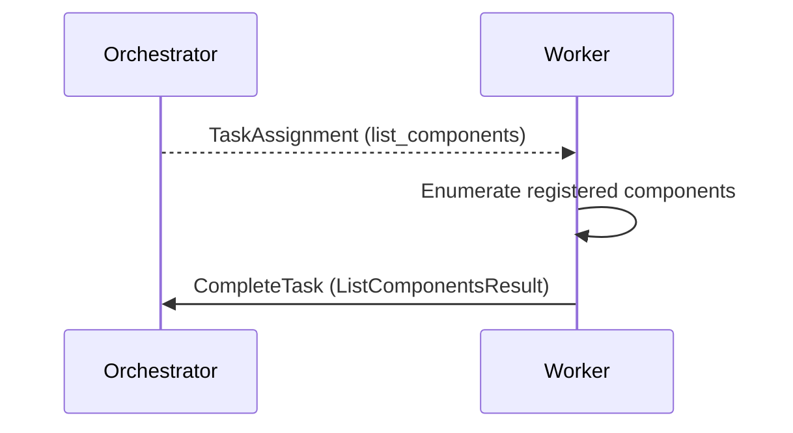
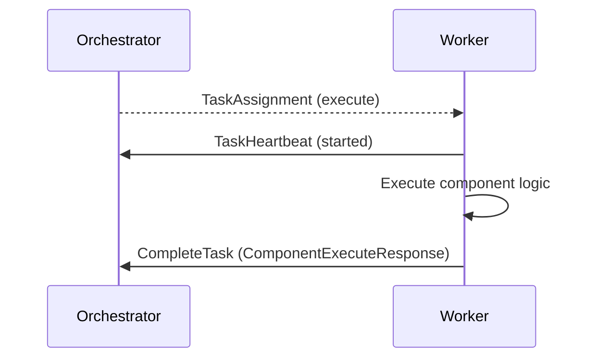
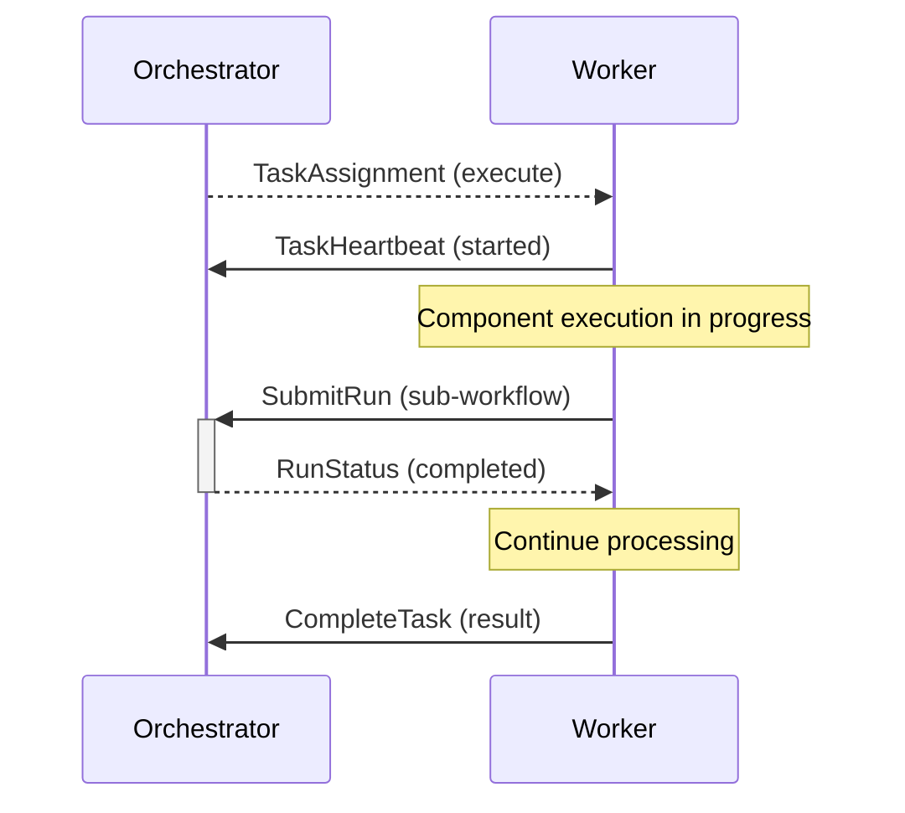

# Components

Component methods enable the discovery, introspection, and execution of workflow components. These operations are dispatched as task assignments via the `PullTasks` stream and results are reported via `CompleteTask`.

## Overview

The component lifecycle involves three operations:

1. **Component listing** — Discover all available components on a worker
2. **Component execution** — Execute a component with input data
3. **Task completion** — Report the result back to the orchestrator

## Component Listing

The orchestrator discovers components by sending a `list_components` task assignment.

**Task type:** `ListComponentsRequest`

### Flow


```mermaid
sequenceDiagram
    participant O as Orchestrator
    participant W as Worker

    O-->>W: TaskAssignment (list_components)
    W->>W: Enumerate registered components
    W->>O: CompleteTask (ListComponentsResult)
```

### Response

The worker returns a `ListComponentsResult` containing an array of components, each with:

| Field | Type | Description |
|-------|------|-------------|
| `name` | string | Component name |
| `description` | string | Human-readable description |

## Component Execution

The orchestrator dispatches component execution as an `execute` task assignment.

**Task type:** `ComponentExecuteRequest`

### Flow


```mermaid
sequenceDiagram
    participant O as Orchestrator
    participant W as Worker

    O-->>W: TaskAssignment (execute)
    W->>O: TaskHeartbeat (started)
    W->>W: Execute component logic
    W->>O: CompleteTask (ComponentExecuteResponse)
```

### Request Fields

| Field | Type | Description |
|-------|------|-------------|
| `component` | string | Component path to execute (e.g., `data_processor`) |
| `input` | google.protobuf.Value | Input data as a structured value |
| `attempt` | uint32 | 1-based attempt counter (see below) |
| `observability` | ObservabilityContext | Trace/span IDs for distributed tracing |

### Response Fields

The worker returns a `ComponentExecuteResponse` via `CompleteTask`:

| Field | Type | Description |
|-------|------|-------------|
| `output` | google.protobuf.Value | Component output data |

### The `attempt` Field

The `attempt` field is a **1-based, monotonically increasing counter** that tracks how many times a step has been executed. On the first execution, `attempt` is `1`. Each subsequent re-execution increments the counter by one.

The `attempt` counter is shared across all retry reasons:

| Reason | Trigger | Limit | Configured Via |
|--------|---------|-------|----------------|
| **Transport error** | Subprocess crash, network timeout, connection failure | `transportMaxRetries` (default: 3) | Orchestrator `retry` config |
| **Component error** | Component ran and returned an error; step has `onError: { action: retry }` | `maxRetries` (default: 3) | Step-level `onError` |
| **Orchestrator recovery** | Orchestrator crashed; task was started but no completion journaled | Unlimited | N/A |

Transport errors and component errors have **separate budgets** — exhausting transport retries does not consume component retry budget, and vice versa. The `attempt` counter increments regardless of which retry reason triggered the re-execution.

Components can use the `attempt` field for observability (logging, metrics) or to adjust their behavior on retries (e.g., using a longer timeout or a different strategy).

## Task Completion

Workers report results via `CompleteTask` on the `OrchestratorService`:

### Success

```
CompleteTaskRequest {
    task_id: "abc-123",
    result: ComponentExecuteResponse {
        output: { "processed": true, "count": 42 }
    }
}
```

### Failure

```
CompleteTaskRequest {
    task_id: "abc-123",
    result: TaskError {
        code: COMPONENT_FAILED,
        message: "API call returned 503"
    }
}
```

See [Error Handling](../errors.md) for the complete `TaskErrorCode` taxonomy.

## Heartbeats

Workers signal liveness via `TaskHeartbeat` on the `OrchestratorService`:

1. **Before execution**: Worker sends an initial heartbeat to transition the task to EXECUTING state
2. **During execution**: Periodic heartbeats reset the crash-detection timer
3. **With progress**: Heartbeats can include a progress indicator (0.0–1.0) and status message

If the orchestrator does not receive a heartbeat within the timeout window (5 seconds), the task is assumed to have crashed.

## Bidirectional Execution

Components that need to interact with the orchestrator during execution can make calls back via `OrchestratorService`:


```mermaid
sequenceDiagram
    participant O as Orchestrator
    participant W as Worker

    O-->>W: TaskAssignment (execute)
    W->>O: TaskHeartbeat (started)
    Note over W: Component execution in progress

    W->>+O: SubmitRun (sub-workflow)
    O-->>-W: RunStatus (completed)

    Note over W: Continue processing

    W->>O: CompleteTask (result)
```
