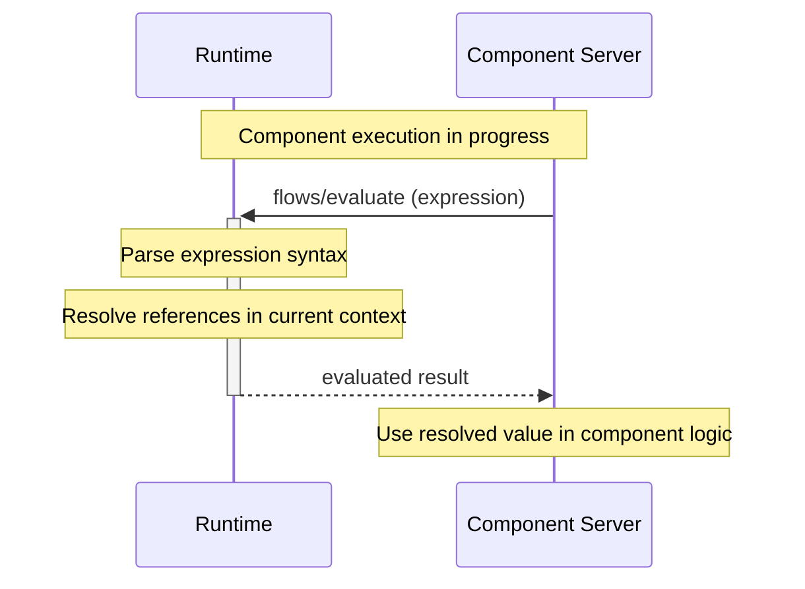
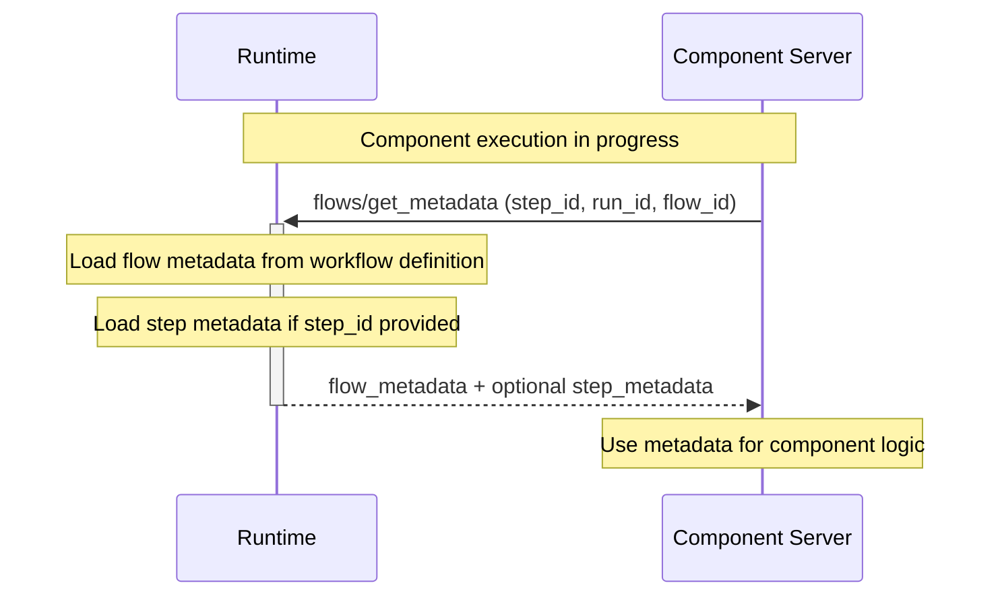

import SchemaDisplay from "@site/src/components/SchemaDisplay";

# Flows

Flow methods enable component servers to evaluate workflow expressions and access runtime context during execution. These methods provide advanced integration capabilities for components that need to understand their execution environment.

## Overview

The flow methods currently include:

1. **`flows/evaluate`** - Evaluate workflow expressions in runtime context
2. **`flows/get_metadata`** - Access flow and step metadata during execution

Additional flow methods may be added in future protocol versions for workflow introspection and runtime interaction.

## Flow Method Sequences

### Flow Evaluation Sequence



### Metadata Access Sequence



## flows/evaluate Method

**Method Name:** `flows/evaluate`
**Direction:** Component Server → Runtime
**Type:** Request (expects response)

<SchemaDisplay schema="https://stepflow.org/schemas/v1/protocol.json" path="$defs/EvaluateFlowParams"/>

<SchemaDisplay schema="https://stepflow.org/schemas/v1/protocol.json" path="$defs/EvaluateFlowResult"/>

### Request Example

```json
{
  "jsonrpc": "2.0",
  "id": "eval-flow-001",
  "method": "flows/evaluate",
  "params": {
    "expression": {
      "$from": {"step": "data_processor"},
      "path": "$.results.total_count"
    }
  }
}
```

### Response Example

```json
{
  "jsonrpc": "2.0",
  "id": "eval-flow-001",
  "result": {
    "value": 42
  }
}
```

## Expression Types

### Workflow Input References

```json
{
  "expression": {
    "$from": {"workflow": "input"},
    "path": "$.user.preferences.theme"
  }
}
```

### Step Output References

```json
{
  "expression": {
    "$from": {"step": "user_validation"},
    "path": "$.validation_result.is_valid"
  }
}
```

### Complex Expressions

```json
{
  "expression": {
    "user_data": {
      "$from": {"workflow": "input"},
      "path": "$.user"
    },
    "validation_status": {
      "$from": {"step": "user_validation"},
      "path": "$.status"
    },
    "static_config": {
      "timeout": 30
    }
  }
}
```

## flows/get_metadata Method

**Method Name:** `flows/get_metadata`
**Direction:** Component Server → Runtime
**Type:** Request (expects response)

<SchemaDisplay schema="https://stepflow.org/schemas/v1/protocol.json" path="$defs/GetFlowMetadataParams"/>

<SchemaDisplay schema="https://stepflow.org/schemas/v1/protocol.json" path="$defs/GetFlowMetadataResult"/>

### Request Example

```json
{
  "jsonrpc": "2.0",
  "id": "get-metadata-001",
  "method": "flows/get_metadata",
  "params": {
    "step_id": "data_processor",
    "run_id": "123e4567-e89b-12d3-a456-426614174000",
    "flow_id": "sha256:abc123..."
  }
}
```

### Response Example

```json
{
  "jsonrpc": "2.0",
  "id": "get-metadata-001",
  "result": {
    "flow_metadata": {
      "name": "Data Processing Workflow",
      "description": "Processes user data through validation and transformation steps",
      "version": "1.0.0",
      "author": "Data Team",
      "timeout": 300,
      "retry_policy": {
        "max_attempts": 3,
        "backoff": "exponential"
      }
    },
    "step_metadata": {
      "timeout": 60,
      "critical": true,
      "description": "Validates and processes incoming data",
      "tags": ["validation", "processing"]
    }
  }
}
```

