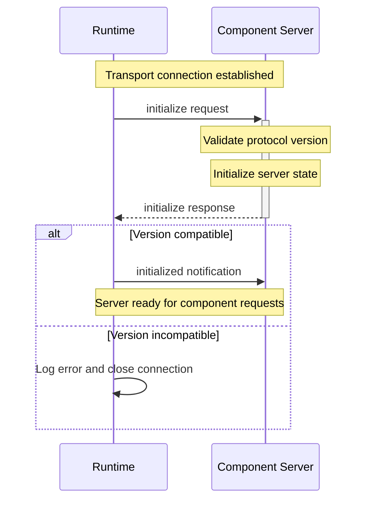

import SchemaDisplay from "@site/src/components/SchemaDisplay";

# Initialization

Initialization methods establish the protocol connection and negotiate capabilities between the Stepflow runtime and component servers.

## Overview

## Initialization Sequence

The initialization sequence establishes the protocol connection in two steps:

1. **`initialize`** - Runtime requests the `initialize` method and client responds.
2. **`initialized`** - Runtime sends `initialized` notification to indicate initialization is complete.

Both steps are required for proper protocol establishment.



## initialize Method

The `initialize` method negotiates protocol version and establishes basic capabilities.

**Method Name:** `initialize`
**Direction:** Runtime → Component Server
**Type:** Request (expects response)

### Request Schema

<SchemaDisplay schema="https://stepflow.org/schemas/v1/protocol.json" path="$defs/InitializeParams"/>

### Response Schema

<SchemaDisplay schema="https://stepflow.org/schemas/v1/protocol.json" path="$defs/InitializeResult"/>

### Request Example

```json
{
  "jsonrpc": "2.0",
  "id": "b4d0c7e1-8f2a-4d3b-9c5a-1e7f8a9b2c3d",
  "method": "initialize",
  "params": {
    "runtime_protocol_version": 1
  }
}
```

### Successful Response Example

```json
{
  "jsonrpc": "2.0",
  "id": "b4d0c7e1-8f2a-4d3b-9c5a-1e7f8a9b2c3d",
  "result": {
    "server_protocol_version": 1
  }
}
```

### Error Response Example

```json
{
  "jsonrpc": "2.0",
  "id": "b4d0c7e1-8f2a-4d3b-9c5a-1e7f8a9b2c3d",
  "error": {
    "code": -32002,
    "message": "Server not initialized - protocol version mismatch",
    "data": {
      "runtime_version": 1,
      "server_version": 2,
      "supported_versions": [2],
      "message": "Server only supports protocol version 2, but runtime requested version 1"
    }
  }
}
```

## initialized Notification

The `initialized` notification is sent by the runtime to confirm the server is ready for component requests.

**Method Name:** `initialized`
**Direction:** Runtime → Component Server
**Type:** Notification (no response expected)

### Notification Format

```json
{
  "jsonrpc": "2.0",
  "method": "initialized",
  "params": {}
}
```

## Protocol Version Negotiation

Current version negotiation requires exact version matching:

| Runtime Version | Server Version | Compatible | Result |
|----------------|----------------|------------|---------|
| 1 | 1 | ✅ Yes | Proceed with protocol |
| 1 | 2 | ❌ No | Connection terminated |
| 2 | 1 | ❌ No | Connection terminated |

Future protocol versions may support version ranges.