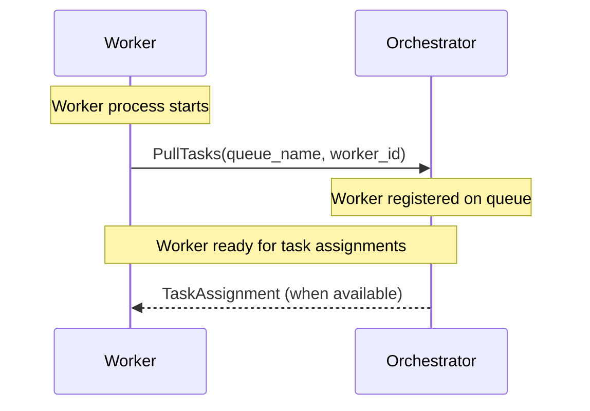

# Initialization

With the gRPC pull-based protocol, worker initialization is handled implicitly through the `PullTasks` streaming RPC. There is no separate initialization handshake.

## Connection Sequence

When a worker starts, it establishes a connection to the orchestrator's `TasksService`:


```mermaid
sequenceDiagram
    participant W as Worker
    participant O as Orchestrator

    Note over W: Worker process starts
    W->>O: PullTasks(queue_name, worker_id)
    Note over O: Worker registered on queue
    Note over W,O: Worker ready for task assignments
    O-->>W: TaskAssignment (when available)
```

## PullTasks Request

The `PullTasks` request serves as the worker's registration with the orchestrator:

| Field | Type | Description |
|-------|------|-------------|
| `queue_name` | string | Queue to pull tasks from (must match plugin config `queueName`) |
| `worker_id` | string | UUID identifying this worker instance (for logging and diagnostics) |

## Subprocess Mode

When the orchestrator launches a worker as a subprocess (via `command` in plugin config), it:

1. Sets environment variables (`STEPFLOW_TASKS_URL`, `STEPFLOW_QUEUE_NAME`, etc.)
2. Launches the worker process
3. The worker reads its configuration from environment variables
4. The worker connects to the orchestrator's `TasksService` and calls `PullTasks`

## Remote Mode

For remote workers (no `command` in plugin config):

1. The worker is deployed independently (e.g., in Kubernetes)
2. The worker reads the orchestrator URL from its environment
3. The worker connects and calls `PullTasks` with the configured queue name
4. The orchestrator dispatches tasks to any worker on that queue

## Orchestrator Discovery

If a worker needs to discover which orchestrator owns a particular run (e.g., after a `NOT_FOUND` error), it can call:

```
TasksService.GetOrchestratorForRun(run_id) → orchestrator_service_url
```

This is a stateless lookup that can be called on any orchestrator instance.
