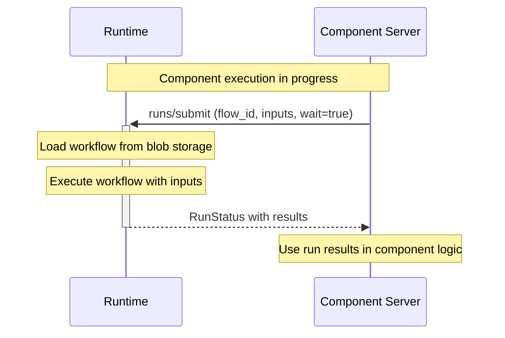
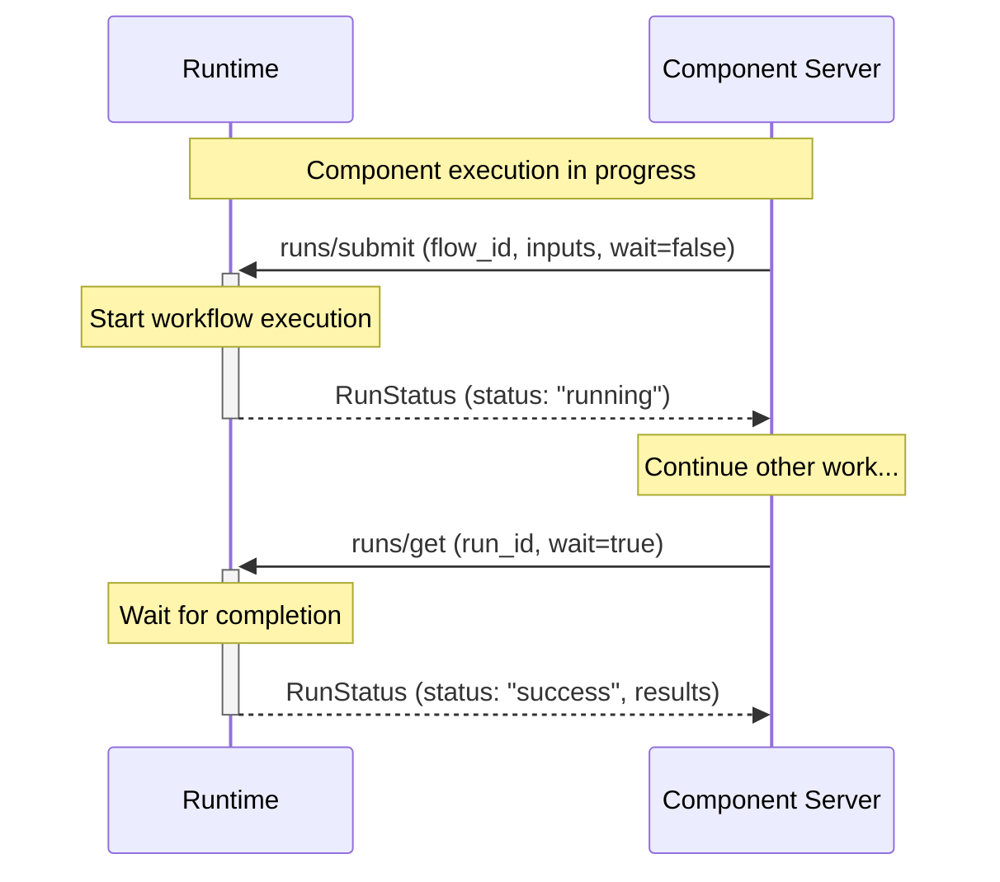

import SchemaDisplay from "@site/src/components/SchemaDisplay";

# Runs

Run methods enable component servers to submit and retrieve workflow runs during execution. These methods provide bidirectional communication capabilities for components that need to orchestrate sub-workflows or check run status.

## Overview

The run methods currently include:

1. **`runs/submit`** - Submit a workflow run for execution
2. **`runs/get`** - Retrieve run status and results

These methods allow component servers to programmatically execute workflows and retrieve their results, enabling patterns like sub-workflow orchestration and batch processing.

## Run Method Sequences

### Run Submission Sequence



### Async Run Submission and Polling



## runs/submit Method

**Method Name:** `runs/submit`
**Direction:** Component Server → Runtime
**Type:** Request (expects response)

Submit a workflow run for execution. The workflow must already be stored as a blob in the runtime's blob storage.

### Parameters

| Field | Type | Required | Description |
|-------|------|----------|-------------|
| `flowId` | string | Yes | The blob ID of the workflow to execute |
| `inputs` | array | Yes | Array of input values, one per run item |
| `wait` | boolean | No | If true, wait for completion before returning (default: false) |
| `maxConcurrency` | number | No | Maximum concurrent item executions |
| `overrides` | object | No | Workflow overrides to apply |
| `observability` | object | No | Observability context for tracing |

### Request Example

```json
{
  "jsonrpc": "2.0",
  "id": "submit-run-001",
  "method": "runs/submit",
  "params": {
    "flowId": "sha256:abc123...",
    "inputs": [
      {"user_id": "user1", "action": "process"},
      {"user_id": "user2", "action": "analyze"}
    ],
    "wait": true,
    "maxConcurrency": 10
  }
}
```

### Response Example

```json
{
  "jsonrpc": "2.0",
  "id": "submit-run-001",
  "result": {
    "runId": "550e8400-e29b-41d4-a716-446655440000",
    "flowId": "sha256:abc123...",
    "flowName": "Data Processing Workflow",
    "status": "success",
    "items": {
      "total": 2,
      "pending": 0,
      "running": 0,
      "success": 2,
      "failed": 0,
      "cancelled": 0
    },
    "createdAt": "2025-01-15T10:30:00Z",
    "completedAt": "2025-01-15T10:30:05Z",
    "results": [
      {
        "itemIndex": 0,
        "result": {"outcome": "success", "value": {"processed": true}},
        "completedAt": "2025-01-15T10:30:03Z"
      },
      {
        "itemIndex": 1,
        "result": {"outcome": "success", "value": {"analyzed": true}},
        "completedAt": "2025-01-15T10:30:05Z"
      }
    ]
  }
}
```

## runs/get Method

**Method Name:** `runs/get`
**Direction:** Component Server → Runtime
**Type:** Request (expects response)

Retrieve the status and optionally results of a workflow run.

### Parameters

| Field | Type | Required | Description |
|-------|------|----------|-------------|
| `runId` | string | Yes | The UUID of the run to retrieve |
| `wait` | boolean | No | If true, wait for completion before returning (default: false) |
| `includeResults` | boolean | No | If true, include item results in response (default: false) |
| `resultOrder` | string | No | Order of results: "byIndex" or "byCompletion" (default: "byIndex") |
| `observability` | object | No | Observability context for tracing |

### Request Example

```json
{
  "jsonrpc": "2.0",
  "id": "get-run-001",
  "method": "runs/get",
  "params": {
    "runId": "550e8400-e29b-41d4-a716-446655440000",
    "wait": true,
    "includeResults": true,
    "resultOrder": "byIndex"
  }
}
```

### Response Example

```json
{
  "jsonrpc": "2.0",
  "id": "get-run-001",
  "result": {
    "runId": "550e8400-e29b-41d4-a716-446655440000",
    "flowId": "sha256:abc123...",
    "flowName": "Data Processing Workflow",
    "status": "success",
    "items": {
      "total": 2,
      "pending": 0,
      "running": 0,
      "success": 2,
      "failed": 0,
      "cancelled": 0
    },
    "createdAt": "2025-01-15T10:30:00Z",
    "completedAt": "2025-01-15T10:30:05Z",
    "results": [
      {
        "itemIndex": 0,
        "result": {"outcome": "success", "value": {"processed": true}},
        "completedAt": "2025-01-15T10:30:03Z"
      },
      {
        "itemIndex": 1,
        "result": {"outcome": "success", "value": {"analyzed": true}},
        "completedAt": "2025-01-15T10:30:05Z"
      }
    ]
  }
}
```

## Run Status Fields

The `RunStatus` response includes:

| Field | Type | Description |
|-------|------|-------------|
| `runId` | string | Unique identifier for the run |
| `flowId` | string | Blob ID of the executed workflow |
| `flowName` | string | Name of the workflow (if defined) |
| `flowLabel` | string | Label for the workflow instance (if provided) |
| `status` | string | Overall status: "pending", "running", "success", "failed", "cancelled" |
| `items` | object | Statistics about run items (total, pending, running, success, failed, cancelled) |
| `createdAt` | string | ISO 8601 timestamp when run was created |
| `completedAt` | string | ISO 8601 timestamp when run completed (if finished) |
| `results` | array | Array of item results (if requested) |

## Use Cases

### Sub-workflow Orchestration

A component can submit a sub-workflow as part of its execution:

```python
@server.component
async def orchestrator(input: Input, ctx: StepflowContext) -> Output:
    # Store the sub-workflow as a blob
    flow_id = await ctx.put_blob(sub_workflow_definition)

    # Submit the sub-workflow
    run_status = await ctx.submit_run(
        flow_id=flow_id,
        inputs=[{"item": item} for item in input.items],
        wait=True,
        max_concurrency=5
    )

    return Output(results=run_status.results)
```

### Batch Processing

Process multiple items using a workflow:

```python
@server.component
async def batch_processor(input: Input, ctx: StepflowContext) -> Output:
    # Submit batch for processing
    run_status = await ctx.submit_run(
        flow_id=input.workflow_id,
        inputs=input.batch_items,
        wait=True,
        max_concurrency=10
    )

    # Check for failures
    if run_status.items.failed > 0:
        # Handle partial failures
        pass

    return Output(
        processed=run_status.items.success,
        failed=run_status.items.failed
    )
```

### Async Execution with Polling

For long-running workflows, submit asynchronously and poll for completion:

```python
@server.component
async def async_processor(input: Input, ctx: StepflowContext) -> Output:
    # Submit without waiting
    run_status = await ctx.submit_run(
        flow_id=input.workflow_id,
        inputs=[input.data],
        wait=False
    )

    # Do other work while workflow runs...
    await do_other_work()

    # Poll for completion
    final_status = await ctx.get_run(
        run_id=run_status.run_id,
        wait=True,
        include_results=True
    )

    return Output(result=final_status.results[0])
```
