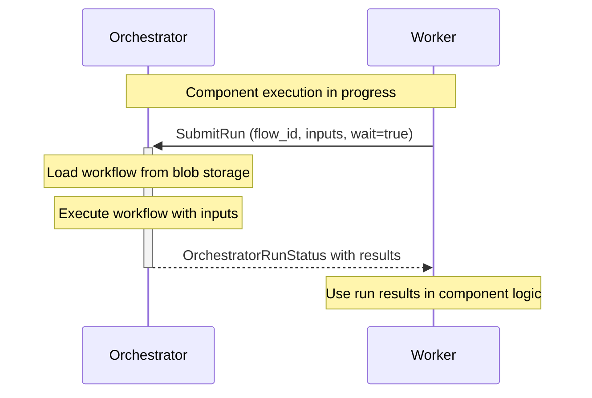
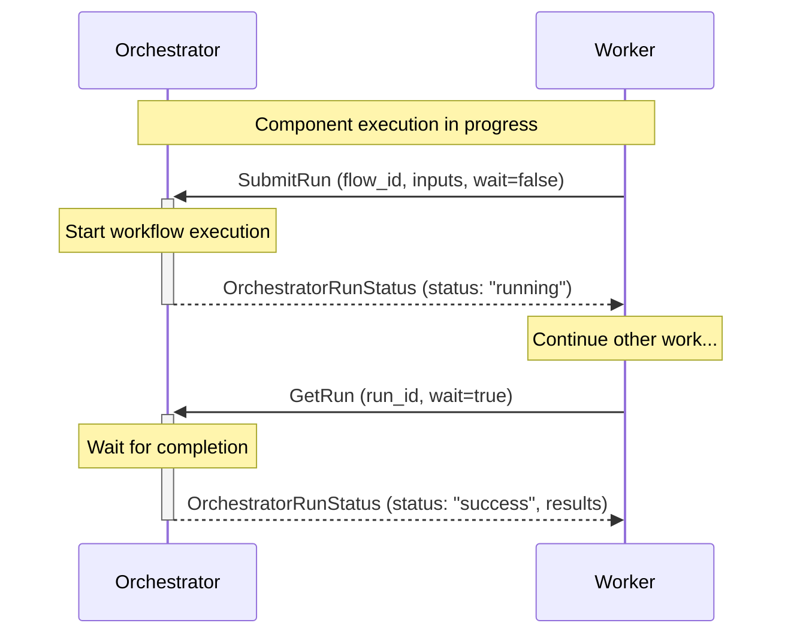

# Runs

Run methods enable workers to submit and retrieve workflow runs during execution. Workers call these methods on the `OrchestratorService` using the `orchestrator_service_url` from the task's `TaskContext`.

## Overview

The run methods include:

1. **`SubmitRun`** - Submit a workflow run for execution
2. **`GetRun`** - Retrieve run status and results

These methods allow workers to programmatically execute workflows and retrieve their results, enabling patterns like sub-workflow orchestration and batch processing.

## Run Method Sequences

### Run Submission Sequence


```mermaid
sequenceDiagram
    participant O as Orchestrator
    participant W as Worker

    Note over O,W: Component execution in progress

    W->>+O: SubmitRun (flow_id, inputs, wait=true)
    Note over O: Load workflow from blob storage
    Note over O: Execute workflow with inputs
    O-->>-W: OrchestratorRunStatus with results

    Note over W: Use run results in component logic
```

### Async Run Submission and Polling


```mermaid
sequenceDiagram
    participant O as Orchestrator
    participant W as Worker

    Note over O,W: Component execution in progress

    W->>+O: SubmitRun (flow_id, inputs, wait=false)
    Note over O: Start workflow execution
    O-->>-W: OrchestratorRunStatus (status: "running")

    Note over W: Continue other work...

    W->>+O: GetRun (run_id, wait=true)
    Note over O: Wait for completion
    O-->>-W: OrchestratorRunStatus (status: "success", results)
```

## runs/submit Method

**RPC:** `OrchestratorService.SubmitRun`
**Direction:** Worker → Orchestrator

Submit a workflow run for execution. The workflow must already be stored as a blob in the orchestrator's blob storage.

### Parameters

| Field | Type | Required | Description |
|-------|------|----------|-------------|
| `flow_id` | string | Yes | The blob ID of the workflow to execute |
| `inputs` | repeated Value | Yes | Array of input values, one per run item |
| `wait` | bool | No | If true, wait for completion before returning (default: false) |
| `max_concurrency` | uint32 | No | Maximum concurrent item executions |
| `overrides` | Value | No | Workflow overrides to apply |
| `observability` | ObservabilityContext | No | Observability context for tracing |
| `root_run_id` | string | Yes | Root run ID from TaskContext (for ownership validation) |
| `subflow_key` | string | No | Deduplication key for recovery scenarios |

### Response

The `OrchestratorRunStatus` response includes:

| Field | Type | Description |
|-------|------|-------------|
| `run_id` | string | Unique identifier for the run |
| `flow_id` | string | Blob ID of the executed workflow |
| `flow_name` | string | Name of the workflow (if defined) |
| `status` | string | Overall status: "pending", "running", "success", "failed", "cancelled" |
| `items` | ItemCounts | Statistics about run items (total, pending, running, success, failed, cancelled) |
| `created_at` | Timestamp | When run was created |
| `completed_at` | Timestamp | When run completed (if finished) |
| `results` | repeated ItemResult | Array of item results (if requested) |

## runs/get Method

**RPC:** `OrchestratorService.GetRun`
**Direction:** Worker → Orchestrator

Retrieve the status and optionally results of a workflow run.

### Parameters

| Field | Type | Required | Description |
|-------|------|----------|-------------|
| `run_id` | string | Yes | The UUID of the run to retrieve |
| `wait` | bool | No | If true, wait for completion before returning (default: false) |
| `include_results` | bool | No | If true, include item results in response (default: false) |
| `result_order` | string | No | Order of results: "byIndex" or "byCompletion" (default: "byIndex") |
| `root_run_id` | string | Yes | Root run ID for ownership validation |

## Use Cases

### Sub-workflow Orchestration

A component can submit a sub-workflow as part of its execution:

```python
@server.component
async def orchestrator(input: Input, ctx: StepflowContext) -> Output:
    # Store the sub-workflow as a blob
    flow_id = await ctx.put_blob(sub_workflow_definition)

    # Submit the sub-workflow
    run_status = await ctx.submit_run(
        flow_id=flow_id,
        inputs=[{"item": item} for item in input.items],
        wait=True,
        max_concurrency=5
    )

    return Output(results=run_status.results)
```

### Batch Processing

Process multiple items using a workflow:

```python
@server.component
async def batch_processor(input: Input, ctx: StepflowContext) -> Output:
    # Submit batch for processing
    run_status = await ctx.submit_run(
        flow_id=input.workflow_id,
        inputs=input.batch_items,
        wait=True,
        max_concurrency=10
    )

    # Check for failures
    if run_status.items.failed > 0:
        # Handle partial failures
        pass

    return Output(
        processed=run_status.items.success,
        failed=run_status.items.failed
    )
```

### Async Execution with Polling

For long-running workflows, submit asynchronously and poll for completion:

```python
@server.component
async def async_processor(input: Input, ctx: StepflowContext) -> Output:
    # Submit without waiting
    run_status = await ctx.submit_run(
        flow_id=input.workflow_id,
        inputs=[input.data],
        wait=False
    )

    # Do other work while workflow runs...
    await do_other_work()

    # Poll for completion
    final_status = await ctx.get_run(
        run_id=run_status.run_id,
        wait=True,
        include_results=True
    )

    return Output(result=final_status.results[0])
```
