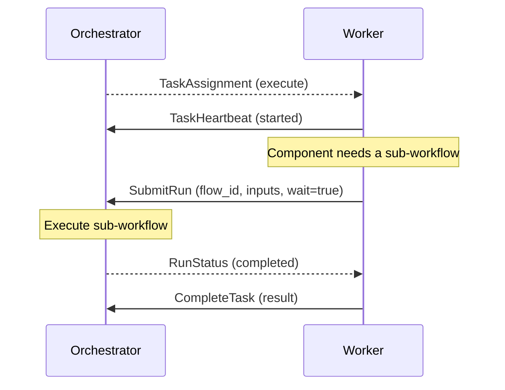

# Task Lifecycle

This page describes how a task moves from the orchestrator to a worker and back. The lifecycle is the same regardless of which [queue backend](./index.md#queue-backends) is used.

## Task Types

The orchestrator dispatches two types of tasks:

| Type | Purpose |
|------|---------|
| **Execute** (`ComponentExecuteRequest`) | Run a component with input data and return output |
| **List Components** (`ListComponentsRequest`) | Discover which components a worker provides |

Both are delivered as a `TaskAssignment` containing the task type, a unique `task_id`, a `TaskContext`, and a suggested heartbeat interval.

## Task Dispatch

When a workflow step is ready to execute, the orchestrator:

1. Resolves the component path (e.g., `/python/my_func`) to a plugin via [routing rules](../configuration.md#routing-configuration)
2. Creates a `TaskAssignment` with the component path, resolved input, and observability context
3. Publishes the task to the plugin's named queue

The worker pulls the task from the queue and begins execution.

## Heartbeats

Workers signal liveness by sending `TaskHeartbeat` messages to the `OrchestratorService`:

1. **Before execution** — The worker sends an initial heartbeat immediately after receiving the task. This transitions the task to EXECUTING state.
2. **During execution** — Periodic heartbeats reset the orchestrator's crash-detection timer (5-second default). If no heartbeat arrives within this window, the task is assumed crashed.
3. **Progress reporting** — Heartbeats can include a `progress` indicator (0.0–1.0) and a `status_message`.

The heartbeat response tells the worker whether to continue (`IN_PROGRESS`) or abort (`ALREADY_CLAIMED` — another worker claimed the task, e.g., after a timeout).

## Task Completion

When execution finishes, the worker calls `CompleteTask` on the `OrchestratorService` with one of:

| Result | When |
|--------|------|
| `ComponentExecuteResponse` | Component succeeded — contains output data |
| `TaskError` | Component failed — contains a [`TaskErrorCode`](./errors.md) and message |
| `ListComponentsResult` | Response to a list-components task — contains available components |

The worker uses the `orchestrator_service_url` from the task's `TaskContext` to reach the correct orchestrator instance (important in multi-orchestrator deployments).

## Component Execution

An `execute` task carries a `ComponentExecuteRequest` with:

| Field | Description |
|-------|-------------|
| `component` | Component path to invoke (e.g., `/python/data_processor` or `/builtin/eval`) |
| `input` | Structured input data (`google.protobuf.Value`) |
| `attempt` | 1-based attempt counter (see [Retries](#retries) below) |
| `observability` | Trace/span IDs for distributed tracing |

## Component Discovery

A `list_components` task asks the worker to enumerate all components it provides. The worker responds with a `ListComponentsResult` containing each component's name and description. The orchestrator uses this during validation and for the public `ComponentsService.ListRegisteredComponents` API.

## Retries

The `attempt` field is a monotonically increasing counter shared across all retry reasons:

| Reason | Trigger | Budget | Configured Via |
|--------|---------|--------|----------------|
| **Transport error** | Worker crash, disconnect, heartbeat timeout | `transportMaxRetries` (default: 3) | Orchestrator retry config |
| **Component error** | Component returned a retriable error | `maxRetries` (default: 3) | Step-level `onError` |
| **Recovery** | Orchestrator crashed; task started but no completion journaled | Unlimited | N/A |

Transport and component retries have **separate budgets** — exhausting one does not consume the other. See [Error Handling](./errors.md) for which error codes are retriable.

## Bidirectional Callbacks

During execution, workers can call back to the orchestrator via `OrchestratorService` RPCs:

| RPC | Purpose |
|-----|---------|
| `SubmitRun` | Submit a sub-workflow for execution (optionally wait for completion) |
| `GetRun` | Query run status and results |

These enable patterns like sub-workflow orchestration and batch processing from within a component:

Workers use the `orchestrator_service_url` from `TaskContext` for all callbacks. If the orchestrator returns `NOT_FOUND` (run migrated) or `UNAVAILABLE`, the worker can call `GetOrchestratorForRun` on any orchestrator to discover the current owner. The Python SDK handles this automatically via its `OrchestratorTracker`.

## Observability

Each task carries an `ObservabilityContext` with OpenTelemetry trace/span IDs and workflow identifiers:

| Field | Description |
|-------|-------------|
| `trace_id` | OpenTelemetry trace ID (128-bit hex) |
| `span_id` | OpenTelemetry span ID (64-bit hex) — use as parent span |
| `run_id` | Workflow run UUID |
| `flow_id` | Flow definition blob ID |
| `step_id` | Step identifier within the flow |

Workers should extract the parent context and create child spans for component execution. The Python SDK does this automatically when `STEPFLOW_OTLP_ENDPOINT` is configured.
