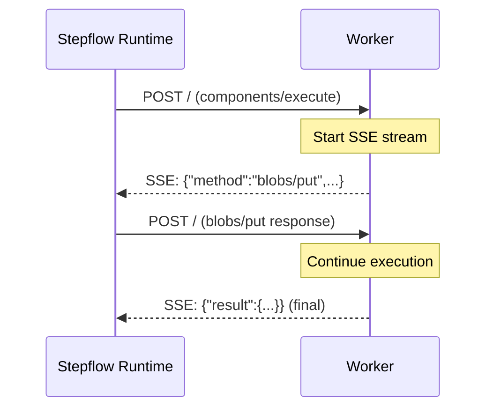

# Transport

The Stepflow Protocol uses HTTP as its transport layer, enabling workers to run as independent HTTP services that can be deployed locally or distributed across a network.

Workers communicate over HTTP using the Streamable HTTP transport:

- **Use Case**: Both local and distributed workers
- **Connectivity**: HTTP requests with SSE for bidirectional communication
- **Lifecycle**: Independent server processes (can be spawned by runtime or run separately)
- **Scaling**: Horizontal scaling with load balancing

## Endpoints

Workers MUST expose these endpoints:

| Endpoint | Method | Description |
|----------|--------|-------------|
| `/` | POST | JSON-RPC message endpoint |
| `/health` | GET | Health check (recommended) |

## Request Format

All JSON-RPC requests are sent as HTTP POST to `/`:

```http
POST / HTTP/1.1
Host: localhost:8080
Content-Type: application/json
Accept: application/json, text/event-stream

{"jsonrpc":"2.0","id":"req-001","method":"components/list","params":{}}
```

### Required Headers

| Header | Value | Description |
|--------|-------|-------------|
| `Content-Type` | `application/json` | Request body format |
| `Accept` | `application/json, text/event-stream` | Accepted response formats |

The `Accept` header MUST include both `application/json` and `text/event-stream` to indicate support for both simple responses and streaming responses.

## Response Formats

Workers respond in one of two formats depending on whether bidirectional communication is needed.

### Simple JSON Response

For requests that don't require callbacks to the runtime (e.g., `components/list`, `components/info`):

```http
HTTP/1.1 200 OK
Content-Type: application/json

{"jsonrpc":"2.0","id":"req-001","result":{"components":[...]}}
```

### Streaming SSE Response

For requests where the worker needs to make calls back to the runtime (e.g., `components/execute` with blob operations):

```http
HTTP/1.1 200 OK
Content-Type: text/event-stream

data: {"jsonrpc":"2.0","id":"blob-001","method":"blobs/put","params":{...}}

data: {"jsonrpc":"2.0","id":"req-001","result":{"output":{...}}}

```

In streaming mode:
1. The worker sends requests to the runtime as SSE `data:` events
2. The runtime sends responses back as separate HTTP POST requests
3. The final result is sent as the last SSE event

## Bidirectional Communication

During component execution, workers may need to call back to the runtime for operations like blob storage. This is handled through SSE streaming.



When the runtime receives a bidirectional request via SSE, it processes the request and sends the response as a new HTTP POST to the worker. The worker MUST:

1. Track pending requests by their `id`
2. Route incoming responses to the correct pending request
3. Continue execution once the response is received

## Port Announcement

When starting as a subprocess, workers MUST announce their listening port by printing JSON to stdout:

```json
{"port": 8080}
```

This allows the Stepflow runtime to discover the worker's port dynamically. Workers SHOULD:
- Bind to port `0` to get an available port automatically
- Print the announcement immediately after the server is ready to accept connections
- Print exactly one line of JSON

## Health Check Endpoint

Workers SHOULD implement a health check endpoint:

```http
GET /health HTTP/1.1
Host: localhost:8080
```

Response:
```json
{
  "status": "healthy",
  "instanceId": "abc123def456",
  "timestamp": "2025-01-15T10:30:00.000Z",
  "service": "my-worker"
}
```

This enables:
- Load balancer health checks
- Kubernetes liveness/readiness probes
- Monitoring and alerting

## Error Responses

HTTP-level errors should use appropriate status codes:

| Status | When to Use |
|--------|-------------|
| 200 | Successful request (even if JSON-RPC result is an error) |
| 400 | Invalid request (parse error, missing fields) |
| 406 | Invalid Accept header |
| 415 | Invalid Content-Type |
| 500 | Internal server error |

JSON-RPC errors are returned in the response body with status 200:

```json
{
  "jsonrpc": "2.0",
  "id": "req-001",
  "error": {
    "code": -32001,
    "message": "Component not found",
    "data": {"component": "/unknown/component"}
  }
}
```

## Configuration

Configure workers in `stepflow-config.yml`:

```yaml
plugins:
  # Subprocess mode: runtime spawns the worker
  python_worker:
    type: stepflow
    command: python
    args: ["my_server.py"]

  # Remote mode: connect to existing worker
  remote_worker:
    type: stepflow
    url: "http://localhost:8080"
```

See [Configuration](../configuration/) for complete options.

## See Also

- [Message Format](./message-format.md) - JSON-RPC message structure and validation
- [Implementing Workers](../components/component-server/implementing-workers.md) - Complete worker implementation guide
- [Protocol Overview](./index.md) - Protocol fundamentals
- [Error Handling](./errors.md) - Error codes reference
