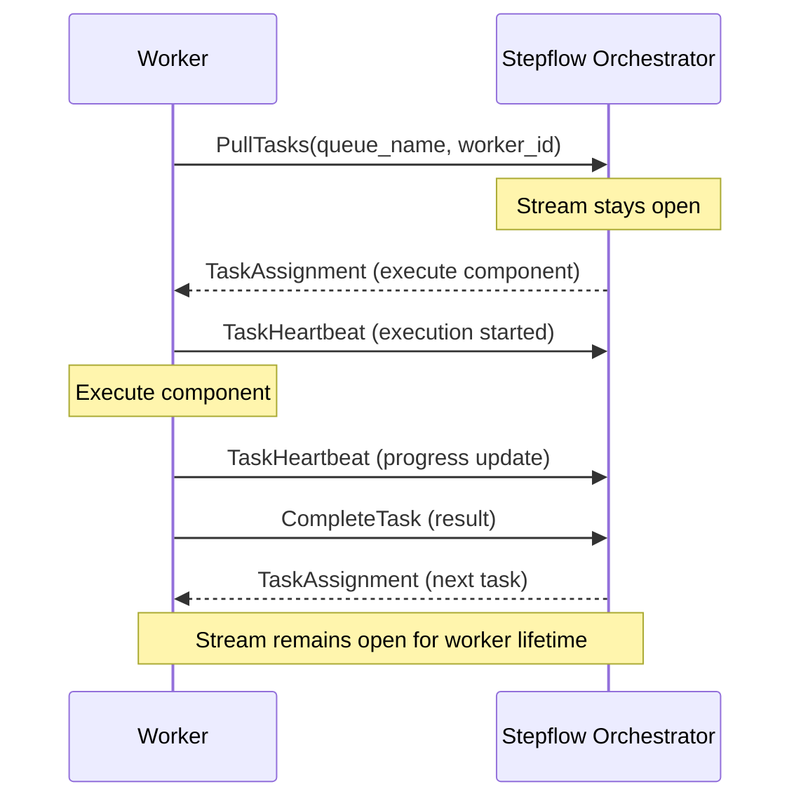
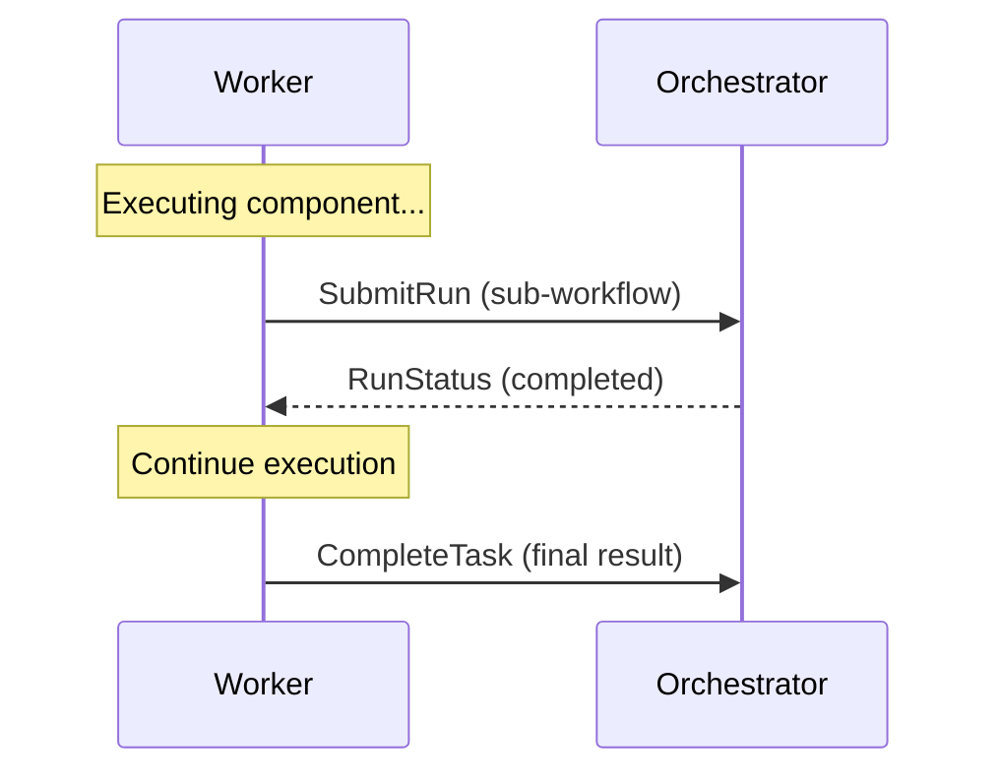

# Transport

The Stepflow Protocol uses gRPC as its transport layer, enabling workers to pull tasks from the orchestrator and report results back via a bidirectional communication model.

Workers communicate over gRPC using a pull-based protocol:

- **Use Case**: Both local and distributed workers
- **Connectivity**: gRPC streaming (workers pull tasks, report results)
- **Lifecycle**: Workers connect to the orchestrator and maintain a long-lived stream
- **Scaling**: Horizontal scaling via named queues and multiple worker instances

## gRPC Services

The protocol defines two primary gRPC services:

| Service | Direction | Description |
|---------|-----------|-------------|
| `TasksService` | Orchestrator → Worker | Workers pull task assignments via streaming RPC |
| `OrchestratorService` | Worker → Orchestrator | Workers report results, heartbeats, and submit sub-runs |

## Task Dispatch Flow

Workers pull tasks from the orchestrator using the `PullTasks` streaming RPC:


```mermaid
sequenceDiagram
    participant Worker as Worker
    participant Orchestrator as Stepflow Orchestrator

    Worker->>Orchestrator: PullTasks(queue_name, worker_id)
    Note over Orchestrator: Stream stays open

    Orchestrator-->>Worker: TaskAssignment (execute component)
    Worker->>Orchestrator: TaskHeartbeat (execution started)
    Note over Worker: Execute component
    Worker->>Orchestrator: TaskHeartbeat (progress update)
    Worker->>Orchestrator: CompleteTask (result)

    Orchestrator-->>Worker: TaskAssignment (next task)
    Note over Worker,Orchestrator: Stream remains open for worker lifetime
```

### PullTasks

Workers call `PullTasks` once on startup and keep the stream open for their entire lifetime. The orchestrator sends `TaskAssignment` messages as tasks become available.

**Request fields:**
- **`queue_name`**: Matches the `queueName` in the plugin configuration
- **`worker_id`**: UUID identifying this worker instance (for logging)

### TaskAssignment

Each task assignment includes:

- **`task_id`**: Unique task identifier
- **`task`**: One of:
  - `execute` — `ComponentExecuteRequest` with component path, input, and attempt number
  - `list_components` — `ListComponentsRequest` for component discovery
- **`context`**: `TaskContext` with the orchestrator's gRPC URL and root run ID
- **`heartbeat_interval_secs`**: Suggested heartbeat cadence (0 = no heartbeating required)

## Heartbeats

Workers send heartbeats to signal liveness during task execution:

1. **On execution start**: Worker calls `TaskHeartbeat` immediately before executing the component (transitions task to EXECUTING state)
2. **Periodically during execution**: Resets the crash-detection timer (5-second timeout)
3. **With progress**: Heartbeats can include a progress indicator (0.0–1.0) and status message

If the orchestrator does not receive a heartbeat within the timeout window, the task is assumed to have crashed and may be retried.

## Task Completion

Workers report task results via `CompleteTask`:

- **Success**: `ComponentExecuteResponse` with output data
- **Failure**: `TaskError` with a `TaskErrorCode` and message
- **Discovery**: `ListComponentsResult` for component listing tasks

The worker uses the `orchestrator_service_url` from the `TaskContext` to reach the orchestrator that owns the specific run.

## Bidirectional Communication

During component execution, workers can make calls back to the orchestrator via `OrchestratorService`:

- **`SubmitRun`**: Submit a sub-workflow for execution
- **`GetRun`**: Query run status with optional wait for completion
- **`TaskHeartbeat`**: Keep the task alive during long execution


```mermaid
sequenceDiagram
    participant Worker as Worker
    participant Orchestrator as Orchestrator

    Note over Worker: Executing component...
    Worker->>Orchestrator: SubmitRun (sub-workflow)
    Orchestrator-->>Worker: RunStatus (completed)
    Note over Worker: Continue execution
    Worker->>Orchestrator: CompleteTask (final result)
```

:::note Blob Storage
Blob storage uses a separate HTTP API rather than gRPC. See [Blob Storage](./methods/blobs.md) for details.
:::

## Worker Configuration

Workers receive their configuration via environment variables when launched as subprocesses:

| Variable | Description |
|----------|-------------|
| `STEPFLOW_TRANSPORT` | Set to `grpc` for gRPC mode |
| `STEPFLOW_TASKS_URL` | gRPC server address for `TasksService` |
| `STEPFLOW_QUEUE_NAME` | Queue name (must match plugin config `queueName`) |
| `STEPFLOW_BLOB_URL` | Blob HTTP API URL |
| `STEPFLOW_ORCHESTRATOR_URL` | Override for orchestrator callback URL (for K8s deployments) |

## Configuration

Configure workers in `stepflow-config.yml`:

```yaml
plugins:
  # Subprocess mode: runtime launches the worker
  python_worker:
    type: grpc
    queueName: python
    command: python
    args: ["my_server.py"]

  # Remote mode: workers connect independently
  remote_workers:
    type: grpc
    queueName: remote
```

See [Configuration](../configuration/) for complete options.

## Error Handling

When workers disconnect or fail to heartbeat, the orchestrator classifies the error as `UNREACHABLE` and retries the task automatically. See [Error Handling](./errors.md) for the complete error taxonomy.

## See Also

- [Error Handling](./errors.md) - Error codes and retry behavior
- [Implementing Workers](../workers/implementing-workers.md) - Complete worker implementation guide
- [Protocol Overview](./index.md) - Protocol fundamentals
- [Bidirectional Communication](./bidirectional.md) - Worker-to-orchestrator callbacks
