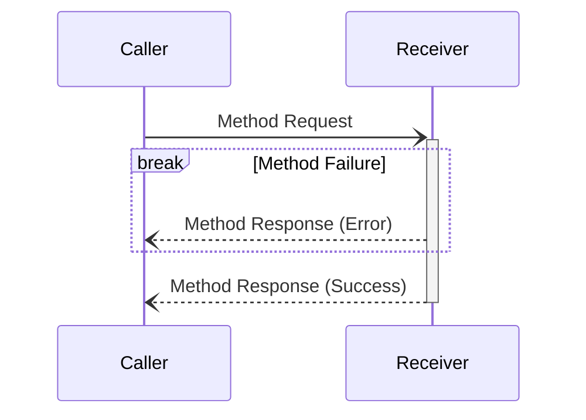
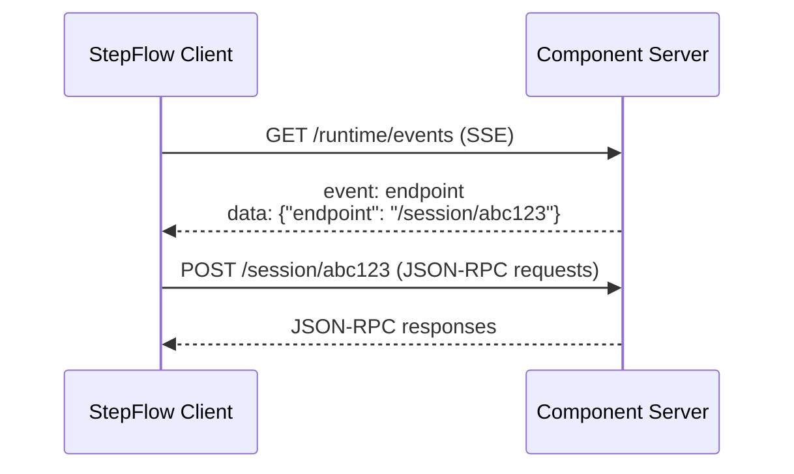

# Transport

StepFlow protocol supports two transport mechanisms for communicating with component servers:

1. **STDIO Transport** - JSON-RPC over stdin/stdout with subprocess communication
2. **HTTP Transport** - JSON-RPC over HTTP with optional MCP-style session negotiation

Future improvements will include additional protocols such as gRPC for improved performance.
Transport selection and session negotiation may be automatically handled during initialization (see [Lifecycle](./lifecycle.md)).



## Method Request

Method requests look like:

```json
{
    "jsonrpc": "2.0",
    "id": <uuid>,
    "method": <method name>,
    "params": <parameter to method as JSON>
}
```

The presence of the `id` indicates this is a method to be responded to (a [notification](#notifications) does not have an `id`).
The shape of the parameters depends on the method being requested.

## Method Response (Success)

Successful method responses look like:

```json
{
    "jsonrpc": "2.0",
    "id": <uuid>,
    "result": <output of the method as JSON>
}
```

## Method Response (Error)

```json
{
    "jsonrpc": "2.0",
    "id": <uuid>,
    "error": {
        "code": <integer error code>,
        "message": <error message string>,
        "data": <optional data as JSON>
    }
}
```

## Notifications

```json
{
    "jsonrpc": "2.0",
    "method": <notification method name>,
    "params": <input to method as JSON>
}
```

## Transport Types

### STDIO Transport

The STDIO transport communicates with component servers running as subprocesses using JSON-RPC over stdin/stdout. This is the default transport for most component servers.

**Configuration:**
```yaml
plugins:
  python:
    type: stepflow
    transport: stdio
    command: python
    args: ["-m", "stepflow_py"]
```

**Communication Flow:**
- StepFlow launches the component server as a subprocess
- JSON-RPC messages are sent via stdin
- Responses are received via stdout
- Bidirectional communication is supported through the same channels

### HTTP Transport

The HTTP transport communicates with component servers over HTTP using JSON-RPC. This allows for distributed component servers and better scalability.

**Configuration:**
```yaml
plugins:
  remote_python:
    type: stepflow
    transport: http
    url: "http://localhost:8080"
```

**Communication Flow:**
- Component server runs as an independent HTTP service
- JSON-RPC requests are sent via HTTP POST to the configured URL
- Responses are received as HTTP responses
- Optional MCP-style session negotiation for connection isolation

#### MCP-Style Session Negotiation

For HTTP transport, StepFlow supports optional MCP (Model Context Protocol) style session negotiation to isolate multiple client connections:



**Session Negotiation Process:**
1. Client opens Server-Sent Events (SSE) connection to `/runtime/events`
2. Server sends an `endpoint` event with session-specific URL
3. Client uses the provided endpoint URL for all JSON-RPC communication
4. Each session is isolated with its own request/response handling

**Fallback Behavior:**
If the server doesn't support MCP-style negotiation, StepFlow will fall back to direct JSON-RPC communication with the configured base URL after a timeout period.

#### Starting HTTP Component Servers

**Python SDK HTTP Server:**
```python
# Start server in HTTP mode
from stepflow_py import StepflowServer
import uvicorn

server = StepflowServer()

@server.component
def my_component(input: MyInput) -> MyOutput:
    return MyOutput(result="processed")

# Create FastAPI app
app = server.create_http_app()

# Run with uvicorn
if __name__ == "__main__":
    uvicorn.run(app, host="0.0.0.0", port=8080)
```

**Command Line:**
```bash
# Start Python SDK server in HTTP mode
python -m stepflow_py --http --port 8080

# Or using uv
uv run --project . --extra http python -m stepflow_py --http --port 8080
```
