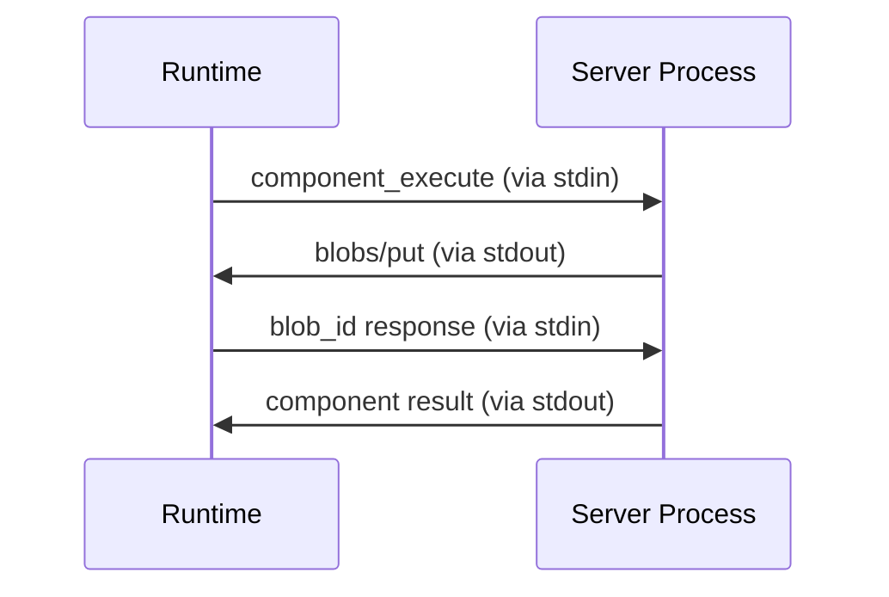
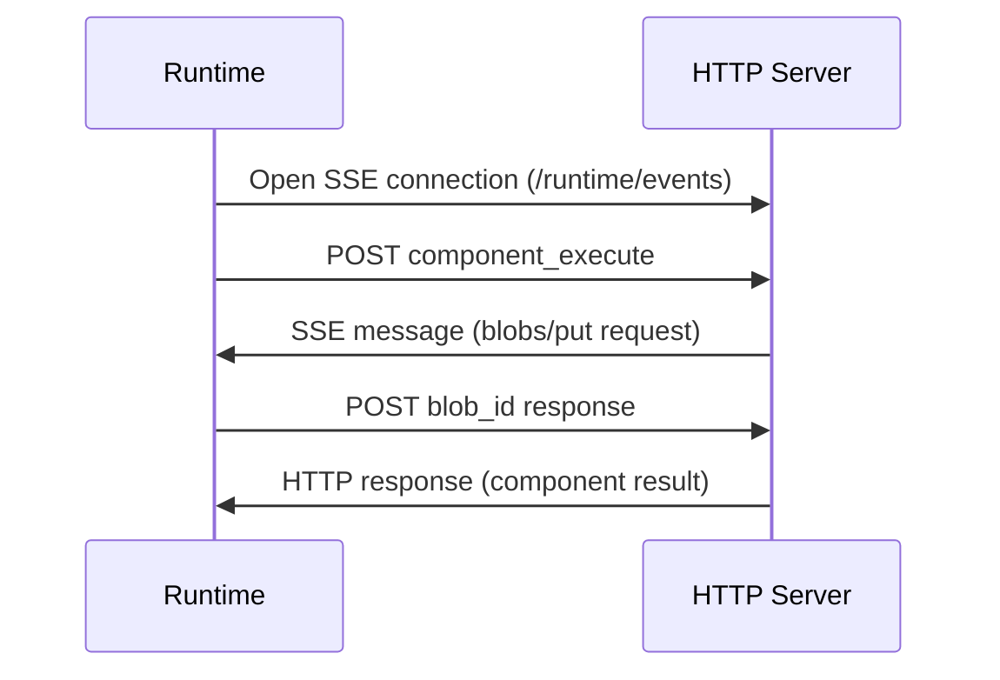

# Transport Layer Overview

The Stepflow Protocol supports multiple transport mechanisms to accommodate different deployment scenarios. Each transport maintains the same JSON-RPC message format while providing different connectivity patterns, performance characteristics, and operational requirements.

This page covers transport characteristics and implementation details. For detailed JSON-RPC message structure and field specifications, see [Message Format](../message-format.md). For transport configuration, see [Configuration](../../configuration.md).

## Transport Types

Both transports use the same JSON-RPC messages described in the [Message Format](../message-format.md) documentation, but differ in how the messages are transmitted.
Currently, they both use JSON as the serialization format, but other serialization formats (eg., messagepack, protobuf) may be supported in the future.

### STDIO Transport
**Process-based communication using standard input/output streams**

- **Use Case**: Local component servers running as subprocesses
- **Connectivity**: Bidirectional communication over stdin/stdout
- **Lifecycle**: Managed by the Stepflow runtime (process spawning/termination)
- **Performance**: Low latency, high throughput for local operations
- **Scaling**: One process per plugin instance

See [Configuration Documentation](../../configuration/) for transport configuration details.

### HTTP Transport
**Network-based communication using HTTP and Server-Sent Events**

- **Use Case**: Distributed component servers, microservices architecture
- **Connectivity**: HTTP requests with optional SSE for bidirectional communication
- **Lifecycle**: Independent server processes managed separately
- **Performance**: Network-dependent latency, excellent for distributed systems
- **Scaling**: Horizontal scaling with load balancing

See [Configuration Documentation](../../configuration/) for transport configuration details.

## Transport Comparison

| Feature | STDIO | HTTP |
|---------|--------|------|
| **Latency** | Very Low | Low-Medium |
| **Throughput** | High | Medium-High |
| **Distribution** | Local Only | Network |
| **Process Management** | Runtime Managed | External |
| **Session Isolation** | Process-based | Optional MCP |
| **Bidirectional** | Native | SSE-based |
| **Error Recovery** | Process Restart | Connection Retry |
| **Development** | Simple | More Complex |

### Transport-Specific Considerations

#### STDIO Transport
- **Line-delimited JSON**: Each message is a single line terminated by `\n`
- **UTF-8 encoding**: All text must be valid UTF-8
- **Buffer limits**: Limited by OS pipe buffer sizes (typically 64KB)
- **Process lifecycle**: Component server process lifecycle tied to connection

#### HTTP Transport
- **HTTP POST**: JSON-RPC requests sent as POST to configured URL
- **Content-Type**: `application/json; charset=utf-8`
- **Response correlation**: HTTP request-response pairs maintain correlation
- **Session management**: Optional MCP-style session negotiation for isolation

## Bidirectional Communication

Both transports support bidirectional communication, allowing component servers to make requests back to the runtime during execution.

### STDIO Bidirectional
Uses the same stdin/stdout channels with JSON-RPC request/response correlation:

### HTTP Bidirectional
Uses Server-Sent Events (SSE) for server-to-runtime requests:

## Next Steps

- **[STDIO Transport](./stdio.md)**: Detailed STDIO implementation specification
- **[HTTP Transport](./http.md)**: Complete HTTP transport specification with MCP session negotiation
- **[Message Format](../message-format.md)**: JSON-RPC message structure and validation