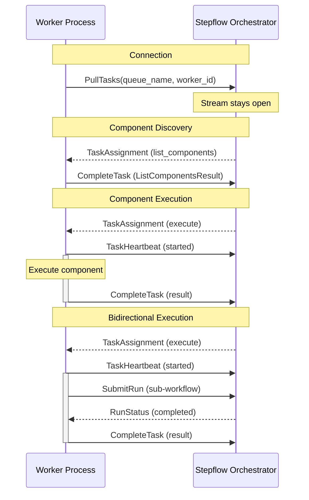

# Implementing Workers

This guide describes how to implement a Stepflow worker in any programming language. Workers are standalone processes that provide components for workflow execution, communicating with the Stepflow orchestrator using a gRPC pull-based protocol.

While the [Python SDK](./custom-components.md) provides a high-level API that handles protocol details automatically, you can implement workers in any language by following this specification.

## What is a Worker?

A **worker** is a process that hosts one or more workflow components and executes them on behalf of the Stepflow orchestrator. Workers are registered with the orchestrator through [routing configuration](../configuration.md), which maps component paths (like `/my_worker/process_data`) to specific named queues. Workers:

- Connect to the orchestrator's `TasksService` and pull task assignments
- Execute components and report results via `CompleteTask`
- Send heartbeats to signal liveness during execution
- Can make calls back to the orchestrator (e.g., for sub-run submission)
- Run as independent processes, enabling language flexibility and fault isolation



## Requirements Overview

This section uses RFC 2119 terminology:
- **MUST**: Absolute requirement for protocol compliance
- **SHOULD**: Recommended for production-quality implementations
- **MAY**: Optional features

### Protocol Requirements

| Requirement | Description |
|------------|-------------|
| **gRPC Transport** | Workers MUST connect to the orchestrator's `TasksService` via gRPC |
| **PullTasks Stream** | Workers MUST call `PullTasks` and maintain the stream for their lifetime |
| **Task Completion** | Workers MUST report results via `CompleteTask` on `OrchestratorService` |
| **Heartbeats** | Workers MUST send `TaskHeartbeat` before and during execution |
| **Component Listing** | Workers MUST handle `list_components` task assignments |
| **Component Execution** | Workers MUST handle `execute` task assignments |
| **Error Reporting** | Workers MUST report failures via `CompleteTask` with appropriate `TaskErrorCode` |
| **Bidirectional Calls** | Workers MAY call `SubmitRun` and `GetRun` during execution |

### Observability Requirements

| Requirement | Description |
|------------|-------------|
| **OTLP Tracing** | Workers SHOULD support OpenTelemetry Protocol (OTLP) for distributed tracing |
| **OTLP Logging** | Workers SHOULD support OTLP for structured log export |
| **Diagnostic Context** | Workers SHOULD include `flow_id`, `run_id`, `step_id` in log diagnostic context |
| **Trace Context** | Workers SHOULD include `trace_id`, `span_id` in logs when tracing is enabled |
| **Context Propagation** | Workers SHOULD propagate observability context in bidirectional calls |

### Best Practices

| Requirement | Description |
|------------|-------------|
| **Graceful Shutdown** | Workers SHOULD handle shutdown signals gracefully |
| **Structured Logging** | Workers SHOULD use structured JSON logging format |
| **Progress Reporting** | Workers SHOULD include progress in heartbeats for long-running tasks |

## Transport: gRPC

Workers communicate with the orchestrator using gRPC. The protocol is defined in Protocol Buffer files in `proto/stepflow/v1/`.

For complete transport details, see the [Transport documentation](../protocol/transport.md).

**Key requirements:**
- Workers MUST connect to the orchestrator's `TasksService` gRPC endpoint
- Workers MUST call `PullTasks` with their `queue_name` and a unique `worker_id`
- Workers MUST keep the `PullTasks` stream open for their entire lifetime
- Workers MUST use the `orchestrator_service_url` from `TaskContext` for callbacks

**Environment variables (subprocess mode):**
- `STEPFLOW_TASKS_URL`: gRPC server address for `TasksService`
- `STEPFLOW_QUEUE_NAME`: Queue name to pull tasks from
- `STEPFLOW_BLOB_URL`: HTTP API URL for blob operations
- `STEPFLOW_ORCHESTRATOR_URL`: Override for orchestrator callback URL

## Protocol Methods

Workers handle task assignments received via the `PullTasks` stream. See the [Protocol Methods Reference](../protocol/methods/index.md) for detailed specifications.

### Component Listing (MUST)

When the worker receives a `list_components` task assignment, it MUST:
1. Enumerate all registered components
2. Report the list via `CompleteTask` with a `ListComponentsResult`

### Component Execution (MUST)

When the worker receives an `execute` task assignment, it MUST:
1. Send a `TaskHeartbeat` immediately (transitions task to EXECUTING)
2. Execute the component with the provided input
3. Send periodic heartbeats during execution (resets crash-detection timer)
4. Report the result via `CompleteTask` (success or failure)

See [Component Methods](../protocol/methods/components.md) for details.

### Bidirectional Methods (MAY)

During component execution, workers MAY call back to the orchestrator via `OrchestratorService`:

#### Sub-Run Execution

| RPC | Description |
|-----|-------------|
| `SubmitRun` | Submit a workflow for execution, optionally waiting for completion |
| `GetRun` | Get the status and results of a workflow run |

See [Run Methods](../protocol/methods/runs.md) for details.

#### Blob Storage

Blob storage uses a separate HTTP API (not gRPC). See [Blob Storage](../protocol/methods/blobs.md) for details.

## Error Handling

Workers MUST report failures via `CompleteTask` with an appropriate `TaskErrorCode`:

| Code | When to Use |
|------|------------|
| `COMPONENT_FAILED` | Component executed but returned a business-logic failure |
| `INVALID_INPUT` | Input validation failure |
| `COMPONENT_NOT_FOUND` | Requested component doesn't exist on this worker |
| `RESOURCE_UNAVAILABLE` | External resource unavailable |
| `WORKER_ERROR` | Unexpected worker/SDK error |

See [Error Handling](../protocol/errors.md) for the complete error codes reference and retry behavior.

## Observability

### ObservabilityContext

The `observability` field in `ComponentExecuteRequest` enables distributed tracing and structured logging:

| Field | Format | Description |
|-------|--------|-------------|
| `trace_id` | 32-char hex | OpenTelemetry trace ID (128-bit) |
| `span_id` | 16-char hex | OpenTelemetry span ID (64-bit) |
| `run_id` | string | Workflow run identifier |
| `flow_id` | blob ID | Flow definition blob ID |
| `step_id` | string | Step identifier within the flow |

### Implementing Tracing (SHOULD)

Workers SHOULD implement OpenTelemetry tracing:

1. **Extract parent context** from `trace_id` and `span_id`
2. **Create child spans** for component execution
3. **Propagate context** in bidirectional calls

```python
# Pseudocode example
def execute_component(request):
    # Extract parent span context
    parent_context = create_span_context(
        trace_id=request.observability.trace_id,
        span_id=request.observability.span_id,
        is_remote=True
    )

    # Create child span
    with tracer.start_span("component.execute", parent=parent_context) as span:
        span.set_attribute("stepflow.component", request.component)
        span.set_attribute("stepflow.step_id", request.observability.step_id)
        span.set_attribute("stepflow.run_id", request.observability.run_id)

        # Execute component logic
        result = do_execute(request.input)

        return result
```

### Environment Variables

Workers SHOULD support these environment variables for observability configuration:

| Variable | Description | Default |
|----------|-------------|---------|
| `STEPFLOW_OTLP_ENDPOINT` | OTLP collector endpoint (e.g., `http://localhost:4317`) | none |
| `STEPFLOW_SERVICE_NAME` | Service name for traces/logs | `stepflow-worker` |
| `STEPFLOW_TRACE_ENABLED` | Enable tracing | `true` if endpoint set |
| `STEPFLOW_LOG_LEVEL` | Log level (DEBUG, INFO, WARNING, ERROR) | `INFO` |
| `STEPFLOW_LOG_DESTINATION` | Where to log (stderr, file, otlp) | `otlp` if endpoint set, else `stderr` |

## Implementation Checklist

Use this checklist when implementing a worker:

### Required (MUST)

- [ ] gRPC client connecting to `TasksService`
- [ ] Call `PullTasks` with `queue_name` and `worker_id`
- [ ] Handle `list_components` task assignments
- [ ] Handle `execute` task assignments
- [ ] Send `TaskHeartbeat` before execution starts
- [ ] Send periodic heartbeats during execution
- [ ] Report results via `CompleteTask` with appropriate result type
- [ ] Report failures via `CompleteTask` with `TaskError` and `TaskErrorCode`

### Recommended (SHOULD)

- [ ] OpenTelemetry tracing with parent context extraction
- [ ] Structured JSON logging with diagnostic context
- [ ] OTLP export for traces and logs
- [ ] Graceful shutdown handling
- [ ] Progress reporting in heartbeats
- [ ] Observability context propagation in bidirectional calls

## Example: Minimal Worker

Here's a minimal worker implementation outline:

```
1. Read environment variables (STEPFLOW_TASKS_URL, STEPFLOW_QUEUE_NAME)
2. Connect to TasksService gRPC endpoint

3. Call PullTasks(queue_name, worker_id):
   - Stream stays open for worker lifetime

4. For each TaskAssignment received:
   a. If list_components:
      - Enumerate registered components
      - Call CompleteTask with ListComponentsResult
   b. If execute:
      - Send TaskHeartbeat (task started)
      - Execute component with input data
      - Send periodic heartbeats during execution
      - On success: Call CompleteTask with ComponentExecuteResponse
      - On failure: Call CompleteTask with TaskError

5. For bidirectional calls during execution:
   - Call SubmitRun/GetRun on OrchestratorService
   - Use orchestrator_service_url from TaskContext

6. On shutdown signal:
   - Complete pending tasks
   - Close gRPC stream
   - Exit
```

## Reference Implementations

- **Python SDK**: See [sdks/python/stepflow-py](https://github.com/stepflow-ai/stepflow/tree/main/sdks/python/stepflow-py) for a complete implementation
- **Proto definitions**: See [proto/stepflow/v1/](https://github.com/stepflow-ai/stepflow/tree/main/proto/stepflow/v1) for the gRPC service definitions

## See Also

- [Protocol Overview](../protocol/index.md) - Complete protocol specification
- [Transport](../protocol/transport.md) - gRPC transport details
- [Error Handling](../protocol/errors.md) - Error codes reference
- [Custom Components](./custom-components.md) - Python SDK guide
