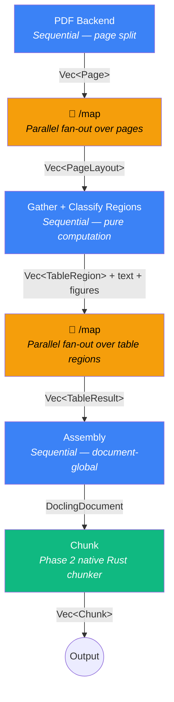

# Proposal: Rust-Native Docling Integration

**Status:** Draft  
**Authors:** Nate McCall  
**Created:** February 2026  
**Prerequisite:** Existing `integrations/docling/` package and [K8s deployment](./stepflow-docling-namespace.md)

## Summary

This proposal describes two complementary strategies for scaling document processing in Stepflow:

1. **Rust-native migration** — incrementally replacing the Python-based Docling integration with Rust, starting with a reusable Component Server SDK (Phase 0), then progressing from HTTP proxy through native chunking to ONNX inference
2. **Pipeline disaggregation** — decomposing docling's monolithic pipeline into independently scalable Stepflow stages using the existing `MapComponent` for per-page fan-out of expensive model inference

Each phase delivers standalone value while structurally enabling the next. The entire approach works **without forking or modifying any docling project code**.

**Prerequisite:** The [docling-step-worker proposal](./docling-step-worker.md) establishes the flow abstraction and validates output parity using the Python SDK with no changes required to any Docling code. This proposal builds on the effort by using the Rust infrastructure and native components to progressively replace what's behind that flow contract.

**Current state:** Python `StepflowDoclingServer` → HTTP → `docling-serve` sidecar (~31s/paper avg, monolithic sequential pipeline)  
**End state:** Build on the docling-serve emulation defined in the [docling-step-worker proposal](./docling-step-worker.md) to create a Disaggregated Stepflow flow with per-stage parallelism, Rust-native processing for the common path, and docling-serve fallback for complex formats. A single 50-page document that today takes ~37s can be parallelized across layout workers to ~4s + assembly overhead.

## Motivation

### Operational Overhead

The current Python-based `StepflowDoclingServer` is designed for integration with Langflow's use of Docling and as such adds significant operational weight to each docling-worker pod. The worker itself is a thin HTTP proxy — it receives Stepflow JSON-RPC requests, reformats them, and forwards to the docling-serve sidecar on localhost. Despite this simplicity, it requires a full Python runtime, `uv` dependency resolution, and ~150-200MB of memory overhead. The new docling-step-worker creates a full doculing-serve replacement with much lower per-pod overhead (as we no longer require Langflow integration), but still just delegates to docling internals. 

### Performance at Scale

From our K8s performance testing (`examples/production/k8s/run-pdf-workflow.sh`), the sweet spot for our Kind node is 3 docling pods with parallelism=4, yielding ~31s/paper. CPU contention is the binding constraint — at `OMP_NUM_THREADS=4, cpu limit=4000m`, adding a 4th pod saturates the node rather than improving throughput. Reducing per-pod overhead directly increases the headroom available for actual document processing. Additionally, even just breaking up the docling pipeline to enable page-level parallelism will create a substantial performance improvement by supporting per-page fan out across the architecture. 

### Path Toward Native Processing

As document ingestion scales, the HTTP round-trip through docling-serve adds latency and complexity. A Rust-based server creates the foundation for eventually performing document processing natively. Particularly compeling as replacement candidates are the chunking (CPU-bound, no ML) and ONNX inference (the layout model already uses ONNX Runtime) use cases. Not only will they be faster as native Rust components (no Global Interpreter Lock and python dependency baggage for starters), will again enable parallelism and fan-out by allowing stepflow internals to route tasks to optimised instances, eg. GPU based hardware for inference. 

## Background

### Current Architecture

```
docling-worker pod
├── StepflowDoclingServer (Python)
│   └── httpx async client → docling-serve HTTP API
│   └── Input normalization, output formatting
│   └── 4 components matching Langflow class names
└── docling-serve sidecar
    └── Layout analysis (ONNX Runtime)
    └── TableFormer (PyTorch)
    └── OCR (EasyOCR/Tesseract)
    └── docling-parse PDF backend
```

### Performance Baseline

From the Docling technical report, per-component timing on CPU:

| Component | CPU Time (per unit) | Frequency |
|-----------|-------------------|-----------|
| Layout analysis (ONNX) | 633ms / page | Every page |
| TableFormer (PyTorch) | 1.74s / table | ~28% of pages |
| OCR - EasyOCR | 13s / page | Only scanned pages |
| PDF backend (docling-parse) | ~100ms / page | Every page |

Tables seem to be the biggest performance issue for PDF documents. For PDFs without tables, processing is ~733ms/page. Our 31s/paper average includes table-heavy arxiv papers. Enterprise DOCX/PDF without complex tables would be significantly faster.

### Key Discovery: Models Already in ONNX Format

The layout analysis model which the most frequently invoked ML component, **already runs on ONNX Runtime** in docling's own pipeline. From the Docling technical report:

> *"For inference, our implementation relies on the onnxruntime. The Docling pipeline feeds page images at 72 dpi resolution, which can be processed on a single CPU with sub-second latency."*

TableFormer uses PyTorch natively, but community ONNX exports exist on HuggingFace. This means a Rust-native inference path does not require model conversion work as it only loads existing ONNX weights via the `ort` crate.

### DoclingDocument Schema

A published JSON schema exists at [`docling-core/docs/DoclingDocument.json`](https://github.com/docling-project/docling-core/blob/main/docs/DoclingDocument.json) (currently v1.9.0). The `DoclingDocument` is a Pydantic model with well-defined structure:

- **Content items:** `texts` (TextItem), `tables` (TableItem), `pictures` (PictureItem), `key_value_items`
- **Content structure:** `body` tree, `furniture` tree, `groups` — all using JSON pointer refs (`#/texts/0`, etc.)
- **Provenance:** Bounding boxes, page numbers, confidence scores

This schema enables generating Rust types via `serde` without any Python dependency.

## Design

### Core Abstraction: Rust Component Server SDK

A key architectural goal is to have processing logic run on distributed worker pods with a `DocumentProcessor` trait. To lay the groundwork for this, the first part of this proposal is a **Rust Component Server SDK**. This SDK will be a reusable library for building component servers that speak the Stepflow JSON-RPC protocol. This SDK is not docling-specific. Any Rust service that wants to register Stepflow components will benefit from its integration. The docling integration is the first consumer, but the SDK enables componentizing any processing workload, such as embedding generation, format conversion, validation pipelines, etc.

**SDK responsibilities:**
- JSON-RPC server implementing the Stepflow component protocol
- Component registration and dispatch
- Health check endpoint
- Blob store client for reading/writing intermediate data
- Configuration and graceful shutdown
- OpenTelemetry / fastrace integration for per-component spans

This SDK will be built on patterns already established in `stepflow-server` and `stepflow-protocol` crates, extracted into a single, reusable library. 

### DocumentProcessor Trait

Within a docling component server built on the SDK, a `DocumentProcessor` trait enables incremental migration between backends:

```rust
#[async_trait]
pub trait DocumentProcessor: Send + Sync {
    async fn convert(
        &self,
        sources: Vec<DocumentSource>,
        options: Option<ConversionOptions>,
    ) -> Result<ConversionResult>;

    async fn chunk(
        &self,
        sources: Vec<DocumentSource>,
        chunker_type: ChunkerType,
    ) -> Result<ChunkResult>;

    async fn export(
        &self,
        data: ExportInput,
        format: ExportFormat,
    ) -> Result<ExportResult>;

    async fn health(&self) -> Result<HealthStatus>;
}
```

Phase 1 provides `ProxyProcessor` (HTTP → docling-serve). Phase 2 adds `NativeChunker` as a separate component server. Phase 3 adds `OnnxProcessor`. A `HybridProcessor` composes these, routing each operation to the best available backend:

```rust
pub struct HybridProcessor {
    proxy: ProxyProcessor,
    chunker: Option<NativeChunker>,
    onnx: Option<OnnxProcessor>,
}
```

Critically, all of these run as distributed component servers on worker pods — the orchestrator only routes work to them via the flow definition.

### Crate Structure

```
stepflow-rs/crates/stepflow-docling/
├── Cargo.toml
├── src/
│   ├── lib.rs
│   ├── main.rs                  # Binary entrypoint
│   ├── error.rs                 # DoclingError types (thiserror + error-stack)
│   ├── config.rs                # Config (env vars, CLI args)
│   ├── components.rs            # Component registration & dispatch
│   ├── models/                  # Docling data types (from JSON schema)
│   │   ├── mod.rs
│   │   ├── document.rs          # DoclingDocument, TextItem, TableItem, etc.
│   │   ├── conversion.rs        # ConversionOptions, DocumentSource
│   │   ├── chunking.rs          # ChunkerType, Chunk, ChunkMeta
│   │   └── export.rs            # ExportFormat types
│   └── processing/              # DocumentProcessor implementations
│       ├── mod.rs               # Trait definition + HybridProcessor
│       ├── proxy.rs             # Phase 1: HTTP proxy to docling-serve
│       ├── chunking.rs          # Phase 2: Native Rust chunking
│       └── inference.rs         # Phase 3: ONNX inference
```

### Component Registration

Components match existing Langflow class names exactly, maintaining routing compatibility:

| Component Name | Operation |
|---------------|-----------|
| `DoclingInlineComponent` | `convert()` |
| `DoclingRemoteComponent` | `convert()` |
| `ChunkDoclingDocument` | `chunk()` |
| `ExportDoclingDocument` | `export()` |

Plus lfx-style path aliases (`docling_inline/DoclingInlineComponent`, etc.) for `known_components` routing.

### Configuration

The Stepflow plugin config remains unchanged — the Rust binary is a drop-in replacement:

```yaml
plugins:
  docling_k8s:
    type: stepflow
    url: "http://docling-load-balancer.stepflow.svc.cluster.local:8080"

routes:
  "/langflow/core/lfx/components/docling/{*component}":
    - plugin: docling_k8s
```

## Phased Implementation

### Phase 0: Rust Component Server SDK

**Goal:** Extract and publish a reusable Rust SDK for building Stepflow component servers. Any service that implements Stepflow components, not just docling, can uses this SDK.

**Scope:**
- Extract JSON-RPC server scaffolding from `stepflow-server` into a `stepflow-component-sdk` crate
- Component registration API: `#[component]` attribute macro or builder pattern for registering handlers
- Blob store client for reading/writing intermediate data between steps
- Health check and readiness endpoints
- OpenTelemetry / fastrace span propagation per component invocation
- Configuration via environment variables (server address, blob store URL, TLS)
- Graceful shutdown with in-flight request draining

**Crate structure:**

```
stepflow-rs/crates/stepflow-component-sdk/
├── Cargo.toml
└── src/
    ├── lib.rs           # Public API
    ├── server.rs        # JSON-RPC server + component dispatch
    ├── component.rs     # Component trait + registration
    ├── blob.rs          # Blob store client
    ├── config.rs        # Environment-based configuration
    └── health.rs        # Health/readiness checks
```

**Usage pattern (what a component server author writes):**

```rust
use stepflow_component_sdk::{ComponentServer, component, Context, Result};

#[component(name = "/my-service/process")]
async fn process(ctx: &Context, input: ProcessInput) -> Result<ProcessOutput> {
    let data = ctx.blob_store().get(&input.source).await?;
    // ... processing logic ...
    Ok(ProcessOutput { result })
}

#[tokio::main]
async fn main() -> Result<()> {
    ComponentServer::new()
        .register(process)
        .serve("0.0.0.0:8080")
        .await
}
```

This is the foundation that all subsequent phases build on. Phase 1 becomes: use the SDK to build a docling-specific component server, rather than building both the SDK and the docling integration simultaneously.

**Why this is Phase 0, not part of Phase 1:** The SDK is reusable infrastructure with value beyond docling. Separating it ensures the API is designed for general use, not coupled to docling's specific needs. It also unblocks other teams or integrations that want to build Rust component servers in parallel. We are doing it as part of this Docling effort as it provides a concrete use case for us to ensure proper functionality. 

### Phase 1: Rust Component Server (HTTP Proxy)

**Goal:** Replace the Python `StepflowDoclingServer` + `DoclingServeClient` with a Rust binary that proxies requests to docling-serve, built on the Phase 0 SDK.

**Scope:**
- Implement `ProxyProcessor` using `reqwest` to call docling-serve's v1 API
- Port input normalization logic (URL, base64, bytes, nested Langflow format)
- Port output formatting for Langflow compatibility
- Register all 8 component names (4 primary + 4 lfx aliases) via the component SDK
- Docker multi-stage build producing a minimal container image

**Dependency:** Phase 0 (Rust Component Server SDK)

**Projected operational impact:**

| Metric | Python (current) | Rust (projected) |
|--------|-----------------|-------------------|
| Container image size | ~800MB | ~30MB |
| Pod startup time | 3-5s | <100ms |
| Memory per worker | 150-200MB RSS | 10-20MB RSS |
| Cold-start penalty | 2-3s Python overhead | Eliminated |

**No impact on per-document processing time** — the bottleneck remains inside docling-serve. The win is purely operational: smaller images, faster scaling, more CPU/memory headroom for the sidecar.

**Testing strategy:**
- Unit tests: mock `DocumentProcessor`, test input normalization and output formatting
- Integration tests: run against docling-serve in Docker
- Compatibility: run `run-pdf-workflow.sh` and compare output structure

### Phase 2: Native Rust Chunking

**Goal:** Implement document chunking natively in Rust, eliminating the docling-serve round-trip for chunking operations.

**Why chunking first:**
- Pure computation — no ML models, no GPU, no external dependencies
- CPU-bound — benefits directly from Rust's zero-overhead abstractions
- GIL-free parallelism — chunk multiple documents concurrently without contention
- Well-defined interface — takes DoclingDocument JSON, returns chunks
- High-frequency — every document in a RAG pipeline goes through chunking

**Data flow (no Python needed):**

```
docling-serve (convert) → DoclingDocument JSON → Rust deserialize → NativeChunker → chunks
```

**HybridChunker algorithm** (re-implemented from MIT-licensed `docling-core` specification):

1. **Hierarchical pass:** one chunk per document element, merge list items
2. **Split pass:** split oversized chunks at token boundaries
3. **Merge pass:** merge undersized peer chunks sharing the same heading context
4. **Contextualize:** prepend heading hierarchy + captions to each chunk's serialized text

**Tokenizer:** HuggingFace `tokenizers` Rust crate. This is the *native* Rust implementation — the Python `tokenizers` library wraps it. Aligns with docling's own HybridChunker which supports HuggingFace tokenizers.

The Rust chunker will be deployed as its own component server using the Phase 0 SDK. It registers a `/chunking/hybrid` component (or equivalent), accepts `DoclingDocument` JSON from blob storage, and returns chunks. No PyO3 or Python interop needed — it's a standalone Rust service that other flows can reference by component name.

**Expected performance (chunking only):**

| Metric | Python (docling) | Rust (native) |
|--------|-----------------|---------------|
| Single document | ~50-200ms | ~2-10ms |
| 100 docs concurrent | GIL-bound, sequential | Truly parallel |

This won't dramatically change per-paper wall clock time (chunking is a fraction of the 31s), but matters at scale in RAG pipelines processing thousands of documents as it is now a parallelisable task.

### Phase 3: ONNX-Based Native Inference

**Goal:** Replace docling-serve's ML inference with Rust-native ONNX Runtime for the most common processing path (born-digital PDF to structured text), retaining docling-serve as fallback.

**Scope — the "80% path" (born-digital PDFs):**

1. PDF page rasterization → `pdfium-render` crate
2. Layout analysis → `ort` crate loading existing ONNX weights from HuggingFace
3. Text extraction → PDF text layer (no OCR needed for born-digital)
4. Table structure → `ort` with community ONNX TableFormer weights
5. Post-processing → NMS on bounding boxes, region-text intersection
6. Assembly → DoclingDocument JSON output

**What falls outside the 80% (automatic fallback to docling-serve):**
- Scanned PDFs requiring OCR
- DOCX, PPTX parsing (docling has custom parsers)
- Images requiring full OCR pipeline
- Forced OCR mode (`force_ocr: true`)

**Key Rust dependencies:**

| Crate | Purpose | Status |
|-------|---------|--------|
| `ort` | ONNX Runtime bindings | Stable, production-ready |
| `pdfium-render` | PDF → image rasterization | Stable, wraps Google's pdfium |
| `image` | Image preprocessing | Very stable |
| `tokenizers` | HuggingFace tokenizers | Production-ready, native Rust |
| `ndarray` | Tensor operations | Stable |

**Graceful degradation pattern:**

```rust
async fn convert(&self, sources, options) -> Result<ConversionResult> {
    if self.can_process_natively(&sources, &options) {
        match self.onnx.convert(sources, options).await {
            Ok(result) => Ok(result),
            Err(e) => {
                log::warn!("Native processing failed, falling back: {}", e);
                self.proxy.convert(sources, options).await
            }
        }
    } else {
        self.proxy.convert(sources, options).await
    }
}
```

**Prerequisites before committing to Phase 3:**
1. Profile docling-serve to confirm where the 31s actually goes per component
2. Verify ONNX model weights load correctly via `ort` with expected accuracy
3. Analyze actual document corpus distribution (% born-digital PDF vs. scanned vs. DOCX)

## Pipeline Disaggregation: Stepflow-Native Document Processing

### Motivation

Phases 1-3 progressively replace the Python worker and selectively move processing into Rust, but they preserve docling's fundamental architecture: a **monolithic, single-document, sequential pipeline**. Each worker pod runs the complete stack — layout analysis, TableFormer, OCR, assembly — for one document at a time. Scaling means replicating whole pipelines, so every pod carries the full memory footprint even when most documents never need OCR and only 28% of pages contain tables.

Stepflow can do something fundamentally different: **disaggregate the pipeline into independently scalable stages with data-driven routing.** This transforms the cost model from `N pods × full_memory` to `N_layout × layout_memory + N_table × table_memory + N_ocr × ocr_memory`, and unlocks document-internal parallelism that docling's architecture cannot achieve.

**Where the time goes and where fan-out helps:** Docling's pipeline runs in order: PDF parsing → per-page layout analysis → per-page table extraction → document assembly → chunking. Chunking happens *after* conversion and assembly — it operates on the fully assembled `DoclingDocument`, not on raw pages. This means fan-out after chunking offers no benefit. The win is fanning out *during* conversion: layout analysis (633ms/page) and table extraction (1.74s/table) are per-page operations with no cross-page dependencies. These are the expensive model inference stages, and they're embarrassingly parallel. Per-page inference fan-out is the primary goal of disaggregation.

### Existing Primitive: MapComponent (Parallel Fan-Out/Fan-In)

The disaggregated pipeline requires a parallel map primitive — and one already exists. The `MapComponent` (`stepflow-builtins/src/map.rs`) provides exactly the fan-out/fan-in pattern needed, backed by robust subflow infrastructure:

**Current `/map` builtin:**

```rust
// Input
struct MapInput {
    workflow: Flow,              // Sub-flow to apply to each item
    items: Vec<ValueRef>,        // Items to process in parallel
    max_concurrency: Option<usize>,  // Concurrency limit
}

// Output  
struct MapOutput {
    results: Vec<FlowResult>,    // Per-item results (Success or Failed)
    successful: u32,
    failed: u32,
}
```

The implementation delegates to `RunContext::execute_batch()`, which submits all items to the parent executor via `SubflowSubmitter`. The subflow infrastructure (`stepflow-plugin/src/subflow.rs`) handles run hierarchy tracking, channel-based submission, and result collection from the metadata store with ordering preserved.

**Partial failure is already supported.** Each item produces an independent `FlowResult::Success` or `FlowResult::Failed`. Downstream steps (e.g., assembly) can pattern-match on each result to handle incomplete regions gracefully — producing a DoclingDocument with placeholders for failed extractions rather than failing the entire document.

**Required work for disaggregated pipeline support:**

1. **Wire `max_concurrency` through the executor.** The parameter is accepted by `MapComponent` and passed to `execute_batch()` → `SubflowSubmitter::submit()`, but the executor currently has `// TODO: support max_concurrency` and hardcodes `None`. This needs to be connected so that a 500-page document doesn't fan out unbounded and overwhelm downstream workers.

2. **Validate with nested fan-out.** The docling pipeline requires two levels of `/map` (pages → layout, then table regions → TableFormer). The `SubflowSubmitter::for_run()` method supports nested hierarchies, but this pattern needs integration testing to verify trace propagation and result collection work correctly with nested parallelism.

3. **Consider timeout support.** Long-running fan-out operations (e.g., OCR on many scanned pages) should have a per-item or overall timeout. This could be added to `MapInput` or handled at the executor level.

The `MapComponent` is already general-purpose and has applications beyond document processing — batch API calls, parallel data transformations, fan-out to multiple LLM providers, etc.

### Docling Pipeline as a Stepflow Flow

With the `MapComponent`, the docling pipeline decomposes into a Stepflow flow where each stage is a routable, independently scalable component:



**Two `/map` operations** handle the parallelism. The first fans out pages to layout analysis workers. The second fans out table regions to TableFormer workers. Each map's sub-flow is a single component invocation that routes to the appropriate worker pool via Stepflow's routing configuration.

### Scaling Properties

This architecture fundamentally changes how resources are allocated:

| Stage | Workers carry | Scales with |
|-------|--------------|-------------|
| PDF backend | Minimal (text extraction) | Document throughput |
| Layout analysis | ONNX layout model (~100MB) | Total page count |
| TableFormer | TableFormer model (~200MB) | Table count (28% of pages) |
| OCR | OCR engine (~500MB+) | Scanned page count |
| Assembly + Chunking | No models (pure computation) | Document throughput |

For a SaaS platform with unknown document mixes, this is critical. The system auto-balances: table workers stay idle when tenants submit born-digital PDFs, OCR workers spin up when someone uploads scanned invoices. No single pod carries models it doesn't use.

**Document-internal parallelism:** A single 50-page document currently processes sequentially at ~733ms/page = ~37s. With fan-out to 10 layout workers, that drops to ~4s for layout + assembly overhead. This is parallelism that docling's monolithic architecture cannot achieve regardless of pod count.

### Intermediate Data and Blob Storage

Page images (~100-200KB at 72dpi) flow between stages via Stepflow's content-addressed blob storage. The overhead per stage transition is a blob PUT + blob GET at local-network latency (single-digit milliseconds) — negligible compared to the 633ms+ per-stage processing time. Content-addressing provides automatic deduplication if the same document is processed multiple times.

Intermediate blobs (page images, region crops) are ephemeral — only needed between adjacent stages. The flow should include cleanup metadata or TTL so that intermediate artifacts are garbage-collected after assembly completes.

### OCR as a Conditional Stage

OCR is the most expensive operation (13s/page) and is only needed for scanned documents. In the disaggregated pipeline, OCR becomes a conditional branch:

1. The PDF backend step detects whether the document has a usable text layer
2. If yes (born-digital): pages route to layout analysis → text extraction from PDF layer
3. If no (scanned): pages route to OCR workers → text extraction from OCR output → then layout analysis

The `force_ocr` option overrides this detection. Routing is expressed in the flow definition, not in code.

### Relationship to Phases 0-3

The disaggregated pipeline builds on top of the phased work, not instead of it:

- **Phase 0** (Rust Component Server SDK) provides the reusable infrastructure that every subsequent component server is built on
- **Phase 1** (Rust proxy) is the first component server using the SDK, providing docling-serve integration
- **Phase 2** (native chunking) is a standalone component server using the SDK, becoming the final stage in the disaggregated flow
- **Phase 3** (ONNX inference) provides native layout analysis and TableFormer component servers that replace docling-serve calls within the fan-out sub-flows
- **MapComponent** already exists; remaining work is wiring `max_concurrency` through the executor and validating nested fan-out
- **Pipeline flow definition** can be authored once `max_concurrency` is wired + Phase 1 is complete, initially using docling-serve for all processing stages, then progressively replacing stages with native implementations as Phases 2 and 3 deliver

This means the disaggregated architecture can be deployed incrementally: start with docling-serve handling every stage (same processing, better parallelism and observability), then swap in native implementations per-stage as they mature.

### Observability Benefits

Per-stage execution as Stepflow steps means fastrace automatically captures per-stage latency distributions. Instead of "this document took 31 seconds," operators see:

- PDF backend: 1.2s (12 pages)
- Layout analysis: 7.6s (12 pages × 633ms, parallelized to 2.5s wall-clock across 4 workers)
- TableFormer: 3.5s (2 tables)
- Assembly: 180ms
- Chunking: 45ms

This profiling data — previously identified as a prerequisite for Phase 3 scope decisions — is generated as a byproduct of the disaggregated architecture.

### Design Considerations

**Assembly is the synchronization barrier.** Assembly requires all layout and extraction results before producing the DoclingDocument. The reading order algorithm needs the full spatial layout across all pages to determine heading hierarchy and cross-page references. This is inherently sequential and document-global, but also pure computation (fast, no ML). The data model for "bag of parallel region results → ordered document tree" requires careful design.

**Multi-tenant fairness.** A 500-page document from Tenant A generates 500 layout tasks. Without fairness controls, Tenant B's 3-page document queues behind them. Per-tenant queuing or priority scheduling at the stage level is needed for production SaaS. Disaggregation makes this more tractable than monolithic pods (preemption at task boundaries vs. blocking the entire pod), but the fairness policy must be designed explicitly. NATS JetStream's consumer model (per-tenant subjects, weighted consumers) is a natural fit. Not required for initial deployment but should not be precluded by the architecture.

**Partial failure semantics.** If TableFormer fails on 1 of 12 tables, the assembly step should produce a DoclingDocument with a placeholder for the failed table and a warning — not fail the entire document. The `MapComponent`'s per-item `ItemStatus` enables this: assembly receives `MapOutput` with both successful and failed items and handles each appropriately. This matches or improves docling-serve's current behavior for enterprise workloads where losing an entire 500-page contract because of one malformed table is unacceptable.

**Metering and cost attribution.** Per-stage execution enables per-page, per-table, per-OCR-page metering for SaaS billing — more granular than the current per-document model. Stepflow traces provide the attribution data. Design should not preclude this but it is not required for initial deployment.

## No-Fork Analysis

A critical constraint: all three phases must work **without modifying any docling project code**. This is achievable because we consume only public interfaces.

### Phase 1: No fork required ✅

Consumes docling-serve's documented REST API. The Rust server is a drop-in replacement for the Python `StepflowDoclingServer`. The only contracts are the HTTP API and the Stepflow JSON-RPC protocol.

### Phase 2: No fork required ✅

Re-implements the chunking algorithm in Rust using:
- Published `DoclingDocument` JSON schema → Rust types via `serde`
- HybridChunker algorithm documented in docling concepts and MIT-licensed source
- HuggingFace `tokenizers` crate (this IS the native Rust implementation)

Chunking operates on the *serialized* DoclingDocument. We deserialize JSON, walk the tree, and produce chunks. The `docling-core` source serves as our specification, not a runtime dependency.

### Phase 3: No fork required ✅

Consumes publicly available artifacts:
- Layout analysis ONNX model weights from HuggingFace (`ds4sd/docling-models`)
- TableFormer ONNX weights (community exports on HuggingFace)
- `ort` crate for inference, `pdfium-render` for PDF handling
- Pre/post-processing pipeline re-implemented from technical report + MIT source

The fallback pattern eliminates the need for feature parity. Anything we can't handle natively routes to docling-serve automatically.

**Summary table:**

| Capability | Fork needed? | Approach |
|-----------|-------------|----------|
| HTTP proxy to docling-serve | No | Public REST API |
| DoclingDocument deserialization | No | Published JSON schema |
| Chunking algorithm | No | Re-implement from MIT-licensed spec |
| HuggingFace tokenizer | No | `tokenizers` crate IS the native impl |
| Layout analysis inference | No | ONNX weights on HuggingFace + `ort` |
| TableFormer inference | No | Community ONNX exports + `ort` |
| PDF text extraction | No | `pdfium-render` or `docling-parse` via FFI |
| Pre/post-processing | No | Re-implement from technical report |
| DOCX/PPTX parsing | No | Fallback to docling-serve |
| OCR pipeline | No | Fallback to docling-serve |

## Chunking as a Component Server

Rather than bridging Rust chunking into Python via PyO3, the Rust chunker is deployed as its own component server using the Phase 0 SDK. This is cleaner: Python consumers call it the same way they call any Stepflow component (via the flow definition), and the chunker scales independently as a worker pool.

Docling's Python `HybridChunker` likely already wraps native tokenization code underneath, so the performance win from a Rust reimplementation comes primarily from GIL-free concurrency when chunking many documents in parallel — not from single-document speedup. The component server model provides this concurrency naturally via multiple worker pods, without requiring any Python-Rust interop complexity.

## Migration Strategy

### Parallel Deployment

During each phase transition, run both implementations side-by-side using weighted routing:

```yaml
routes:
  "/langflow/core/lfx/components/docling/{*component}":
    - plugin: docling_rust
      weight: 10
    - plugin: docling_python
      weight: 90
```

### Validation

For each phase:
1. **Output equivalence:** same input → same structured output
2. **Performance comparison:** run `run-pdf-workflow.sh` against both
3. **Error handling parity:** same error conditions produce appropriate errors
4. **Observability:** traces and metrics comparable between implementations

### Rollback

Each phase is independently deployable. Rollback = change the K8s deployment to point at the Python image.

## Future Consideration: Granite-Docling

IBM recently released [Granite-Docling-258M](https://www.ibm.com/new/announcements/granite-docling-end-to-end-document-conversion), an ultra-compact vision-language model (Apache 2.0) that does document understanding in a single pass — replacing the multi-model pipeline (layout + TableFormer + OCR) with one VLM. At 258M parameters, it's feasible to run via [candle](https://github.com/huggingface/candle) (HuggingFace's Rust ML framework) on CPU.

This could simplify Phase 3 further: instead of orchestrating three separate ONNX models, run a single small VLM. However, the multi-model pipeline is proven and well-understood while Granite-Docling is new. Worth monitoring as it matures.

## Estimated Effort

| Work Item | Estimate | Dependencies |
|-----------|----------|-------------|
| Phase 0: Rust Component Server SDK | 1-2 weeks | None |
| Phase 1: Rust component server (docling proxy) | 1-2 weeks | Phase 0 |
| MapComponent: wire max_concurrency + nested validation | 2-3 days | None (parallel with Phase 0/1) |
| Phase 2: Native chunking component server | 2 weeks | Phase 0 |
| Pipeline flow definition (docling-serve backed) | 1 week | Phase 1 + MapComponent concurrency |
| Phase 3: ONNX layout analysis | 3-4 weeks | Phase 0 |
| Phase 3: ONNX TableFormer | 2-3 weeks | Phase 3 layout |
| Disaggregated native stages | 1-2 weeks | Phase 3 + pipeline flow |

The MapComponent already exists with the core fan-out/fan-in pattern. The remaining work is wiring `max_concurrency` through the executor and validating nested fan-out. The pipeline flow definition can be authored and tested with docling-serve backends as soon as Phase 1 and the concurrency work are complete, providing parallelism and observability wins before any native processing is implemented.

## Open Questions

1. **Profiling data needed:** Before committing to Phase 3 scope, instrument docling-serve to determine exact per-component time breakdown on our actual workloads. The disaggregated pipeline generates this data as a byproduct once deployed with docling-serve backends. This determines whether layout analysis, table recognition, or something else is the highest-ROI target.

2. **DOCX in scope for native processing?** Enterprise workloads are expected to be mostly DOCX + PDF. DOCX falls back to docling-serve in this proposal, but if it represents >50% of volume, a Rust DOCX parser (using the existing `docx-rs` crate) could be worth evaluating for a later phase.

3. **Model quantization:** Independent of the Rust rewrite, INT8 quantized ONNX models can be 2-4x faster on CPU. This optimization composes with Phase 3 and could be explored in parallel.

4. **MapComponent concurrency control:** The existing `max_concurrency` parameter is accepted but not yet wired through the executor (`// TODO` in `RunContext::execute_batch` and `execute_via_channel`). What is the right default? Options: static limit, adaptive based on worker pool size, or backpressure from the routing/load-balancer layer.

5. **Assembly algorithm specification:** The reading order and heading hierarchy reconstruction algorithm needs detailed specification. The Docling technical report describes the approach at a high level, but the implementation details (cross-page heading inheritance, figure/table caption association) require study of the `docling-core` source.

6. **Intermediate blob lifecycle:** Design the TTL or explicit cleanup mechanism for ephemeral page images and region crops. Should this be flow-level metadata, a storage-layer feature, or an explicit cleanup step in the flow?

## References

- [Docling Technical Report](https://arxiv.org/abs/2408.09869) — Architecture, models, and benchmarks
- [DoclingDocument JSON Schema](https://github.com/docling-project/docling-core/blob/main/docs/DoclingDocument.json)
- [docling-core source (MIT)](https://github.com/docling-project/docling-core) — Chunking algorithm specification
- [Docling Chunking Concepts](https://docling-project.github.io/docling/concepts/chunking/)
- [Existing proposal: Docling Integration](./docling-integration.md)
- [Existing proposal: K8s Deployment](./docling-integration-k8s-followup.md)
- [Performance log](../../examples/production/k8s/) — `run-pdf-workflow.sh` results in `/tmp/stepflow-perf-log.md`
- [`stepflow-server` crate](../../stepflow-rs/crates/stepflow-server/) — Server-side reference for Phase 1
- [`stepflow-protocol` crate](../../stepflow-rs/crates/stepflow-protocol/) — JSON-RPC protocol types
- [HuggingFace `ort` crate](https://github.com/pykeio/ort) — ONNX Runtime Rust bindings
- [HuggingFace `tokenizers` crate](https://github.com/huggingface/tokenizers) — Native Rust tokenizer
- [Granite-Docling announcement](https://www.ibm.com/new/announcements/granite-docling-end-to-end-document-conversion)
- [`IterateComponent` source](../../stepflow-rs/crates/stepflow-builtins/src/iterate.rs) — Pattern for `MapComponent` implementation
- [`RunContext::execute_flow`](../../stepflow-rs/crates/stepflow-plugin/) — Sub-flow execution infrastructure used by both iterate and map
