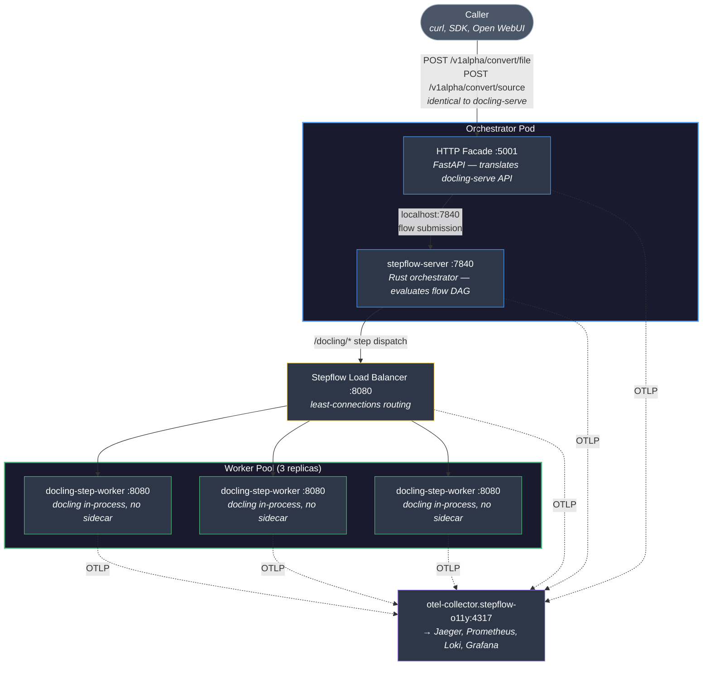

# stepflow-docling Namespace — Docling Parity Testbed

**Status:** Draft
**Related:** #684a (response format parity), #689 (request options parity)

## Goal

Deploy the docling-step-worker integration as a standalone Kubernetes namespace that proves the "drop-in replacement for docling-serve" story end-to-end. A caller hitting `localhost:5001` should see identical behavior to upstream docling-serve: the same endpoints and the same request/response shapes. Unlike docling-serve, this deployment is backed by 3 load-balanced docling-step-worker pods orchestrated through Stepflow.

This deployment is also a live demonstration that docling-step-worker already addresses known architectural limitations in upstream docling-serve (documented in detail in `docling-step-worker.md`):

- **In-memory task state prevents horizontal scaling** ([docling-serve #378](https://github.com/docling-project/docling-serve/issues/378), [#317](https://github.com/docling-project/docling-serve/issues/317)) — docling-serve stores async task state in an in-memory dict pinned to a single Uvicorn worker. Users are told to set `UVICORN_WORKERS=1`. In our deployment, all execution state lives in the Stepflow server. Any pod can serve status polls for any task. The 3-worker pool demonstrates this directly.

- **No horizontal scaling path** ([docling-serve #10](https://github.com/docling-project/docling-serve/issues/10), [#257](https://github.com/docling-project/docling-serve/issues/257), [Discussion #1890](https://github.com/docling-project/docling/discussions/1890)) — docling-serve runs an isolated orchestrator per process with no shared queue. Users are advised to use sticky sessions. Our deployment routes through Stepflow's orchestrator → Stepflow Load Balancer → 3 workers with least-connections. No sticky sessions, shared state by default.

- **Sync timeout handling** ([docling-serve #317](https://github.com/docling-project/docling-serve/issues/317)) — `DOCLING_SERVE_MAX_SYNC_WAIT` has no effect beyond ~250s due to ASGI/Uvicorn limits. Our sync path uses `StepflowClient.run()` with server-side `wait_timeout`, independent of the ASGI stack.

The `stepflow-docling` namespace proposed in this document makes these improvements concrete and testable.

## Non-goals

This is **not** an extension of the existing `stepflow` namespace. That namespace was built around langflow integration and carries architecture (langflow workers, OpenSearch, docling-serve sidecar pattern) that is irrelevant here. We reuse only the structural conventions (deployment/service/headless patterns, o11y wiring, Stepflow Load Balancer) and the shared `stepflow-o11y` observability stack.

## Architecture



### Why the facade is a sidecar

The HTTP facade's only downstream dependency is stepflow-server. Colocating them in the same pod turns that dependency into a `localhost:7840` call — no DNS lookup, no service hop, no extra deployment to manage. This gives us:

- **Reduced latency** — flow submission is loopback, not cross-pod
- **Simpler topology** — 3 component types instead of 4, no facade service/deployment to manage
- **Atomic scaling** — facade and server scale together as a unit, which is the right default since they share the same throughput bottleneck (waiting on worker pods to process documents)
- **Fewer failure modes** — no scenario where the facade is up but can't reach the server

The tradeoff is that you can't scale the facade independently of the server. For a testbed this is fine. If a future production deployment needs independent scaling (e.g., many concurrent uploads queuing while workers are saturated), the facade can be extracted to its own deployment with minimal changes.

## Components

### Orchestrator Pod (1 replica, 2 containers)

A single pod running two containers that together form the front door of the system.

**Container 1: HTTP Facade** (:5001)

A thin FastAPI application that makes the system look exactly like docling-serve to the outside world. It:

- Accepts multipart file uploads on docling-serve's API endpoints (`/v1alpha/convert/file`, `/v1alpha/convert/source`, etc.)
- Translates the request into the `docling-process-document` flow input schema (base64-encodes uploaded files, maps `ConvertDocumentsOptions` to the `options` dict, sets `source_kind`)
- Submits the flow to stepflow-server on `localhost:7840`
- Translates the flow output back into docling-serve's `ExportDocumentResponse` shape

The facade image is designed to be lightweight, relying only on FastAPI and httpx libraries. 

**Container 2: stepflow-server** (:7840)

This is the Rust orchestrator and the hand-off point to Stepflow. The orchestrator receives flow submissions from the facade, evaluates the classify → convert → chunk DAG flow, and dispatches each step to the worker pool via the Stepflow LB. A ConfigMap holds the server config and the `docling-process-document` flow definition.

The Stepflow orchestrator config is minimal with only one plugin and one route:

```yaml
plugins:
  docling:
    type: stepflow
    transport: http
    url: "http://docling-lb.stepflow-docling.svc.cluster.local:8080"

routes:
  "/docling/{*component}":
    - plugin: docling
```

### Stepflow Load Balancer (1 replica)

Discovers docling-step-worker pods via headless service DNS, routing with a least-connections strategy. This is the same `stepflow-load-balancer` image and functionality as the `stepflow` namespace, just configured with a different upstream.

### docling-step-worker (3 replicas)

The Doclint step workers consist of single-container pods running the `docling-step-worker-server` entry point. The docling library (PDF parsing, OCR, table structure detection, model inference) runs in-process. 

Stepflow's docling integration code registers three Stepflow components: `/classify`, `/convert`, `/chunk`, to route to individual workers. 

The container images are built from `integrations/docling-step-worker/docker/Dockerfile`, which pre-downloads model artifacts at build time. 

## Facade Application

### Why it lives in `integrations/docling-step-worker`

Though minimal and specific to this deployment, the facade is application code, not deployment configuration. It shares types and contracts with the existing integration:

- `response_builder.py` already defines the `ExportDocumentResponse` shape and format normalization
- The `options` dict schema in the flow YAML matches docling-serve's `ConvertDocumentsOptions` exactly (#689)
- Request translation (multipart → base64 + options dict) is tightly coupled to how `convert.py` consumes its input

Keeping facade and worker in the same package means shared code, not duplicated contracts.

### Package layout

```
integrations/docling-step-worker/
  src/docling_step_worker/
    facade/
      __init__.py
      app.py              # FastAPI app: docling-serve endpoint handlers
      translate.py         # Request → flow input, flow output → response
    server.py             # Existing stepflow component server (unchanged)
    convert.py            # Existing converter (unchanged)
    response_builder.py   # Shared response shapes (unchanged)
    converter_cache.py    # Shared converter cache (unchanged)
    ...
  docker/
    Dockerfile            # Existing worker image (heavy: docling + models)
    Dockerfile.facade     # Facade image (light: FastAPI + httpx only)
```

### Entry point

`docling-step-worker-facade` — starts the FastAPI app on port 5001. Configured via:

- `STEPFLOW_SERVER_URL` — `http://localhost:7840` (sidecar, hardcoded in deployment)
- `STEPFLOW_FLOW_NAME` — default `docling-process-document`
- Standard OTEL env vars for observability

### Endpoint mapping

| docling-serve endpoint | Facade behavior |
|------------------------|-----------------|
| `POST /v1alpha/convert/file` | Accept multipart, base64-encode file, submit flow with `source_kind: base64` |
| `POST /v1alpha/convert/source` | Accept URL/source, submit flow with `source_kind: url` |
| `GET /health` | Health check (own status + localhost:7840 health) |
| `GET /docs` | OpenAPI docs (generated by FastAPI, matching docling-serve schema) |

## Kubernetes Manifests

### Directory layout

```
examples/production/k8s/
  stepflow-docling/
    orchestrator/
      configmap.yaml         # stepflow config + flow YAML
      deployment.yaml        # 2 containers: facade (:5001) + stepflow-server (:7840)
      service.yaml           # Exposes :5001 (facade) and :7840 (server)
    worker/
      deployment.yaml        # 3 replicas, single container, no sidecar
      service.yaml           # ClusterIP :8080
      service-headless.yaml  # Stepflow Load Balancer pod discovery
    loadbalancer/
      deployment.yaml        # Stepflow Load Balancer → worker-headless
      service.yaml           # ClusterIP :8080
```

### Resource profile

| Pod | Containers | Memory (request/limit) | Notes |
|-----|-----------|----------------------|-------|
| orchestrator | facade + stepflow-server | 384Mi / 768Mi | Facade ~128Mi, server ~256Mi |
| Stepflow LB | 1 | 128Mi / 256Mi | Rust, small footprint |
| docling-step-worker (×3) | 1 | 2Gi / 4Gi | docling models are memory-hungry |

Total cluster ask: ~3 workers × 4Gi + orchestrator + LB ≈ **14Gi** (vs ~21Gi in the sidecar architecture from the `stepflow` namespace which allocated 6Gi per docling-serve sidecar).

### Observability wiring

All pods emit OTLP to `otel-collector.stepflow-o11y.svc.cluster.local:4317`. Service names distinguish components in dashboards:

- `docling-facade` — the HTTP translation layer
- `stepflow-server` (with `service.namespace=stepflow-docling` resource attribute)
- `docling-step-worker`

Traces span the full chain: facade → server → LB → worker, showing flow orchestration decomposed into classify/convert/chunk steps. The facade → server hop shows as a loopback span with negligible latency.

### Changes to existing files

**`namespaces.yaml`** — Add:
```yaml
apiVersion: v1
kind: Namespace
metadata:
  name: stepflow-docling
  labels:
    name: stepflow-docling
    app.kubernetes.io/part-of: stepflow-docling
```

**`kind-config.yaml`** — Add port mapping:
```yaml
# stepflow-docling facade (docling-serve parity endpoint)
- containerPort: 30501
  hostPort: 5001
  protocol: TCP
```

Port 5001 is intentional — it's docling-serve's default. Existing scripts and SDK clients pointed at `localhost:5001` work unchanged.

**`apply.sh`** — Add deployment block for the new namespace (after o11y, before final status).

## Usage

Once deployed, parity testing is transparent:

```bash
# This is what a docling-serve call looks like
curl -X POST http://localhost:5001/v1alpha/convert/file \
  -F "file=@paper.pdf" \
  -F "to_formats=markdown,json" \
  -F "options={\"do_ocr\": true, \"table_mode\": \"accurate\"}"

# The response is ExportDocumentResponse — identical shape to docling-serve
```

The caller has no idea Stepflow is involved. Traces in Grafana tell the full story.

## What this proves

1. **No sidecar needed for docling** — docling library runs in-process in the worker pods, one container per worker, ~30% less memory than the docling-serve sidecar pattern
2. **Drop-in API compatibility** — same endpoints, same request/response shapes as docling-serve
3. **Horizontal scaling** — 3 workers behind the stepflow-load-balancer with least-connections routing
4. **Full observability** — same Grafana/Jaeger/Prometheus stack, traces decompose the full orchestration chain
5. **Options parity** — all 15 docling-serve request options (#689) flow through the facade → flow schema → converter cache
6. **Compact orchestrator** — facade + server colocated as sidecar, localhost communication, single pod to manage

## Implementation order

1. **Facade application** (`integrations/docling-step-worker/src/docling_step_worker/facade/`) — the new code. FastAPI app, request/response translation, `Dockerfile.facade`.
2. **K8s manifests** (`examples/production/k8s/stepflow-docling/`) — orchestrator pod (facade + server), worker deployment, LB, services.
3. **Plumbing** — namespace addition, kind-config port mapping, apply.sh updates.
4. **Parity test script** — curl-based smoke tests comparing response shapes.

## Open questions

1. **Async flow submission** — docling-serve supports both sync (`/convert/file`) and async (`/convert/file/async` + polling) endpoints. The facade should start with sync-only (submit flow, wait for completion, return result). Async can follow once the sync path is proven.

2. **Orchestrator pod readiness** — The pod has two containers. Readiness should gate on both: facade health + stepflow-server health. The facade's `/health` endpoint can proxy the server check on localhost:7840 to provide a single readiness signal, or we define readiness probes on both containers and let Kubernetes gate on the conjunction.

3. **Test harness** — Should we include a `test-parity.sh` script alongside the manifests that exercises key endpoints and compares against expected response shapes?
