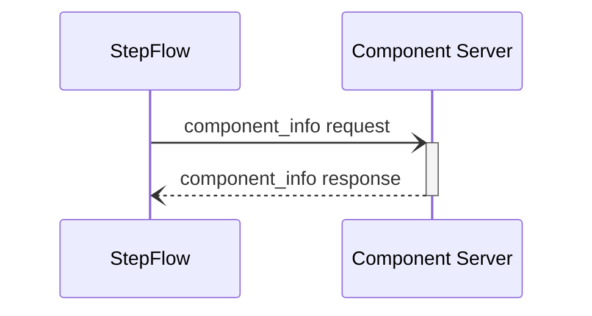
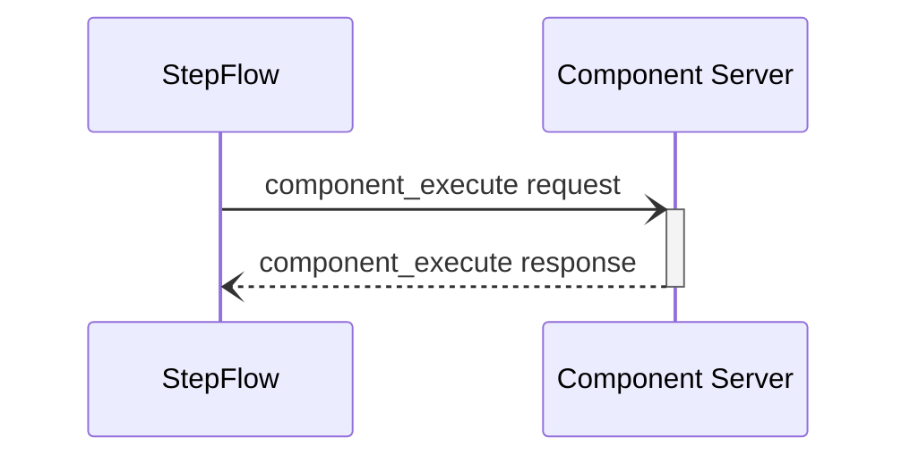
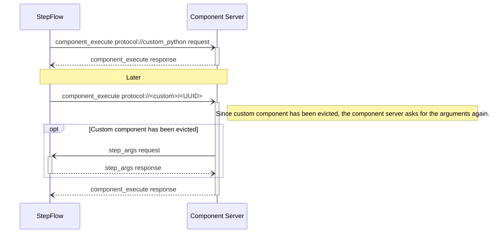

# Components

## Component Discovery

## Component Information

The component information request is used to retrieve metadata about a specific component, including its input and output schemas.



### Request Format

```json
{
    "component": "string" // Component identifier URL
}
```

### Response Format

```json
{
    "input_schema": {
        "type": "object",
        "properties": {
            // JSON Schema for component inputs
        }
    },
    "output_schema": {
        "type": "object",
        "properties": {
            // JSON Schema for component outputs
        }
    },
    "always_execute": boolean // Whether component should execute without inputs
}
```

The response includes:
- `input_schema`: JSON Schema defining the expected input structure
- `output_schema`: JSON Schema defining the output structure
- `always_execute`: Boolean flag indicating if the component should execute even without inputs

:::note
Components should also have fields for describing the UI aspects of providing their input.
One option here is to use something like https://jsonforms.io/docs/.
The `input_schema` would determine the shape of allowed data, while this other metadata would help generate the UI widget.
This could also include things like the icon to use for the component, etc.
:::

## Component Execution

The component execution request is used to run a specific component with provided input data. The component server processes the input according to its defined schema and returns the output.



### Request Format

```json
{
    "component": "string", // Component identifier URL
    "input": {
        // Input data matching the component's input_schema
    }
}
```

### Response Format

```json
{
    "output": {
        // Output data matching the component's output_schema
    }
}
```

### Error Handling

The component server may return errors in the following cases:
- Component not found (error code: -32601)
- Invalid input data (error code: -32000)
- Server not initialized (error code: -32002)

:::note
Flesh out the error protocol.
It would likely be nice to have a standard set of error codes, etc.
:::

## Dynamic Components

Dynamic components allow the component server to create a new compnonent that can be referenced later in the workflow.
Since a component is just a URL, the main capability here is that the workflow format allows the component to a step to depend on the result of an earlier step.



:::note
This will require the workflow to provide enough information about custom components (possibly storing it in the URL) to retrieve the input arguments.
This allows the component server to evict things.
:::