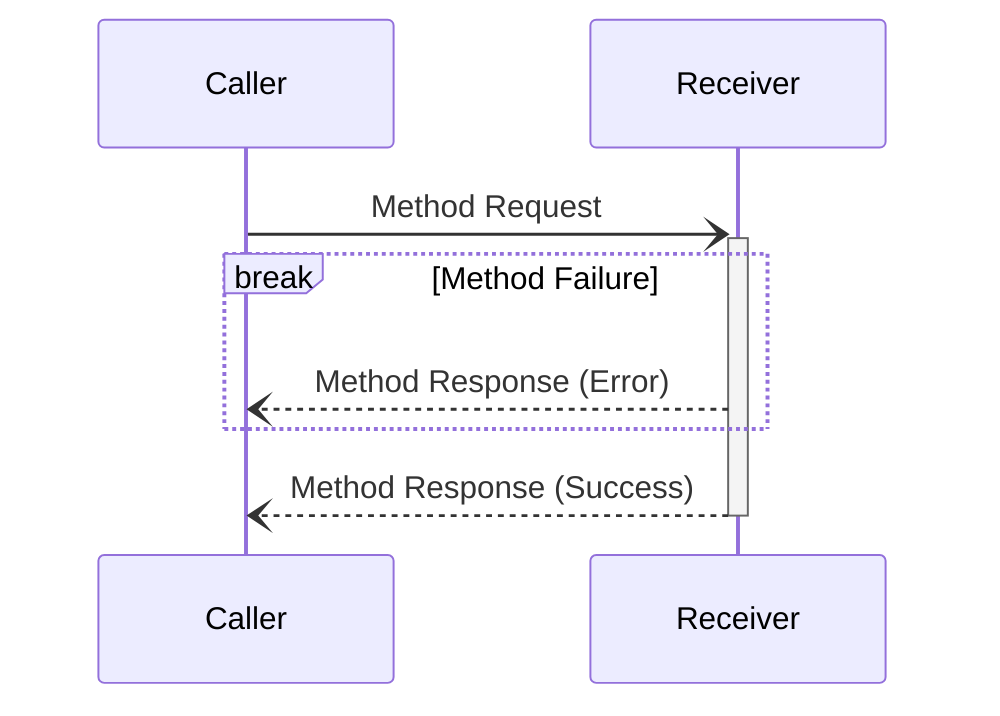

# Transport

Currently, the StepFlow protocol only supports communicating with subprocesses over stdin/stdout.
Future improvements are intended to support JSON-RPC over HTTP, as well as other protocols such as gRPC for improved performance.
Some of these may be automatically negotiated during initialization (see [Lifecycle](./lifecycle.md)).



## Method Request

Method requests look like:

```json
{
    "jsonrpc": "2.0",
    "id": <uuid>,
    "method": <method name>,
    "params": <input to method as JSON>
}
```

The presence of the `id` indicates this is a method to be responded to (a [notification](#notifications) does not have an `id`).
The shape of the parameters depends on the method being requested.

## Method Response (Success)

Successful method responses look like:

```json
{
    "jsonrpc": "2.0",
    "id": <uuid>,
    "result": <output of the method as JSON>
}
```

## Method Response (Error)

```json
{
    "jsonrpc": "2.0",
    "id": <uuid>,
    "error": {
        "code": <integer error code>,
        "message": <error message string>,
        "data": <optional data as JSON>
    }
}
```

## Notifications

```json
{
    "jsonrpc": "2.0",
    "method": <notification method name>,
    "params": <input to method as JSON>
}
```
