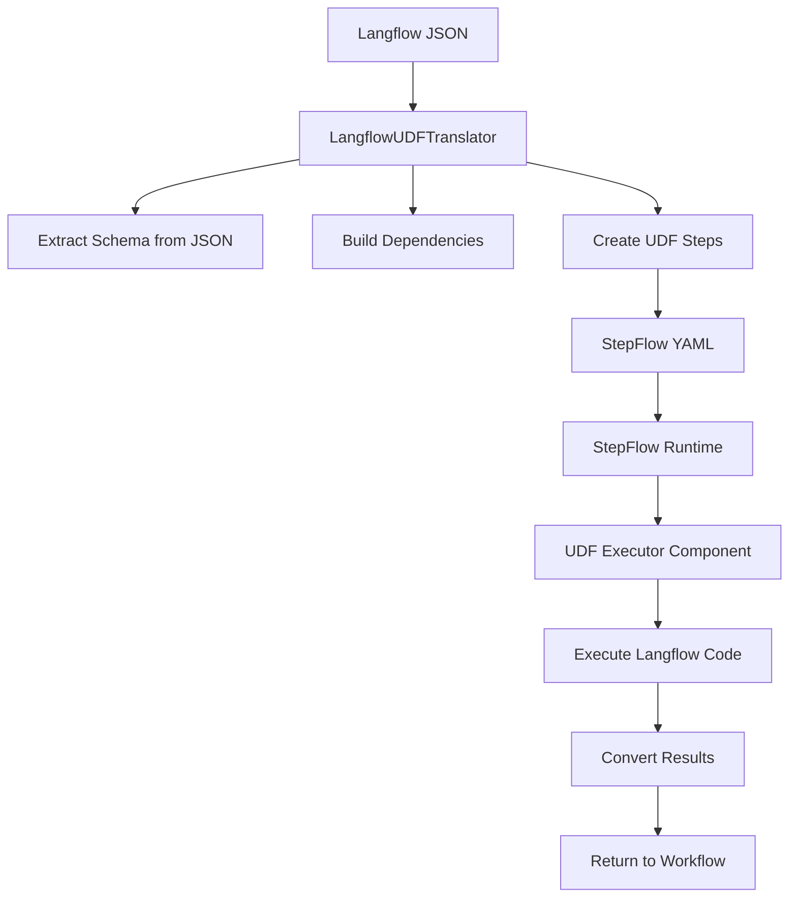

# UDF-Based Langflow to StepFlow Translation

This directory contains a **User-Defined Function (UDF)** based translation system that converts Langflow JSON workflows to StepFlow YAML workflows.

## Key Features

- **✅ Full Compatibility**: Executes exact Langflow component code for 100% compatibility
- **✅ Dynamic Schema Discovery**: Extracts output schemas from Langflow JSON metadata
- **✅ Native Type Support**: Handles Langflow's `Message`, `Data`, and `DataFrame` types
- **✅ Fallback Strategy**: UDF execution as a reliable fallback for any Langflow component
- **✅ CLI Tools**: Easy-to-use command-line interface for translation

## Architecture

### Components

1. **`langflow_component_server_udf_only.py`** - StepFlow component server with UDF executor
2. **`udf_translator_cli.py`** - Command-line interface for translation
3. **`test_udf_translator.py`** - Test script for validation

### How It Works



### Translation Process

1. **Schema Discovery**: Extract output types from Langflow JSON metadata
2. **Dependency Analysis**: Build execution graph from edges
3. **UDF Generation**: Create UDF executor steps for each component
4. **Code Execution**: Execute original Langflow code in controlled environment
5. **Result Conversion**: Convert Langflow types to StepFlow format

## Usage

### CLI Translation

```bash
# Translate a Langflow JSON file
python udf_translator_cli.py input.json output.yaml

# Analyze Langflow structure
python udf_translator_cli.py input.json --analyze-only

# Translate with pretty printing
python udf_translator_cli.py input.json output.yaml --pretty
```

### Test the System

```bash
# Run the test suite
python test_udf_translator.py
```

### Run the Component Server

```bash
# Start the StepFlow component server
python langflow_component_server_udf_only.py
```

## Schema Discovery

The system automatically discovers output schemas from Langflow JSON:

### Method 1: Node Outputs
```json
{
  "outputs": [
    {
      "types": ["Message"],
      "name": "message"
    }
  ]
}
```

### Method 2: Base Classes
```json
{
  "base_classes": ["Message"]
}
```

### Method 3: Component Heuristics
- `ChatInput` → `Message`
- `LanguageModelComponent` → `Message`
- `TextSplitter` → `Data`
- etc.

## Supported Langflow Types

### Message
```python
{
  "result": {
    "text": "Hello world",
    "sender": "user",
    "sender_name": "User",
    "type": "Message"
  }
}
```

### Data
```python
{
  "result": {
    "data": {"key": "value"},
    "text_key": "text",
    "type": "Data"
  }
}
```

### DataFrame
```python
{
  "result": {
    "data": [{"col1": "val1", "col2": "val2"}],
    "type": "DataFrame"
  }
}
```

## Example Translation

### Input: Langflow JSON
```json
{
  "data": {
    "nodes": [
      {
        "id": "ChatInput-123",
        "data": {
          "type": "ChatInput",
          "node": {
            "template": {
              "code": {"value": "class ChatInput(Component): ..."}
            }
          }
        }
      }
    ]
  }
}
```

### Output: StepFlow YAML
```yaml
name: Translated Workflow
steps:
  - id: udf_123
    component: langflow://udf_executor
    input:
      code: "class ChatInput(Component): ..."
      template: {...}
      component_type: ChatInput
      runtime_inputs: {}
    output_schema:
      type: object
      properties:
        text: {type: string}
        sender: {type: string}
        type: {type: string, const: Message}
```

## Error Handling

The system includes comprehensive error handling:

- **Import Errors**: Graceful fallback when Langflow modules are missing
- **Execution Errors**: Detailed error messages with component context
- **Schema Errors**: Fallback to generic schemas when discovery fails
- **Code Errors**: Safe execution environment prevents system damage

## Development

### Adding New Component Types

1. **Update Schema Heuristics**:
```python
def _get_component_schema_heuristics(component_type: str) -> Dict[str, Any]:
    type_heuristics = {
        'MyNewComponent': _convert_langflow_types_to_stepflow_schema(['Data']),
        # ... existing mappings
    }
```

2. **Add Import Support**:
```python
# In _execute_langflow_component
from langflow.components.mynew import MyNewComponent
exec_globals['MyNewComponent'] = MyNewComponent
```

### Testing New Components

1. Create a test Langflow JSON with your component
2. Run the analyzer: `python udf_translator_cli.py test.json --analyze-only`
3. Test translation: `python udf_translator_cli.py test.json output.yaml`
4. Validate the generated StepFlow YAML

## Benefits vs. Native Translation

| Aspect | UDF Translation | Native Translation |
|--------|-----------------|-------------------|
| **Compatibility** | 100% (exact code) | Depends on implementation |
| **Performance** | Slower (code execution) | Faster (direct mapping) |
| **Maintenance** | Low (automatic) | High (manual mapping) |
| **Debugging** | Complex (sandboxed) | Simple (direct) |
| **Security** | Controlled execution | Direct type mapping |

## Future Enhancements

1. **Hybrid Approach**: Combine UDF with native components
2. **Caching**: Cache component execution results
3. **Sandbox Improvements**: Enhanced security for code execution
4. **Performance Optimization**: Pre-compile frequently used components
5. **Schema Validation**: Runtime schema validation for type safety

## Dependencies

- `stepflow-langflow` - StepFlow SDK for Langflow integration
- `langflow` - Core Langflow components and types
- `msgspec` - Fast serialization for type handling
- `pyyaml` - YAML processing for output generation

## License

This code is part of the StepFlow project and follows the same license terms. 