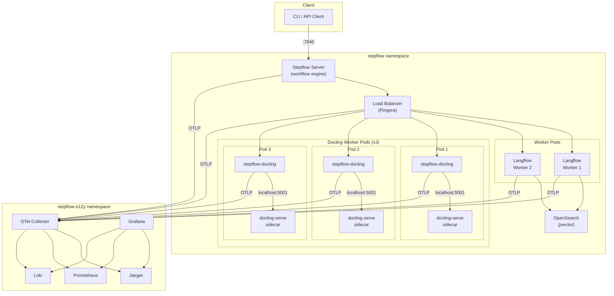
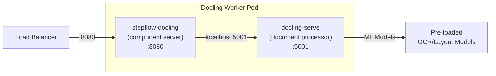
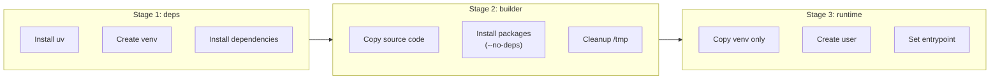

# Stepflow Kubernetes Deployment

This directory contains Kubernetes manifests for deploying Stepflow and its supporting infrastructure on a local Kind cluster.

## Overview

The Stepflow K8s deployment provides a complete local development environment with:

- **Stepflow Server**: Core workflow orchestration engine
- **Load Balancer**: Pingora-based request routing to workers
- **Langflow Worker**: Python-based component execution
- **Docling Worker**: Document processing with sidecar architecture
- **OpenSearch**: Document storage and vector search (with jvector plugin)
- **Observability Stack**: Full telemetry pipeline (traces, metrics, logs)

## Architecture



### Docling Worker Architecture

The docling-worker deployment uses a **sidecar pattern** for document processing:



Each docling-worker pod contains two containers:
- **stepflow-docling**: Stepflow component server that handles incoming requests
- **docling-serve**: The actual document processing engine (PDF, DOCX, images)

This sidecar pattern provides:
- Fast localhost communication (no network hop)
- Independent scaling of document processing capacity
- Isolated resource limits for CPU-intensive ML operations

## Prerequisites

- **Kind**: Kubernetes in Docker - `brew install kind`
- **kubectl**: Kubernetes CLI - `brew install kubectl`
- **Podman** (or Docker): Container runtime - `brew install podman`

## Quick Start

### 1. Build Docker Images

From the repository root:

```bash
# Build core Stepflow images
podman build -t localhost/stepflow-server:latest -f docker/Dockerfile.server .
podman build -t localhost/stepflow-load-balancer:latest -f docker/Dockerfile.loadbalancer .
podman build -t localhost/langflow-worker:latest -f docker/langflow-component-server/Dockerfile .

# Build docling worker
podman build -t localhost/stepflow-docling:v14 -f docker/docling-worker/Dockerfile .

# Build OpenSearch with jvector plugin
podman build -t localhost/opensearch-jvector:latest -f examples/production/k8s/stepflow/opensearch/Dockerfile examples/production/k8s/stepflow/opensearch
```

#### Dockerfile Build Patterns

The worker Dockerfiles use a **3-stage build pattern** for cache efficiency and smaller images:



**Key optimizations:**
- **Layer caching**: Dependencies in `deps` stage are cached unless `pyproject.toml` changes
- **Minimal runtime**: Final image has no build tools (gcc, uv), only the Python venv
- **Source cleanup**: `/tmp` source copies are removed before creating runtime image
- **Stdlib healthchecks**: Use `urllib.request` instead of external `requests` package

This pattern is used in:
- `docker/langflow-component-server/Dockerfile` (langflow worker)
- `docker/docling-worker/Dockerfile` (docling worker)

### 2. Create Kind Cluster

```bash
kind create cluster --config k8s/kind-config.yaml
```

This creates a cluster named `stepflow` with port mappings for:
- 7840 → Stepflow API
- 3000 → Grafana
- 16686 → Jaeger
- 9090 → Prometheus

### 3. Load Images into Kind

```bash
# Load all images into the Kind cluster
# For Podman, use: podman save <image> | kind load image-archive /dev/stdin --name stepflow

kind load docker-image localhost/stepflow-server:latest --name stepflow
kind load docker-image localhost/stepflow-load-balancer:latest --name stepflow
kind load docker-image localhost/langflow-worker:latest --name stepflow
kind load docker-image localhost/stepflow-docling:v14 --name stepflow
kind load docker-image localhost/opensearch-jvector:latest --name stepflow
```

### 4. Create Secrets

Create the required secrets (do not commit credentials to source control):

```bash
kubectl create secret generic stepflow-secrets \
  --namespace=stepflow \
  --from-literal=openai-api-key="YOUR_OPENAI_KEY" \
  --from-literal=opensearch-password="YOUR_PASSWORD"
```

**Note**: Run this after namespaces are created (step 5) or the apply script will create the namespace first.

### 5. Deploy Everything

```bash
./k8s/apply.sh
```

This deploys all components in the correct order with dependency waits.

### 6. Verify Deployment

```bash
kubectl get pods -n stepflow
kubectl get pods -n stepflow-o12y
```

All pods should show `Running` status.

## Access URLs

| Service | URL | Description |
|---------|-----|-------------|
| Stepflow API | http://localhost:7840 | Workflow API |
| Swagger UI | http://localhost:7840/swagger-ui/ | API documentation |
| Grafana | http://localhost:3000 | Observability dashboards (admin/admin) |
| Jaeger | http://localhost:16686 | Distributed tracing |
| Prometheus | http://localhost:9090 | Metrics |
| Docling API | Internal only | Document processing (see port-forward below) |

**Accessing Docling** (internal service):
```bash
kubectl port-forward -n stepflow svc/docling-serve 5001:5001
# Then access: http://localhost:5001/docs (API documentation)
```

## Namespaces

| Namespace | Purpose |
|-----------|---------|
| `stepflow` | Application workloads (server, load balancer, workers) and infrastructure services (OpenSearch, Docling) |
| `stepflow-o12y` | Observability stack (OTel Collector, Jaeger, Prometheus, Loki, Grafana) |

## Running Workflows

Two scripts are provided for processing documents through the ingestion pipeline.

### Wikipedia Article Ingestion

Process Wikipedia articles (HTML pages) through the pipeline:

```bash
# Process default article list (wikipedia-ai-articles.jsonl)
./run-workflow.sh

# Process custom URL file
./run-workflow.sh my-urls.txt

# Run with parallel execution
./run-workflow.sh --parallel 3 wikipedia-ai-articles.jsonl

# Dry run to see what would be processed
./run-workflow.sh --dry-run
```

**Options:**
| Flag | Description |
|------|-------------|
| `-p, --parallel N` | Run N workflows concurrently (default: 1) |
| `-f, --flow FILE` | Use custom flow file |
| `-v, --vars FILE` | Use custom variables file |
| `--dry-run` | Show URLs without executing |

### PDF Document Ingestion

Process PDF documents (downloads from arxiv.org) through the pipeline:

```bash
# Download papers and run workflow
./run-pdf-workflow.sh

# Skip download, use existing PDFs
./run-pdf-workflow.sh --skip-download

# Run with higher parallelism
./run-pdf-workflow.sh --skip-download --parallelism 4

# Download only (no workflow execution)
./run-pdf-workflow.sh --download-only
```

**Options:**
| Flag | Description |
|------|-------------|
| `--parallelism N` | Number of parallel workflow submissions (default: 2) |
| `--skip-download` | Skip PDF download, use existing files |
| `--download-only` | Only download PDFs, don't run workflow |
| `--pdf-dir DIR` | Directory to store PDFs (default: ./arxiv-pdfs) |

**Note:** Both scripts require `OPENAI_API_KEY` environment variable for embedding generation.

## Teardown

To remove all resources:

```bash
./k8s/teardown.sh
```

To delete the Kind cluster entirely:

```bash
kind delete cluster --name stepflow
```

## Directory Structure

```
k8s/
├── README.md                      # This file
├── OBSERVABILITY.md               # Observability stack documentation
├── COMMANDS.md                    # Command reference
├── kind-config.yaml               # Kind cluster configuration
├── namespaces.yaml                # Namespace definitions
├── apply.sh                       # Deployment script
├── teardown.sh                    # Teardown script
├── stepflow-config.yml            # Reference config (see stepflow/server/configmap.yaml)
├── stepflow/                      # Application manifests
│   ├── server/                    # Stepflow server
│   ├── loadbalancer/              # Pingora load balancer
│   ├── langflow-worker/           # Python workers
│   ├── opensearch/                # OpenSearch (infrastructure)
│   └── docling/                   # Docling document processing (infrastructure)
└── stepflow-o12y/                 # Observability manifests
    ├── otel-collector/            # OpenTelemetry Collector
    ├── jaeger/                    # Distributed tracing
    ├── prometheus/                # Metrics
    ├── loki/                      # Log aggregation
    ├── promtail/                  # Log collection
    └── grafana/                   # Dashboards
```

## Configuration

### Stepflow Server

The server configuration is stored in `k8s/stepflow/server/configmap.yaml`. Key settings:

- Routes `/langflow/*` components to the load balancer
- Routes `/builtin/*` to built-in components
- Sends telemetry to OTel Collector

### Docling Worker Configuration

The docling-worker deployment (`stepflow/docling/deployment.yaml`) includes tuned settings for document processing:

| Setting | Value | Description |
|---------|-------|-------------|
| Replicas | 3 | Number of docling worker pods |
| CPU Request/Limit | 1000m / 4000m | CPU cores for docling-serve container |
| Memory Request/Limit | 2Gi / 6Gi | Memory for docling-serve container |
| `OMP_NUM_THREADS` | 4 | OpenMP thread limit to prevent contention |
| `DOCLING_SERVE_MAX_SYNC_WAIT` | 300 | Sync conversion timeout in seconds |

The extended timeout (300s vs default 120s) accommodates large PDF documents that require significant processing time.

### Langflow Worker Configuration

The langflow-worker deployment (`stepflow/langflow-worker/deployment.yaml`) includes:

| Setting | Value | Description |
|---------|-------|-------------|
| Replicas | 2 | Number of langflow worker pods |
| `OPENSEARCH_MAX_CONNECTIONS` | 20 | Connection pool size for OpenSearch |

### Environment Variables

All services are configured via environment variables in their deployment manifests. Sensitive values (API keys, passwords) are referenced from the `stepflow-secrets` secret.

### Logging Configuration

Stepflow components support configurable logging via environment variables:

| Variable | Default | Description |
|----------|---------|-------------|
| `STEPFLOW_LOG_LEVEL` | `info` | Log level: `debug`, `info`, `warning`, `error` |
| `STEPFLOW_LOG_DESTINATION` | `otlp` | Where to send logs: `stderr`, `otlp`, or comma-separated |
| `STEPFLOW_OTLP_ENDPOINT` | - | OTLP collector endpoint for traces and logs |

**Important:** Setting `STEPFLOW_LOG_LEVEL=debug` generates verbose output that can exceed Loki's gRPC message size limits (4MB default). Use `info` level in production to avoid log ingestion failures.

To change log level at runtime:
```bash
kubectl set env deployment/docling-worker -n stepflow -c stepflow-docling STEPFLOW_LOG_LEVEL=info
kubectl set env deployment/langflow-worker -n stepflow STEPFLOW_LOG_LEVEL=info
```

## Infrastructure Services vs. Routed Components

This deployment distinguishes between two types of services:

### Routed Components

Components accessible via the Stepflow routing configuration. These are invoked by workflow steps and routed through the load balancer.

| Path Pattern | Plugin | Description |
|--------------|--------|-------------|
| `/langflow/*` | langflow_k8s | Langflow components via load balancer |
| `/docling/*` | docling_k8s | Docling document processing via load balancer |
| `/builtin/*` | builtin | Built-in components (OpenAI, eval, etc.) |

### Infrastructure Services

Backend services accessed directly by workers via Kubernetes DNS. These are NOT part of the Stepflow routing configuration.

| Service | DNS Endpoint | Port | Purpose |
|---------|--------------|------|---------|
| OpenSearch | `opensearch.stepflow.svc.cluster.local` | 9200 | Document storage, vector search (jvector) |

### Docling Sidecar Communication

Within docling-worker pods, the stepflow-docling container communicates with its docling-serve sidecar via localhost:

```
stepflow-docling container → localhost:5001 → docling-serve container
```

This is configured via the `DOCLING_SERVE_URL` environment variable set to `http://localhost:5001`.

Workers discover OpenSearch through environment variables (e.g., `OPENSEARCH_HOST`, `OPENSEARCH_PORT`).

## Observability

The deployment includes a full observability stack. See [OBSERVABILITY.md](OBSERVABILITY.md) for:

- Component details (OTel Collector, Jaeger, Prometheus, Loki, Grafana)
- Telemetry flow (traces, metrics, logs)
- Dashboard navigation
- Trace-to-log correlation
- Troubleshooting guides

## Command Reference

See [COMMANDS.md](COMMANDS.md) for useful commands including:

- Cluster management
- Pod operations and logs
- Port forwarding
- Troubleshooting
- Image management

## Production Considerations

This deployment is designed for local development. For production:

- Use a managed Kubernetes service (EKS, GKE, AKS)
- Configure persistent storage for OpenSearch, Prometheus, Loki
- Set up proper ingress controllers
- Configure authentication for Grafana
- Implement network policies
- Set resource limits and requests appropriately
- Configure horizontal pod autoscaling
- Set up alerting rules in Prometheus/Grafana

## Future Work

### Docling Enhancements

1. **Model Serving Strategy**: The current deployment uses pre-baked models in the container image. Future work should consider:
   - PVC-mounted model cache for updates without image rebuilds
   - Model versioning and rollback support
   - Shared model storage across replicas

2. **GPU Acceleration**: The `docling-serve-cu126` and `docling-serve-cu128` images exist for NVIDIA GPU acceleration. To enable:
   - Install NVIDIA device plugin in the cluster
   - Change image to `quay.io/docling-project/docling-serve-cu126:latest`
   - Add GPU resource requests to the deployment

3. **Horizontal Scaling**: Document processing is CPU-intensive. Consider:
   - Horizontal Pod Autoscaler (HPA) based on CPU utilization
   - Queue-based scaling for batch processing workloads
   - Pod disruption budgets for availability

4. **Async Document Processing**: The current implementation uses synchronous docling-serve API calls. Future work may leverage the async API (`/v1/convert/source/async`) with polling for better throughput under heavy load.

5. **Batch Submission**: Leverage Stepflow's native batch submission capabilities for processing large document sets more efficiently.
